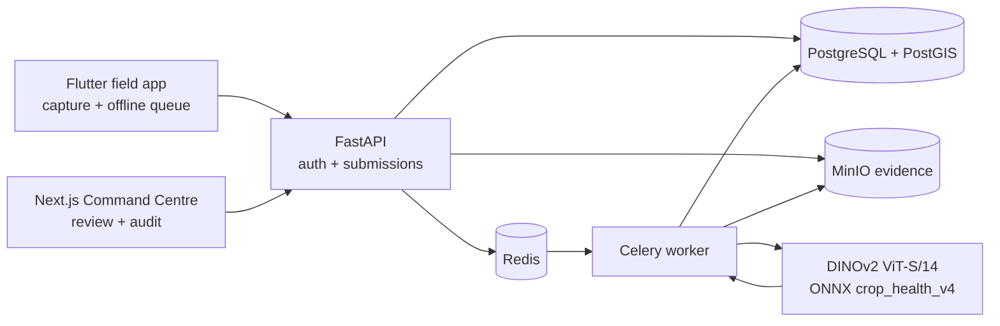
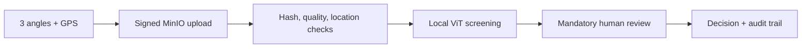

# FasalPramaan AI

Local-first crop evidence capture, assistive ViT screening, and human review.

FasalPramaan connects a Flutter farmer/field app, FastAPI, MinIO, Celery,
PostgreSQL/PostGIS, the local DINOv2 model, and a Next.js reviewer dashboard.
The complete presentation stack runs with Docker and does not download model
weights at runtime.

> AI results are assistive screening signals. They do not determine crop-loss
> severity, produce quality, claim eligibility, or insurance settlement.
> Human review is mandatory.

## One-command start

Prerequisite: Docker Desktop or Docker Engine with Compose v2.

Windows:

```powershell
Copy-Item .env.example .env
powershell -ExecutionPolicy Bypass -File .\scripts\start-portable.ps1
```

macOS/Linux:

```bash
cp .env.example .env
sh scripts/start-portable.sh
```

Or use Docker Compose directly:

```bash
docker compose up -d --build
```

The first build downloads base images and the Flutter SDK used only while
building the field-app image. The selected 86.7 MB ONNX model is already in
the repository.

## Open the apps

| Surface | URL | Demo account |
|---|---|---|
| Farmer/field app | `http://localhost:8085` | `farmer@fasalpramaan.local` / `Demo@12345` |
| Reviewer Command Centre | `http://localhost:3000` | `reviewer@fasalpramaan.local` / `Demo@12345` |
| API health/docs | `http://localhost:8000/health`, `/docs` | — |
| AI health | `http://localhost:8001/health` | — |
| MinIO console | `http://localhost:9001` | `minioadmin` / `minioadmin_dev_only` |

The field app and dashboard use same-origin `/backend` proxies, so no browser
configuration is required.

## Use from another device

Keep the second device and Docker host on the same trusted Wi-Fi/LAN. On
Windows:

```powershell
powershell -ExecutionPolicy Bypass -File .\scripts\start-portable.ps1 `
  -PublicHost 192.168.1.25
```

On macOS/Linux:

```bash
sh scripts/start-portable.sh 192.168.1.25
```

Then open:

- `http://192.168.1.25:8085` for the field app
- `http://192.168.1.25:3000` for the reviewer dashboard

Allow TCP ports `3000`, `8085`, and `9000` through the host firewall only on a
trusted private network. This is a local/LAN MVP, not a public deployment.

## System flow



Capture lifecycle:



## Model included in the MVP

- Adapter: `crop_health_v4`
- Artifact: `services/ai/models/crop_health_dinov2_v14/model.onnx`
- Version: `4.0.0-dinov2-v14`
- Crops: maize, paddy/rice, potato, wheat
- Output: A/B/C/U leaf-health screening bucket with abstention
- Runtime: local ONNX; no cloud inference or startup download
- Status: internally evaluated, not independently field validated

Frozen internal evaluation: macro-F1 `0.8068`, balanced accuracy `0.8193`,
source-held-out field macro-F1 `0.6393`, OOD rejection recall `0.9353`, and
ECE `0.0162`. Potato-healthy is the weakest disclosed class (16 samples,
recall `0.25`, F1 `0.32`). See [AI_MODEL_MVP.md](docs/AI_MODEL_MVP.md).

Analyze one local image:

```powershell
powershell -ExecutionPolicy Bypass -File .\scripts\demo-model.ps1 `
  C:\path\to\leaf.jpg paddy
```

Verify the complete upload → worker → v4 → dashboard data path with three
distinct JPEGs:

```powershell
powershell -ExecutionPolicy Bypass -Command `
  "& .\scripts\verify-e2e.ps1 -ImagePaths @('wide.jpg','mid.jpg','close.jpg')"
```

## Quality checks

```powershell
# Dashboard
cd apps\dashboard
npm.cmd run lint
npm.cmd run typecheck
npm.cmd test

# Containerized services
cd ..\..
docker compose exec api pytest
docker compose exec ai pytest

# Reproducible Flutter checks
docker build --target tester -t fasalpramaan-mobile-test apps/mobile
```

## Portable archive

Create a shareable source bundle that excludes Git metadata, secrets, caches,
raw research data, training runs, and generated build output:

```powershell
powershell -ExecutionPolicy Bypass -File .\scripts\build-portable-bundle.ps1
```

The archive and its SHA-256 file are written to `dist/`. A recipient extracts
it, installs Docker Desktop/Engine, and runs the one-command start above. No
GitHub account or Git client is required.

Clean generated local dependencies and build caches:

```powershell
powershell -ExecutionPolicy Bypass -File .\scripts\clean-workspace.ps1 `
  -IncludeResearchDownloads
```

## Repository layout

```text
apps/mobile/        Flutter farmer and field-officer app
apps/dashboard/     Next.js reviewer Command Centre
services/api/       FastAPI, database models, migrations, Celery worker
services/ai/        ONNX inference service, selected model, evaluation evidence
scripts/            Start, health, model-demo, e2e, and packaging helpers
docs/               Architecture, operations, model, security, and demo docs
docker-compose.yml  Complete local/LAN stack
```

Start with [GETTING_STARTED.md](GETTING_STARTED.md), then use
[RUN_GUIDE.md](RUN_GUIDE.md) for day-to-day operations and
[docs/README.md](docs/README.md) for the full documentation index.

## License

[MIT](LICENSE). Public dataset/model provenance and restrictions are recorded
in [LICENSE_REPORT.md](services/ai/research/reports/LICENSE_REPORT.md).
