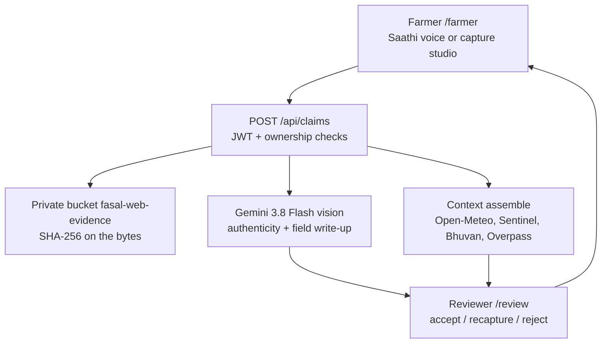

# Fasal-Pramaan (फसल प्रमाण)

<p align="center">
  <a href="https://github.com/dhrrishitvdeka/Fasal-Pramaan/releases">
    
  </a>
  
  
  
  
  
</p>

<p align="center">
  <b>Capture. Verify. Protect.</b><br/>
  Open-source crop-damage evidence capture, geospatial cross-check, and PMFBY-style claim review — one Next.js app on Vercel + Supabase + Gemini.
</p>

---

## What it does

Farmers file a claim from a phone browser (voice or taps, 15 Indian languages). The camera checks framing and screen-replay **on the device**, then the server stores stills in a **private** bucket, runs Gemini vision, and pulls weather / satellite context. A reviewer decides. Nothing auto-pays.


```mermaid
flowchart TD
    A["Farmer /farmer<br/>Saathi voice or capture studio"] --> B["POST /api/claims<br/>JWT + ownership checks"]
    B --> C["Private bucket fasal-web-evidence<br/>SHA-256 on the bytes"]
    B --> D["Gemini 3.8 Flash vision<br/>authenticity + field write-up"]
    B --> E["Context assemble<br/>Open-Meteo, Sentinel, Bhuvan, Overpass"]
    D --> F["Reviewer /review<br/>accept / recapture / reject"]
    E --> F
    F --> A
```

| Portal | Who | Entry |
| :--- | :--- | :--- |
| Farmer | Any confirmed Auth user **not** on `REVIEWER_EMAILS` | `/farmer` |
| Reviewer | Confirmed Auth email listed in `REVIEWER_EMAILS`, or `app_metadata.roles` | `/review` |
| Admin | `app_metadata.roles` includes `administrator` | `/admin`, `/audit` |

There are **no published demo passwords**. Create users in the Supabase Auth dashboard and put reviewer addresses in `REVIEWER_EMAILS`.

---

## Stack (what is actually running)

| Layer | Live path |
| :--- | :--- |
| App | Next.js 16 App Router in `apps/dashboard` (React 19, Tailwind, Vitest) |
| Auth | Supabase Auth, httpOnly cookies, `requireWebActor` on evidence APIs |
| Data | Postgres tables `web_plots`, `web_claims`, `web_claim_images`, `web_milestones`, `web_review_actions`, `web_profiles` — RLS on, **no** anon/authenticated policies |
| Storage | Private bucket `fasal-web-evidence` (JPEG/PNG/WebP, 15 MB). Uploads only via the service role |
| Vision | On-device worker heuristics + Gemini `gemini-3.8-flash` (fallbacks 3.7 → 3.5 → 2.5) |
| Voice | Gemini Live `gemini-3.1-flash-live-preview`, audio only |
| Context | Open-Meteo (no key). Optional Copernicus Process API (`SENTINEL_TOKEN`) for fire NDVI, flood NDWI, drought NDVI. Bhuvan WMS probe. Overpass wildlife/nearby |
| Host | Vercel, region `bom1`. Root Directory = `apps/dashboard` |

Retired: Hugging Face Space, `/submissions`, `/review/queue`, `NEXT_PUBLIC_API_BASE_URL`.

Honest limits: the PWA opens the farmer shell offline; **it does not queue captures**. GPS is recorded, not proven hardware-only. `/privacy` and `/terms` are operational summaries.

---

## Local setup

**Need:** Node.js 22, npm, a Supabase project, a Gemini API key.

```bash
git clone https://github.com/dhrrishitvdeka/Fasal-Pramaan.git
cd Fasal-Pramaan/apps/dashboard
npm ci
cp .env.example .env.local
```

Minimum `.env.local`:

```env
NEXT_PUBLIC_SUPABASE_URL=https://YOUR_PROJECT.supabase.co
NEXT_PUBLIC_SUPABASE_PUBLISHABLE_KEY=your_publishable_or_anon_key
SUPABASE_SERVICE_ROLE_KEY=your_service_role_key
GEMINI_API_KEY=your_gemini_key
REVIEWER_EMAILS=you-reviewer@your-domain.example
APP_ORIGIN=http://localhost:3000
```

Never prefix secrets with `NEXT_PUBLIC_`. Full list: [docs/environment-variables.md](docs/environment-variables.md).

### Supabase SQL (SQL editor, in order)

1. [`scripts/setup_supabase.sql`](scripts/setup_supabase.sql) — extensions + private evidence bucket  
2. [`scripts/setup_web_schema.sql`](scripts/setup_web_schema.sql) — `web_*` tables, RLS lockdown, storage policies, indexes  
3. If this project already existed and might be open to `anon`, run [`scripts/optimize_schema.sql`](scripts/optimize_schema.sql) after a dry look at [`scripts/audit_schema.sql`](scripts/audit_schema.sql)

Then in **Authentication → Users**, create at least one farmer and one reviewer. Turn **Confirm email** on. Put the reviewer address in `REVIEWER_EMAILS`.

```bash
npm run dev
```

Open `http://localhost:3000`. Sign in at `/login`. Farmers land on `/farmer`; reviewers on `/overview`.

### Checks

```bash
npm test          # Vitest (40 files)
npm run typecheck
npm run lint
npm run build
```

---

## Vercel

1. Import the GitHub repo. **Root Directory** = `apps/dashboard`.  
2. Set the same env names as `.env.example`, including `APP_ORIGIN=https://YOUR_DOMAIN`.  
3. Optional: `SITE_LOCK_PASSWORD` for a shared gate on preview URLs; `SENTINEL_TOKEN` for live Sentinel rasters.  
4. Pro plan if Gemini routes need `maxDuration: 60` (Hobby caps ~10s).  
5. Redeploy after saving env.

Walkthrough: [docs/deployment.md](docs/deployment.md).

---

## Docs

| Doc | Contents |
| :--- | :--- |
| [GETTING_STARTED.md](GETTING_STARTED.md) | Longer local + Docker notes |
| [docs/architecture.md](docs/architecture.md) | Topology, claim state, peril routing |
| [docs/api.md](docs/api.md) | Route contracts |
| [docs/evidence-evaluation.md](docs/evidence-evaluation.md) | 4-pillar score |
| [docs/security.md](docs/security.md) | Auth, RLS, cookies |
| [docs/environment-variables.md](docs/environment-variables.md) | Env names |
| [SECURITY.md](SECURITY.md) | How to report a vulnerability |

---

## License

[MIT](LICENSE).
