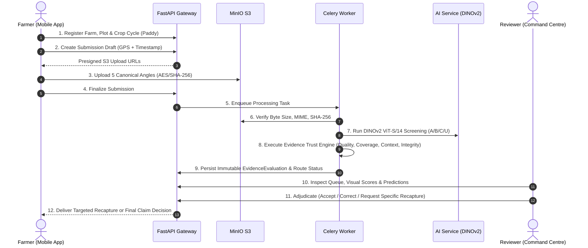

# Fasal-Pramaan (फसल प्रमाण)

<p align="center">
  
  
  
  
  
  
  
</p>

---

## Executive Summary

**Fasal-Pramaan (*फसल प्रमाण* — Capture. Verify. Protect.)** is an open-source, enterprise-grade agricultural evidence capture, trust evaluation, and verification platform designed for agricultural insurance claim adjudication, disaster loss assessment, and crop monitoring programs.

The system addresses the fundamental trust deficit in rural crop insurance by pairing **cryptographically verified multi-angle field evidence capture** with an explainable **Evidence Confidence & Trust Evaluation Engine**, an on-device/local **Vision Transformer (DINOv2 ViT-S/14) Screening Model**, and a **Human-in-the-Loop Reviewer Command Centre**.

```
                           FASAL-PRAMAAN ARCHITECTURE
 ┌─────────────────────────────────────────────────────────────────────────────┐
 │                            EXPERIENCE LAYER                                 │
 │  ┌─────────────────────────────────────┐  ┌──────────────────────────────┐  │
 │  │      Farmer / Field Officer App     │  │   Reviewer Command Centre    │  │
 │  │ (Flutter Mobile + Offline Resilient)│  │   (Next.js 14 + GIS/Metrics) │  │
 │  └──────────────────┬──────────────────┘  └──────────────┬───────────────┘  │
 └─────────────────────┼────────────────────────────────────┼──────────────────┘
                       │ HTTPS / Signed S3                  │ REST / SSE
 ┌─────────────────────▼────────────────────────────────────▼──────────────────┐
 │                            APPLICATION LAYER                                │
 │  ┌───────────────────────────────────────────────────────────────────────┐  │
 │  │                       FastAPI Core API Gateway                        │  │
 │  │   (Auth, RBAC, Spatial Jurisdiction, Evidence Lifecycle & Routing)    │  │
 │  └──────────────────┬──────────────────────────────┬─────────────────────┘  │
 │                     │ Enqueue                      │ X-Service-Token        │
 │  ┌──────────────────▼──────────┐         ┌─────────▼─────────────────────┐  │
 │  │   Celery Async Worker Pool  │         │   Local Assistive AI Service  │  │
 │  │ (Evidence Eval Engine v1)   │         │ (DINOv2 ViT-S/14 ONNX Engine) │  │
 │  └─────────────────────────────┘         └───────────────────────────────┘  │
 └─────────────────────────────────────────────────────────────────────────────┘
 ┌─────────────────────────────────────────────────────────────────────────────┐
 │                               DATA LAYER                                    │
 │  ┌────────────────────────┐  ┌────────────────────┐  ┌───────────────────┐  │
 │  │  PostgreSQL + PostGIS  │  │   Redis 7 Cluster  │  │  MinIO S3 Store   │  │
 │  │ (Spatial Data & Audit) │  │(Broker & Rate-Lim) │  │(Immutable Evidence│  │
 │  └────────────────────────┘  └────────────────────┘  └───────────────────┘  │
 └─────────────────────────────────────────────────────────────────────────────┘
```

---

## Key Pillars & Innovations

### 1. Multi-Angle Guided Evidence Capture
Fasal-Pramaan replaces arbitrary single-photo claims with a standardized **5-Angle Spatial Protocol**:
1. `wide_field`: Macro landscape showing field boundaries, topography, and entire crop stand.
2. `left_context`: Peripheral view from the left flank capturing surrounding vegetation health.
3. `mid_canopy`: Eye-level canopy view showing plant density, spacing, and foliage structure.
4. `right_context`: Peripheral view from the right flank completing 180° spatial context.
5. `closeup_damage`: High-resolution macro shot of symptomatic leaves, lesions, or pest damage.

### 2. Evidence Confidence & Trust Evaluation Engine
Rather than treating model probability as ground truth, the platform computes an independent, deterministic **Evidence Confidence Score** ($0 - 100$):

$$\text{Final Confidence} = 0.4 \times \text{Quality} + 0.3 \times \text{Coverage} + 0.2 \times \text{Context} + 0.1 \times \text{Integrity}$$

- **Threshold for Evidence Sufficiency**: $\ge 85.0$. Cases below 85 automatically trigger uncertainty classification and targeted remediation.
- **Deterministic Uncertainty Priority**:
  $$\text{Integrity} \longrightarrow \text{Coverage} \longrightarrow \text{Visual Quality} \longrightarrow \text{Context}$$
- **Zero False-Accept Policy**: Integrity anomalies (duplicate hashes, mock GPS, byte mismatches) force mandatory human review and cannot be bypassed.

### 3. Adaptive Evidence Recapture Workflow
When evidence is incomplete or blurry, the system **does not force farmers to retake all 5 photos**. Instead, it generates targeted requests for *only* the specific missing or defective angles (e.g., retake only `closeup_damage` due to motion blur). 
- Maintains an **immutable historical audit trail** of every evaluation snapshot.
- Tracks exact **Confidence Delta ($\Delta C = C_{\text{new}} - C_{\text{prev}}$)** upon re-evaluation.

### 4. Fully Local, Assistive DINOv2 Vision Transformer
- **Zero Cloud Dependence**: Shipped with a baked 87 MB ONNX export of DINOv2 ViT-S/14 fine-tuned on maize, paddy, potato, and wheat.
- **Calibrated $A/B/C/U$ Screening**:
  - `A`: Confident healthy crop stand.
  - `B`: Borderline / uncertain signal requiring human inspection.
  - `C`: Confident disease or damage pattern.
  - `U`: Unusable, unsupported crop, or out-of-domain evidence.
- **Model vs. Evidence Independence**: Model predictions never overwrite evidence confidence scores or approve financial claims automatically.

### 5. Offline-First Mobile Resilience
- **Cryptographic Local Storage**: AES-GCM encrypted local SQLite storage ensures evidence captured in remote areas without connectivity is safe and tamper-resistant.
- **Idempotent Background Synchronization**: Resumable multi-part upload pipeline with automatic retry backoff and deterministic idempotency keys.

### 6. Fasal Saathi: Spoken AI Assistant (Gemini Live)
- Full-duplex voice assistance in **Hindi** and **English** for hands-free field operations.
- Server-mediated ephemeral session token architecture with strict human confirmation gates before state mutations (syncing queue, finalizing submissions).

---

## System Portals & Access Points

| Component | Endpoint / URL | Default Demo Credentials | Purpose |
|---|---|---|---|
| **Farmer Field App** | `http://localhost:8085` | `farmer@fasalpramaan.local` / `Demo@12345` | Farm registration, guided 5-angle capture, offline sync, status tracking |
| **Field Officer Portal** | `http://localhost:8085` | `officer@fasalpramaan.local` / `Demo@12345` | Jurisdiction-scoped assisted capture and field validation |
| **Reviewer Command Centre** | `http://localhost:3000` | `reviewer@fasalpramaan.local` / `Demo@12345` | Review queue, GIS mapping, evidence score breakdown, adjudication |
| **System Administrator** | `http://localhost:3000` | `admin@fasalpramaan.local` / `Demo@12345` | User administration, audit log inspection, system health metrics |
| **FastAPI Gateway & Docs** | `http://localhost:8000/docs` | Bearer Token Authentication | Interactive OpenAPI documentation and REST contract |
| **Local AI Service** | `http://localhost:8001/health` | `X-Service-Token` Header | Vision Transformer inference health and model metadata |
| **MinIO S3 Evidence Console** | `http://localhost:9001` | `minioadmin` / `minioadmin_dev_only` | S3-compatible private object storage console |

---

## Layout: Vercel webapp vs local Docker

| Location | What it is |
|---|---|
| `apps/dashboard` | Farmer + reviewer Next.js app. This is what Vercel builds. |
| `vercel.json` | Tells Vercel to install/build `apps/dashboard`. |
| `local/` | Laptop Docker stack helpers (`local/start.ps1`). Secrets in `local/.env` (gitignored). |
| `.env` | Gitignored root env for Compose. Same secrets as `local/.env`. |

Vercel project: connect this GitHub repo. Framework Next.js. Env vars listed below. Root can stay the repository root — `vercel.json` points the build at `apps/dashboard`.

## Vercel farmer → Hugging Face → reviewer

The laptop Docker stack is unchanged (`docker compose up`). The Next.js app in `apps/dashboard` can also be hosted on Vercel:

1. Apply `scripts/setup_supabase.sql` and `scripts/setup_web_schema.sql` on your Supabase project.
2. Set `NEXT_PUBLIC_SUPABASE_URL`, `NEXT_PUBLIC_SUPABASE_PUBLISHABLE_KEY`, `SUPABASE_SERVICE_ROLE_KEY`, `HF_TOKEN`, and `NEXT_PUBLIC_HF_MODEL_ID` (default `wambugu71/crop_leaf_diseases_vit`) in Vercel. Never commit those values.
3. Farmer captures or uploads photos at `/farmer/capture`. The server route `POST /api/claims` stores the image in the private `fasal-web-evidence` bucket, calls the Hugging Face model, and writes `web_claims`.
4. The same claim id appears on `/review` with the stored photos and HF label/score.

There is no showcase/pseudo fallback on these routes.

## Quickstart Guide

### Prerequisites
- Docker Engine 24.0+ and Docker Compose v2.0+
- 8 GB RAM and 12 GB free disk space (base images and dependencies)
- Git (for repository cloning)

### 1. Launch with One Command

#### Windows (PowerShell)
```powershell
git clone https://github.com/dhrrishitvdeka/Fasal-Pramaan.git
cd Fasal-Pramaan
Copy-Item .env.example .env
powershell -ExecutionPolicy Bypass -File .\scripts\start-portable.ps1
```

#### Linux / macOS (Bash)
```bash
git clone https://github.com/dhrrishitvdeka/Fasal-Pramaan.git
cd Fasal-Pramaan
cp .env.example .env
sh scripts/start-portable.sh
```

*Or standard Docker Compose:*
```bash
docker compose up -d --build
```

### 2. Verify System Health

```bash
# Verify API Gateway
curl http://localhost:8000/health

# Verify AI Service
curl http://localhost:8001/health

# Verify Web Portals
curl -I http://localhost:3000
curl -I http://localhost:8085/healthz
```

Expected AI Health Output:
```json
{
  "status": "healthy",
  "default_adapter": "crop_health_v4",
  "crop_health_v4_model": true,
  "inference_ready": true
}
```

---

## End-to-End Workflow Demonstration


```mermaid
sequenceDiagram
  autonumber
  actor Farmer as Farmer (Mobile App)
  participant API as FastAPI Gateway
  participant S3 as MinIO S3
  participant Worker as Celery Worker
  participant AI as AI Service (DINOv2)
  actor Reviewer as Reviewer (Command Centre)

  Farmer->>API: 1. Register Farm, Plot & Crop Cycle (Paddy)
  Farmer->>API: 2. Create Submission Draft (GPS + Timestamp)
  API-->>Farmer: Presigned S3 Upload URLs
  Farmer->>S3: 3. Upload 5 Canonical Angles (AES/SHA-256)
  Farmer->>API: 4. Finalize Submission
  API->>Worker: 5. Enqueue Processing Task
  Worker->>S3: 6. Verify Byte Size, MIME, SHA-256
  Worker->>AI: 7. Run DINOv2 ViT-S/14 Screening (A/B/C/U)
  Worker->>Worker: 8. Execute Evidence Trust Engine (Quality, Coverage, Context, Integrity)
  Worker->>API: 9. Persist Immutable EvidenceEvaluation & Route Status
  Reviewer->>API: 10. Inspect Queue, Visual Scores & Predictions
  Reviewer->>API: 11. Adjudicate (Accept / Correct / Request Specific Recapture)
  API-->>Farmer: 12. Deliver Targeted Recapture or Final Claim Decision
```

For complete step-by-step walkthrough instructions, see [docs/demo-walkthrough.md](docs/demo-walkthrough.md).

---

## Repository Structure

```text
├── apps/
│   ├── dashboard/            # Next.js 14 Reviewer Command Centre (TypeScript, Tailwind, React Query)
│   └── mobile/               # Flutter Multi-Platform App (Offline DB, Camera, Voice Bridge)
├── services/
│   ├── api/                  # FastAPI REST Gateway, Celery Worker, PostgreSQL Models, Alembic
│   │   ├── alembic/          # Database Schema Migrations
│   │   ├── app/              # Core Routing, Services, Schemas & Security Engine
│   │   └── scripts/          # Database Seeders, E2E Verifiers, Reset Utilities
│   └── ai/                   # Vision Transformer Inference Service (DINOv2 ViT-S/14 ONNX)
│       ├── models/           # Pre-baked ONNX Model Artifacts & Label Mappings
│       └── research/         # Research manifests, validation reports & benchmarks
├── docs/                     # Full Technical Specifications, Architecture & API Documentation
├── scripts/                  # Portable Launchers, Diagnostic Probes & Bundle Builders
└── docker-compose.yml        # Multi-Container Orchestration Definition
```

---

## Documentation Directory

| Document | Description |
|---|---|
| [**GETTING_STARTED.md**](GETTING_STARTED.md) | First-time setup, environment configuration, and local launch instructions |
| [**RUN_GUIDE.md**](RUN_GUIDE.md) | Day-to-day operations, LAN exhibition setup, testing, and troubleshooting |
| [**docs/architecture.md**](docs/architecture.md) | Comprehensive system architecture, boundary models, and component contracts |
| [**docs/evidence-evaluation.md**](docs/evidence-evaluation.md) | Mathematical specification of the 4-component Evidence Trust Engine |
| [**docs/adaptive-recapture.md**](docs/adaptive-recapture.md) | Targeted evidence recapture protocol, UX flows, and confidence delta calculations |
| [**docs/api.md**](docs/api.md) | Complete OpenAPI endpoint catalog, request/response models, and schemas |
| [**docs/ai-service.md**](docs/ai-service.md) | Vision Transformer architecture, $A/B/C/U$ screening taxonomy, and inference pipeline |
| [**docs/AI_MODEL_MVP.md**](docs/AI_MODEL_MVP.md) | Model card, benchmark evaluation metrics (Macro-F1, ECE), and dataset provenance |
| [**docs/offline-sync.md**](docs/offline-sync.md) | Cryptographic offline queue, sync protocol, and conflict resolution |
| [**docs/security.md**](docs/security.md) | Defense-in-depth security architecture, RBAC, and anti-tamper controls |
| [**docs/production-readiness.md**](docs/production-readiness.md) | Production architecture, hardening specifications, and deployment matrix |
| [**docs/governance-and-safety.md**](docs/governance-and-safety.md) | Ethical AI boundaries, human-in-the-loop guarantees, and risk controls |
| [**docs/VOICE_ASSISTANT_DEMO.md**](docs/VOICE_ASSISTANT_DEMO.md) | Fasal Saathi Gemini Live full-duplex voice assistant architecture and demo script |
| [**docs/EVIDENCE_REMINDERS.md**](docs/EVIDENCE_REMINDERS.md) | Recurring evidence schedules and background notification engine |
| [**docs/deployment.md**](docs/deployment.md) | Local, LAN, and enterprise cloud deployment topologies |
| [**docs/environment-variables.md**](docs/environment-variables.md) | Environment configuration reference guide |

---

## Verification & Quality Assurance Suite

Run the full testing and static analysis suite:

```bash
# 1. API & Evidence Engine Tests
docker compose exec api pytest -v

# 2. AI Inference & Model Tests
docker compose exec ai pytest -v

# 3. Reviewer Dashboard Tests (Lint, Typecheck & Jest)
cd apps/dashboard
npm run lint
npm run typecheck
npm test

# 4. Mobile App Analysis & Unit Tests
docker build --target tester -t fasalpramaan-mobile-test apps/mobile

# 5. Full End-to-End Automated Pipeline Verification
powershell -ExecutionPolicy Bypass -Command "& .\scripts\verify-e2e.ps1 -ImagePaths @('wide.jpg','left.jpg','mid.jpg','right.jpg','close.jpg')"
```

---

## Core Contributors

<p align="left">
  <a href="https://github.com/dhrrishitvdeka">
    
  </a>
  <a href="https://github.com/parasdwivedi26">
    
  </a>
</p>

- **Dhrrishit V Deka** ([@dhrrishitvdeka](https://github.com/dhrrishitvdeka)) — Project Lead, Architecture & Core Systems
- **Paras Dwivedi** ([@parasdwivedi26](https://github.com/parasdwivedi26)) — Co-Author, Modeling & Evaluation

---

## License

This project is licensed under the **MIT License** — see the [LICENSE](LICENSE) file for details.  
Dataset provenance and model licensing declarations are cataloged in [services/ai/research/reports/LICENSE_REPORT.md](services/ai/research/reports/LICENSE_REPORT.md).
