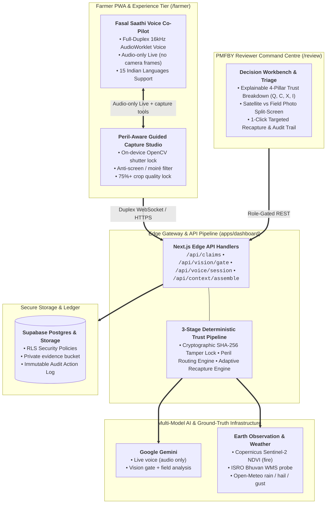

# Fasal-Pramaan (फसल प्रमाण)

  
  
  

  
  
  

  <b>Capture. Verify. Protect.</b> 
  An open-source, multimodal AI platform for agricultural crop damage assessment and transparent PMFBY insurance claims adjudication.

---

## Problem & Mission

Rural agricultural insurance programs like **PMFBY (Pradhan Mantri Fasal Bima Yojana)** face a critical trust deficit:
- **Paper & Bureaucratic Friction:** Smallholder farmers struggle with complex digital portals, language barriers, and non-intuitive cadastral lookups.
- **Subjective & Delayed Assessments:** Traditional loss appraisals rely on manual spot visits that take weeks or months to process.
- **Fraud & Verification Gaps:** Risk of digital screen spoofing, stock imagery, or non-field photos undermines insurance solvency.

**Fasal-Pramaan** bridges this divide by combining **on-device computer vision**, a **multimodal live conversational AI co-pilot (Fasal Saathi)**, **spaceborne satellite cross-checks (Copernicus Sentinel-2 & ISRO Bhuvan)**, and a **deterministic 3-stage trust evaluation engine** with a human-in-the-loop reviewer command centre.

---

## System Architecture

```mermaid
flowchart TB
  %% Client / Browser Tier
  subgraph T_CLIENT["Farmer PWA & Experience Tier (/farmer)"]
    direction TB
    F_SAATHI["<b>Fasal Saathi Voice Co-Pilot</b><br/>• Full-Duplex 16kHz AudioWorklet Voice<br/>• Audio-only Live (no camera frames)<br/>• 15 Indian Languages Support"]
    F_CAPTURE["<b>Peril-Aware Guided Capture Studio</b><br/>• On-device OpenCV shutter lock<br/>• Anti-screen / moiré filter<br/>• 75%+ crop quality lock"]
    F_SAATHI <== "Audio-only Live + capture tools" ==> F_CAPTURE
  end

  %% Gateway & Routing Tier
  subgraph T_GATEWAY["Edge Gateway & API Pipeline (apps/dashboard)"]
    direction TB
    API_ROUTES["<b>Next.js Edge API Handlers</b><br/><code>/api/claims</code> • <code>/api/vision/gate</code> • <code>/api/voice/session</code> • <code>/api/context/assemble</code>"]
    CORE_PIPELINE["<b>3-Stage Deterministic Trust Pipeline</b><br/>• Cryptographic SHA-256 Tamper Lock • Peril Routing Engine • Adaptive Recapture Engine"]
    API_ROUTES --- CORE_PIPELINE
  end

  %% Multi-Model AI & External Signals Tier
  subgraph T_SERVICES["Multi-Model AI & Ground-Truth Infrastructure"]
    direction LR
    S_GEMINI["<b>Google Gemini</b><br/>• Live voice (audio only)<br/>• Vision gate + field analysis"]
    S_SIGNALS["<b>Earth Observation & Weather</b><br/>• Copernicus Sentinel-2 NDVI (fire)<br/>• ISRO Bhuvan WMS probe<br/>• Open-Meteo rain / hail / gust"]
  end

  %% Reviewer Tier
  subgraph T_REVIEWER["PMFBY Reviewer Command Centre (/review)"]
    R_QUEUE["<b>Decision Workbench & Triage</b><br/>• Explainable 4-Pillar Trust Breakdown (Q, C, X, I)<br/>• Satellite vs Field Photo Split-Screen<br/>• 1-Click Targeted Recapture & Audit Trail"]
  end

  %% Persistence
  subgraph T_STORAGE["Secure Storage & Ledger"]
    S_SUPABASE[("<b>Supabase Postgres & Storage</b><br/>• RLS Security Policies<br/>• Private evidence bucket<br/>• Immutable Audit Action Log")]
  end

  %% Flow Connections
  T_CLIENT ==>|"Duplex WebSocket / HTTPS"| API_ROUTES
  T_REVIEWER ==>|"Role-Gated REST"| API_ROUTES
  CORE_PIPELINE ==> S_GEMINI
  CORE_PIPELINE ==> S_SIGNALS
  API_ROUTES ==> T_STORAGE
```

---

## Core Innovations

### 1. Fasal Saathi (फसल साथी) v3.0 — Spoken Multimodal Co-Pilot
- **Hands-Free AudioWorklet Pipeline:** Samples audio off the main thread via `AudioWorkletNode`, downsamples to 16 kHz PCM16 mono, and features acoustic half-duplex echo gating with instant barge-in support.
- **Audio-only Live voice:** Saathi talks over Gemini Live. The camera stays on-device; OpenCV guides framing. Gemini sees stills only when the farmer submits.
- **Proactive Opening Spoken Greeting:** Automatically welcomes the farmer aloud immediately upon connect (*"नमस्ते किसान भाई! मैं फसल साथी हूँ..."*).
- **Hierarchical Multi-Agent Tools:** Spoken plot registration (`register_plot`), GPS parcel geofencing (`check_plot_geofence`), 72-hour agro-weather radar (`fetch_agro_weather_alerts`), and plain-language AI audit explanations (`explain_claim_audit`).
- **15 Indian Languages:** Dynamic native translation across Hindi, Bengali, Tamil, Telugu, Marathi, Gujarati, Punjabi, Kannada, Malayalam, Odia, Assamese, and more.

### 2. Peril-Aware Capture Studio & Edge CV
- **Real-Time On-Device OpenCV:** Excess Green / GLI / Excess Red, Laplacian texture, skin rejection, and scanline/moiré screen detection at a few FPS in a Web Worker. No cloud model on the live viewfinder.
- **Anti-Screen & Anti-Spoofing Filter:** Detects digital display scanlines, pixel subgrids, and Moiré interference patterns ($0^\circ/90^\circ$ gradient ratio $> 0.80$) to reject monitor re-captures and fake images before upload.
- **Strict 75%+ Crop Quality Shutter Lock:** Disables the shutter button unless the live frame achieves $\ge 75\%$ crop match (relaxed to $\ge 40\%$ for charred fire burn scars).

### 3. 3-Stage Ground Truth Verification Pipeline
1. **Stage 1 — Gemini 3.8 Flash Vision Gate:** Evaluates submitted stills for authenticity and peril congruence, rejecting AI-generated images, screen displays, and mismatched crop species.
2. **Stage 2 — Gemini field analysis:** On the submitted stills, Gemini writes crop identity, visible damage, severity, authenticity (screen / AI / indoor), and a reviewer-readable rationale. Assistive only.
3. **Stage 3 — Earth Observation Cross-Check:** Fire claims can run Sentinel-2 NDVI burn-scar when a Copernicus token is set; weather is Open-Meteo (rain / hail / gust); Bhuvan is a WMS reachability probe.

### 4. PMFBY Reviewer Command Centre
- **Explainable 4-Pillar Trust Score:** Bounded mathematical formula ($C_{\text{final}} = 0.4 S_Q + 0.3 S_C + 0.2 S_X + 0.1 S_I$) evaluating Quality, Coverage, Context, and Integrity.
- **Satellite Cross-Check Split-Screen:** Direct comparison between the farmer's `wide_field` photo, ISRO Bhuvan cadastral boundaries, and Copernicus Browser imagery.
- **1-Click Targeted Adaptive Recapture:** Reviewers can request a re-take of only the 1 defective angle without invalidating the rest of the claim.

---

## Documentation Sitemap

Comprehensive architectural, mathematical, API, and deployment documentation is available in the [`docs/`](./docs) directory:

| Guide | Description |
| :--- | :--- |
| [**System Architecture**](./docs/architecture.md) | Full system topology, 8-step claim sequence, deterministic state machine, and spatial jurisdiction hierarchy. |
| [**Fasal Saathi Voice Co-Pilot**](./docs/VOICE_ASSISTANT_DEMO.md) | AudioWorklet protocol, audio-only Live, prompt structure, and spoken command reference. |
| [**Evidence Trust Engine**](./docs/evidence-evaluation.md) | Mathematical formulation ($C_{\text{final}}$), 4-pillar sub-scores, hard rejection rules, and anti-screen algorithms. |
| [**Adaptive Recapture Engine**](./docs/adaptive-recapture.md) | Per-peril confidence thresholds ($T$), automated recapture state machine, and reviewer triage logic. |
| [**REST & WebSocket API Reference**](./docs/api.md) | Complete endpoint schemas for `/api/claims`, `/api/vision/gate`, `/api/voice/session`, `/api/context/assemble`, etc. |
| [**Production Deployment Guide**](./docs/deployment.md) | Vercel + Supabase + Gemini (Root Directory = `apps/dashboard`). |
| [**Security & Governance**](./docs/governance-and-safety.md) | Cryptographic SHA-256 hashes, Row Level Security (RLS) policies, and ephemeral token lifecycle. |
| [**Demonstration Walkthrough**](./docs/demo-walkthrough.md) | Step-by-step presentation script for exhibitions, hackathons, and policy stakeholder reviews. |
| [**Environment Variables**](./docs/environment-variables.md) | Complete configuration matrix for production, preview, and local development. |

---

## Core Contributors

  &nbsp;&nbsp;&nbsp;
  &nbsp;&nbsp;&nbsp;
  &nbsp;&nbsp;&nbsp;
  

---

## License

This project is licensed under the **MIT License** — see the [LICENSE](LICENSE) file for details.
