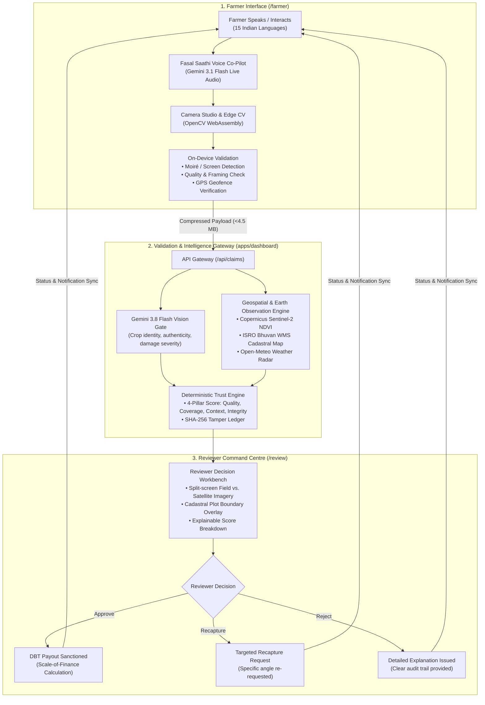
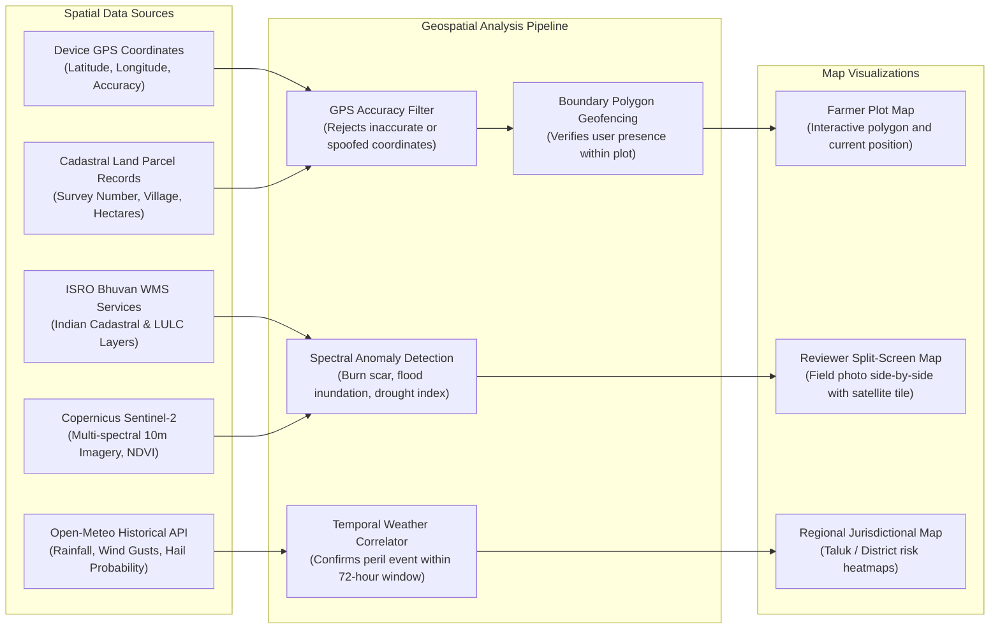
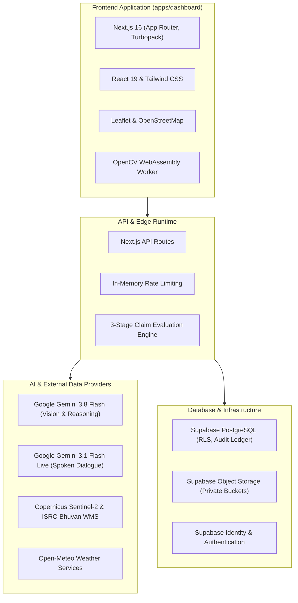

# Fasal-Pramaan (फसल प्रमाण)

<p align="center">
  <a href="https://github.com/dhrrishitvdeka/Fasal-Pramaan/releases">
    
  </a>
  
  
  
  
  
</p>

<p align="center">
  <b>Capture. Verify. Protect.</b><br/>
  An open-source multimodal platform for agricultural crop damage assessment, geospatial ground-truth validation, and transparent PMFBY insurance claims adjudication.
</p>

---

## Overview

Agricultural insurance programs such as the **Pradhan Mantri Fasal Bima Yojana (PMFBY)** protect hundreds of millions of smallholder farmers against weather calamities, pest outbreaks, and natural disasters. However, existing claim adjudication processes face structural challenges:

- **Friction for Farmers:** Complex paperwork, digital literacy barriers, and portal interfaces that lack native language support make filing claims difficult.
- **Prolonged Adjudication Cycles:** Physical spot visits by field adjusters can take weeks or months to schedule and complete.
- **Verification Gaps & Fraud Exposure:** Digital submissions can be susceptible to stock photos, repeated images, or photographs taken off digital screens.
- **Opaque Decisions:** Farmers rarely receive clear explanations for claim denials or partial settlements, leading to distrust.

**Fasal-Pramaan** addresses these challenges by introducing a transparent, technology-driven workflow:
1. **Conversational Voice Assistant:** Farmers can register plots and submit claims using spoken dialogue across 15 Indian languages.
2. **On-Device Edge Vision:** The camera viewfinder inspects image clarity, framing, and screen moire patterns directly inside the browser before an upload occurs.
3. **Geospatial & Satellite Cross-Checks:** Claims are automatically correlated against satellite vegetation indices (Copernicus Sentinel-2), cadastral maps (ISRO Bhuvan), and localized meteorological records (Open-Meteo).
4. **Human-in-the-Loop Reviewer Workspace:** Insurance officers review claims with split-screen satellite comparison, explainable 4-pillar trust scoring, and direct DBT sanctioning.

---

## End-to-End System Workflow


```mermaid
flowchart TD
    subgraph S1["1. Farmer Interface (/farmer)"]
        A["Farmer Speaks / Interacts<br/>(15 Indian Languages)"] --> B["Fasal Saathi Voice Co-Pilot<br/>(Gemini 3.1 Flash Live Audio)"]
        B --> C["Camera Studio & Edge CV<br/>(OpenCV WebAssembly)"]
        C --> D["On-Device Validation<br/>• Moiré / Screen Detection<br/>• Quality & Framing Check<br/>• GPS Geofence Verification"]
    end

    subgraph S2["2. Validation & Intelligence Gateway (apps/dashboard)"]
        D -->|"Compressed Payload (<4.5 MB)"| E["API Gateway (/api/claims)"]
        E --> F["Gemini 3.8 Flash Vision Gate<br/>(Crop identity, authenticity, damage severity)"]
        E --> G["Geospatial & Earth Observation Engine<br/>• Copernicus Sentinel-2 NDVI<br/>• ISRO Bhuvan WMS Cadastral Map<br/>• Open-Meteo Weather Radar"]
        F & G --> H["Deterministic Trust Engine<br/>• 4-Pillar Score: Quality, Coverage, Context, Integrity<br/>• SHA-256 Tamper Ledger"]
    end

    subgraph S3["3. Reviewer Command Centre (/review)"]
        H --> I["Reviewer Decision Workbench<br/>• Split-screen Field vs. Satellite Imagery<br/>• Cadastral Plot Boundary Overlay<br/>• Explainable Score Breakdown"]
        I --> J{"Reviewer Decision"}
        J -->|"Approve"| K["DBT Payout Sanctioned<br/>(Scale-of-Finance Calculation)"]
        J -->|"Recapture"| L["Targeted Recapture Request<br/>(Specific angle re-requested)"]
        J -->|"Reject"| M["Detailed Explanation Issued<br/>(Clear audit trail provided)"]
    end

    K & L & M -->|"Status & Notification Sync"| A
```

---

## Geospatial and Mapping Capabilities

Fasal-Pramaan embeds spatial awareness into every stage of a claim's lifecycle, ensuring that claims correspond to actual physical locations and verifiable environmental conditions.


```mermaid
flowchart LR
    subgraph GeoInputs["Spatial Data Sources"]
        G1["Device GPS Coordinates<br/>(Latitude, Longitude, Accuracy)"]
        G2["Cadastral Land Parcel Records<br/>(Survey Number, Village, Hectares)"]
        G3["ISRO Bhuvan WMS Services<br/>(Indian Cadastral & LULC Layers)"]
        G4["Copernicus Sentinel-2<br/>(Multi-spectral 10m Imagery, NDVI)"]
        G5["Open-Meteo Historical API<br/>(Rainfall, Wind Gusts, Hail Probability)"]
    end

    subgraph GeoProcessing["Geospatial Analysis Pipeline"]
        P1["GPS Accuracy Filter<br/>(Rejects inaccurate or spoofed coordinates)"]
        P2["Boundary Polygon Geofencing<br/>(Verifies user presence within plot)"]
        P3["Spectral Anomaly Detection<br/>(Burn scar, flood inundation, drought index)"]
        P4["Temporal Weather Correlator<br/>(Confirms peril event within 72-hour window)"]
    end

    subgraph GeoOutputs["Map Visualizations"]
        V1["Farmer Plot Map<br/>(Interactive polygon and current position)"]
        V2["Reviewer Split-Screen Map<br/>(Field photo side-by-side with satellite tile)"]
        V3["Regional Jurisdictional Map<br/>(Taluk / District risk heatmaps)"]
    end

    G1 & G2 --> P1 --> P2 --> V1
    G3 & G4 --> P3 --> V2
    G5 --> P4 --> V3
```

### 1. GPS Parcel Geofencing
- During photo capture, device GPS coordinates are validated against registered parcel polygon coordinates.
- Submissions taken more than 100 meters away from plot boundaries or with GPS accuracy degradation (>100m) trigger automated warnings to prevent off-site reporting.
- Coordinates undergo boundary validation to reject placeholder coordinates (such as `0,0`) and out-of-bounds inputs.

### 2. Interactive Map View (`/map`)
- Built using Leaflet and OpenStreetMap, with options for satellite layer overlays.
- Displays registered farmland parcels, crop boundaries, area calculations in hectares, and historical peril activity markers.

### 3. Satellite Ground-Truth Comparison
- **ISRO Bhuvan WMS:** Connects to Indian space research mapping services for cadastral and land-use context.
- **Copernicus Sentinel-2:** In fire, flood, or drought claims, the system fetches near-real-time Normalized Difference Vegetation Index (NDVI) tiles to confirm large-scale crop biomass reduction.

### 4. Localized Weather Correlation
- Integrates with Open-Meteo weather models to pull precipitation, hail likelihood, and maximum wind gusts during the reported loss timeframe.
- If a farmer files a flood or storm claim, the system automatically checks whether localized rainfall exceeded threshold levels during the event window.

---

## User Experiences

### 1. The Farmer Portal (`/farmer`)

Designed for accessibility on basic mobile browsers and rural network connections:

| Capability | Technical Implementation | Purpose |
| :--- | :--- | :--- |
| **Fasal Saathi Voice Assistant** | AudioWorklet, 16 kHz PCM streaming, Gemini 3.1 Flash Live | Enables hands-free claim filing, parcel lookup, and status checks in 15 native Indian languages. |
| **Peril-Aware Camera Studio** | OpenCV WebAssembly in a Web Worker | Provides real-time guidance (framing, lighting, blur detection) without consuming cloud bandwidth. |
| **Anti-Screen / Anti-Spoofing Filter** | 2D gradient ratio analysis for Moiré patterns | Rejects attempts to submit photos of computer monitors or printed photographs. |
| **Offline Queue & Resilient Upload** | IndexedDB storage with automatic retry | Caches captured photos locally if cellular connection drops; uploads automatically upon reconnection. |
| **Client-Side Image Optimization** | HTML5 Canvas bicubic downscaling (max 1600px, 0.82 JPEG) | Compresses multi-photo submissions to under 2 MB, staying safely within serverless limits. |

### 2. The Reviewer Command Centre (`/review`)

Designed for PMFBY insurance adjusters and agricultural officers:

| Capability | Technical Implementation | Purpose |
| :--- | :--- | :--- |
| **Split-Screen Evidence Desk** | Responsive CSS Grid with synchronized zoom | Allows side-by-side visual comparison between field photos and satellite Earth observation imagery. |
| **Explainable 4-Pillar Trust Score** | $C_{\text{final}} = 0.4 S_Q + 0.3 S_C + 0.2 S_X + 0.1 S_I$ | Breaks down confidence across Image Quality ($S_Q$), Crop Coverage ($S_C$), Context & Weather ($S_X$), and Integrity ($S_I$). |
| **Targeted Recapture Requests** | Granular state machine tracking per photo angle | Lets reviewers request a retake of a single deficient photo without forcing the farmer to restart the entire claim. |
| **Direct Bank Sanction (DBT)** | PMFBY Scale-of-Finance loss calculation engine | Computes recommended compensation based on affected acreage, crop type, and verified damage percentage. |

---

## Technology Stack


```mermaid
flowchart TB
    subgraph Frontend["Frontend Application (apps/dashboard)"]
        direction LR
        FE_NEXT["Next.js 16 (App Router, Turbopack)"]
        FE_REACT["React 19 & Tailwind CSS"]
        FE_MAP["Leaflet & OpenStreetMap"]
        FE_WORKER["OpenCV WebAssembly Worker"]
    end

    subgraph Backend["API & Edge Runtime"]
        direction LR
        BE_ROUTE["Next.js API Routes"]
        BE_LIMIT["In-Memory Rate Limiting"]
        BE_PIPE["3-Stage Claim Evaluation Engine"]
    end

    subgraph Intelligence["AI & External Data Providers"]
        direction LR
        AI_VIS["Google Gemini 3.8 Flash (Vision & Reasoning)"]
        AI_VOICE["Google Gemini 3.1 Flash Live (Spoken Dialogue)"]
        EXT_SAT["Copernicus Sentinel-2 & ISRO Bhuvan WMS"]
        EXT_METEO["Open-Meteo Weather Services"]
    end

    subgraph Storage["Database & Infrastructure"]
        direction LR
        DB_POSTGRES["Supabase PostgreSQL (RLS, Audit Ledger)"]
        DB_STORAGE["Supabase Object Storage (Private Buckets)"]
        DB_AUTH["Supabase Identity & Authentication"]
    end

    Frontend --> Backend
    Backend --> Intelligence
    Backend --> Storage
```

| Layer | Technologies Used |
| :--- | :--- |
| **Application Framework** | Next.js 16 (App Router, Turbopack), React 19, TypeScript 5.8 |
| **Styling & Components** | Tailwind CSS, Radix UI primitives |
| **AI Models** | Google Gemini 3.8 Flash (Vision, Damage Grading), Gemini 3.1 Flash Live (Bidirectional Audio) |
| **Client-Side Computer Vision** | OpenCV.js (WebAssembly), Custom Moiré Pattern Detection, GLI Vegetative Index |
| **Mapping & Geospatial** | Leaflet, OpenStreetMap tiles, ISRO Bhuvan WMS services, GeoJSON parcel geometry |
| **External Signals** | Copernicus Sentinel-2 NDVI data, Open-Meteo Historical Weather API |
| **Database & Identity** | Supabase (PostgreSQL 15+, Row Level Security, S3-compatible Object Storage, GoTrue Auth) |
| **Hosting & Deployment** | Vercel (Edge Functions, Serverless APIs), Supabase Cloud |

---

## Repository Structure

```text
Fasal-Pramaan/
├── README.md                      # Primary project overview and documentation
├── GETTING_STARTED.md             # Detailed developer onboarding guide
├── docs/                          # Comprehensive engineering specifications
│   ├── api.md                     # REST and WebSocket endpoint specifications
│   ├── architecture.md            # System topology and sequence diagrams
│   ├── deployment.md              # Production deployment instructions
│   ├── evidence-evaluation.md     # Trust score mathematical formulations
│   ├── security.md                # Security controls and data privacy policies
│   └── ...
└── apps/
    └── dashboard/                 # Next.js 16 core web application
        ├── src/
        │   ├── app/               # App Router pages and API route handlers
        │   │   ├── api/           # Endpoints: claims, vision gate, voice session
        │   │   ├── farmer/        # Farmer dashboard, capture studio, and Saathi
        │   │   ├── review/        # Reviewer triage queue and decision workbench
        │   │   ├── map/           # Geospatial parcel and satellite visualizer
        │   │   └── login/         # Supabase-authenticated entry portal
        │   ├── components/        # Reusable UI components (MapView, Camera, Banners)
        │   ├── lib/               # Business logic, pipeline stages, Supabase store
        │   └── types/             # Strict TypeScript domain models
        ├── __tests__/             # Vitest test suites (37 test files, 309 tests)
        └── package.json           # Dependencies and build scripts
```

---

## Getting Started

### Prerequisites
- **Node.js**: v20.x or higher
- **npm**: v10.x or higher
- **Supabase Account**: A Supabase project with database migrations applied
- **Google Gemini API Key**: Access to Gemini 3 family models

### Local Development Setup

1. **Clone the repository:**
   ```bash
   git clone https://github.com/dhrrishitvdeka/Fasal-Pramaan.git
   cd Fasal-Pramaan/apps/dashboard
   ```

2. **Install dependencies:**
   ```bash
   npm install
   ```

3. **Configure environment variables:**
   Create a `.env.local` file in `apps/dashboard/`:
   ```bash
   cp .env.example .env.local
   ```
   Fill in your required credentials:
   ```env
   NEXT_PUBLIC_SUPABASE_URL=https://your-project.supabase.co
   NEXT_PUBLIC_SUPABASE_ANON_KEY=your-supabase-anon-key
   SUPABASE_SERVICE_ROLE_KEY=your-supabase-service-role-key
   GEMINI_API_KEY=your-gemini-api-key
   ```

4. **Start the local development server:**
   ```bash
   npm run dev
   ```
   Open `http://localhost:3000` in your browser.

### Test Credentials (Default Demo Users)

| Role | Email | Password | Intended Portal |
| :--- | :--- | :--- | :--- |
| **Farmer** | `farmer@fasalpramaan.com` | `Kisan@Pramaan2026!` | `/farmer` |
| **Reviewer** | `reviewer@fasalpramaan.com` | `Reviewer@Pramaan2026!` | `/review` |

---

## Verification and Quality Standards

The project maintains automated quality gates across all releases:

```bash
# Run unit and integration tests (37 suites, 309 tests)
npm test

# Run strict TypeScript type verification
npm run typecheck

# Run ESLint static code analysis
npm run lint

# Build production application bundle with Next.js Turbopack
npm run build
```

---

## Documentation Index

For technical deep dives and formal documentation, refer to the [`docs/`](./docs) directory:

- [System Architecture Specification](./docs/architecture.md): Topology, claim state machines, and lifecycle transitions.
- [REST & WebSocket API Reference](./docs/api.md): Parameter schemas, response models, and status codes.
- [Evidence Trust Engine](./docs/evidence-evaluation.md): Complete mathematical breakdown of the 4-pillar trust model.
- [Production Deployment Guide](./docs/deployment.md): Instructions for configuring Vercel and Supabase.
- [Security & Governance Policy](./docs/security.md): Cryptographic hashing, Row Level Security, and PII protection.
- [Demonstration Walkthrough Script](./docs/demo-walkthrough.md): Scripted guide for demonstrations and stakeholder presentations.

---

## License

This project is open source and licensed under the [MIT License](LICENSE).
