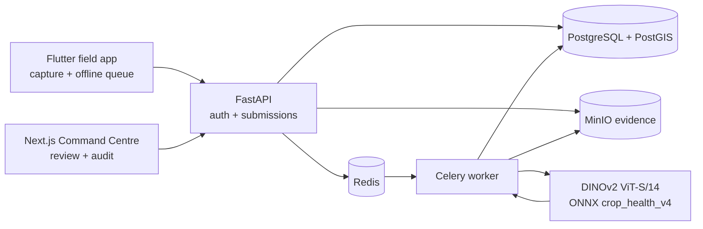
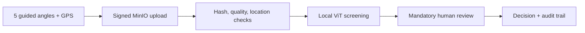

# FasalPramaan AI

Local-first crop evidence capture, assistive ViT screening, and human review.

FasalPramaan connects a Flutter farmer/field app, FastAPI, MinIO, Celery,
PostgreSQL/PostGIS, the local DINOv2 model, and a Next.js reviewer dashboard.
The complete local stack runs with Docker and does not download model
weights at runtime.

> AI results are assistive screening signals. They do not determine crop-loss
> severity, produce quality, claim eligibility, or insurance settlement.
> Human review is mandatory.

## What a clone includes

Everything needed for the local Docker stack is versioned in the repository:

| Included on clone | Notes |
|---|---|
| Flutter field app + Next.js dashboard | Built inside Docker images |
| FastAPI, Celery worker/beat, migrations, seed | Single API image reused by worker, beat, migrate, and seed |
| PostgreSQL/PostGIS, Redis, MinIO | Compose services; no host installs |
| DINOv2 ONNX model (`crop_health_v4`) | `services/ai/models/.../model.onnx` (~87 MB), no runtime download |
| Demo accounts + crop catalogs | Created by the `seed` job (no farms or submissions) |
| `.env.example` + start scripts | Copy once; launcher sets local URLs |

**Host requirements:** Docker Desktop or Docker Engine with Compose v2. Flutter,
Node.js, Python, PostgreSQL, Redis, and MinIO are not required on the host for
the containerized stack.

Recommended free disk for the first build: **~12 GB** (base images + Flutter
build stage + named volumes). Later starts reuse local image layers.

### Fresh clone on any machine

```bash
git clone https://github.com/dhrrishitvdeka/Fasal-Pramaan.git
cd Fasal-Pramaan
```

Windows:

```powershell
Copy-Item .env.example .env
powershell -ExecutionPolicy Bypass -File .\scripts\start-portable.ps1
```

macOS/Linux:

```bash
cp .env.example .env
sh scripts/start-portable.sh
```

Or use Docker Compose directly:

```bash
docker compose up -d --build
```

The first build downloads base images and the Flutter SDK used only while
building the field-app image. The selected ONNX model is already in the clone.

Release tags with the same pack: [`V1.1`](https://github.com/dhrrishitvdeka/Fasal-Pramaan/releases/tag/V1.1)
(Fasal Saathi voice assistant) and [`V1`](https://github.com/dhrrishitvdeka/Fasal-Pramaan/releases/tag/V1).

If the tree is already checked out locally, skip `git clone` and run the
Windows / macOS / Linux start commands from the repo root.

## Open the apps

| Surface | URL | Demo account |
|---|---|---|
| Farmer/field app | `http://localhost:8085` | `farmer@fasalpramaan.local` / `Demo@12345` |
| Reviewer Command Centre | `http://localhost:3000` | `reviewer@fasalpramaan.local` / `Demo@12345` |
| API health/docs | `http://localhost:8000/health`, `/docs` | — |
| AI health | `http://localhost:8001/health` | — |
| MinIO console | `http://localhost:9001` | `minioadmin` / `minioadmin_dev_only` |

## Farmer voice assistant (Fasal Saathi)

The farmer app includes **Fasal Saathi**, a Hindi/English Gemini Live voice
assistant that can read farmer data, navigate allowlisted screens, and operate
the guided capture flow verbally. Sync and submission finalization require a
new, explicit spoken confirmation and cannot be replayed.

Enable it only after adding a server-side Gemini key to `.env`:

```dotenv
VOICE_ASSISTANT_ENABLED=true
GEMINI_API_KEY=your_google_ai_studio_key
```

The long-lived key never enters the Flutter client. The authenticated API mints
a constrained, one-use ephemeral token. On the Docker web app, audio traffic
uses the same-origin Live proxy (`/backend/api/v1/voice/live`). See
[Fasal Saathi](docs/VOICE_ASSISTANT_DEMO.md) for configuration, spoken script,
tool boundaries, and limitations.

The field app and dashboard use same-origin `/backend` proxies, so no browser
API base-URL configuration is required.

## Use from another device

Keep the second device and Docker host on the same trusted Wi-Fi/LAN. On
Windows:

```powershell
powershell -ExecutionPolicy Bypass -File .\scripts\start-portable.ps1 `
  -PublicHost 192.168.1.25
```

On macOS/Linux:

```bash
sh scripts/start-portable.sh 192.168.1.25
```

Then open:

- `http://192.168.1.25:8085` for the field app
- `http://192.168.1.25:3000` for the reviewer dashboard

Allow TCP ports `3000`, `8085`, and `9000` through the host firewall only on a
trusted private network. This is a local/LAN reference deployment, not a public deployment.

## System flow


```mermaid
flowchart LR
  Field["Flutter field app<br/>capture + offline queue"] --> API["FastAPI<br/>auth + submissions"]
  Dashboard["Next.js Command Centre<br/>review + audit"] --> API
  API --> DB[("PostgreSQL + PostGIS")]
  API --> Store[("MinIO evidence")]
  API --> Queue[("Redis")]
  Queue --> Worker["Celery worker"]
  Worker --> Store
  Worker --> AI["DINOv2 ViT-S/14<br/>ONNX crop_health_v4"]
  AI --> Worker
  Worker --> DB
```

Capture lifecycle:


```mermaid
flowchart LR
  Capture["5 guided angles + GPS"] --> Upload["Signed MinIO upload"]
  Upload --> Checks["Hash, quality, location checks"]
  Checks --> ViT["Local ViT screening"]
  ViT --> Review["Mandatory human review"]
  Review --> Audit["Decision + audit trail"]
```

## Included classification model

- Adapter: `crop_health_v4`
- Artifact: `services/ai/models/crop_health_dinov2_v14/model.onnx`
- Version: `4.0.0-dinov2-v14`
- Crops: maize, paddy/rice, potato, wheat
- Output: A/B/C/U leaf-health screening bucket with abstention
- Runtime: local ONNX; no cloud inference or startup download
- Status: internally evaluated, not independently field validated

Frozen internal evaluation: macro-F1 `0.8068`, balanced accuracy `0.8193`,
source-held-out field macro-F1 `0.6393`, OOD rejection recall `0.9353`, and
ECE `0.0162`. Potato-healthy is the weakest disclosed class (16 samples,
recall `0.25`, F1 `0.32`). See [local model reference](docs/AI_MODEL_MVP.md).

Analyze one local image:

```powershell
powershell -ExecutionPolicy Bypass -File .\scripts\demo-model.ps1 `
  C:\path\to\leaf.jpg paddy
```

Verify the complete five-photo upload → worker → v4 → reviewer-dashboard data
path with five distinct JPEGs:

```powershell
powershell -ExecutionPolicy Bypass -Command `
  "& .\scripts\verify-e2e.ps1 -ImagePaths @('wide.jpg','left.jpg','mid.jpg','right.jpg','close.jpg')"
```

## Quality checks

```powershell
# Dashboard
cd apps\dashboard
npm.cmd run lint
npm.cmd run typecheck
npm.cmd test

# Containerized services
cd ..\..
docker compose exec api pytest
docker compose exec ai pytest

# Reproducible Flutter checks
docker build --target tester -t fasalpramaan-mobile-test apps/mobile
```

## Portable archive

Create a shareable source bundle that excludes Git metadata, secrets, caches,
raw research data, training runs, and generated build output:

```powershell
powershell -ExecutionPolicy Bypass -File .\scripts\build-portable-bundle.ps1
```

The archive and its SHA-256 file are written to `dist/`. A recipient extracts
it, installs Docker Desktop/Engine, and runs the one-command start above. No
GitHub account or Git client is required.

Clean generated local dependencies and build caches:

```powershell
powershell -ExecutionPolicy Bypass -File .\scripts\clean-workspace.ps1 `
  -IncludeResearchDownloads
```

## Repository layout

```text
apps/mobile/        Flutter farmer and field-officer app
apps/dashboard/     Next.js reviewer Command Centre
services/api/       FastAPI, database models, migrations, Celery worker
services/ai/        ONNX inference service, selected model, evaluation evidence
scripts/            Start, health, model-demo, e2e, and packaging helpers
docs/               Architecture, operations, model, security, and demo docs
docker-compose.yml  Complete local/LAN stack
```

Start with [GETTING_STARTED.md](GETTING_STARTED.md), then use
[RUN_GUIDE.md](RUN_GUIDE.md) for day-to-day operations and
[docs/README.md](docs/README.md) for the full documentation index.

## Contributors

Thanks to everyone who has shipped code on this project.

<!-- Contributor cards with GitHub profile photos (PFPs). -->
<table>
  <tr>
    <td align="center" width="160">
      <a href="https://github.com/dhrrishitvdeka">
        
        <br />
        <sub><b>Dhrrishit V Deka</b></sub>
      </a>
      <br />
      <sub><a href="https://github.com/dhrrishitvdeka">@dhrrishitvdeka</a></sub>
    </td>
    <td align="center" width="160">
      <a href="https://github.com/parasdwivedi26">
        
        <br />
        <sub><b>Paras Dwivedi</b></sub>
      </a>
      <br />
      <sub><a href="https://github.com/parasdwivedi26">@parasdwivedi26</a></sub>
    </td>
  </tr>
</table>

Auto-updating contribution graph (from GitHub history):

<p align="left">
  <a href="https://github.com/dhrrishitvdeka/Fasal-Pramaan/graphs/contributors">
    
  </a>
</p>

Want to join the list? See [CONTRIBUTING.md](CONTRIBUTING.md).

## License

[MIT](LICENSE). Public dataset/model provenance and restrictions are recorded
in [LICENSE_REPORT.md](services/ai/research/reports/LICENSE_REPORT.md).
