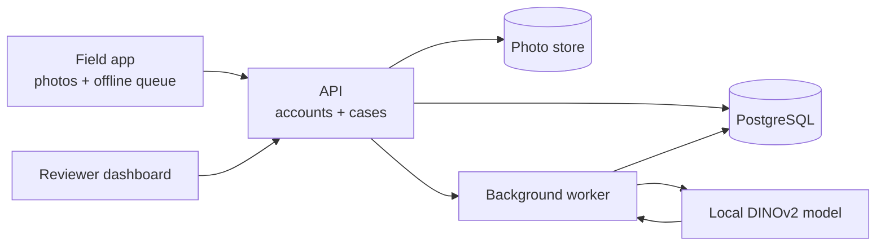

# FasalPramaan

**फसल प्रमाण** — *Capture. Verify. Protect.*

A local crop-evidence system for farmers and reviewers. A farmer records
five guided field photos with location. A local leaf-health model gives a
screening grade. A human reviewer makes the decision.

> The model is a helper, not an authority. It does **not** approve insurance,
> estimate payout, or replace a field officer. Every case still needs a person.

Latest release: [`V1.1.1`](https://github.com/dhrrishitvdeka/Fasal-Pramaan/releases/tag/V1.1.1)

## Who it is for

| You are… | You use… | You can… |
|---|---|---|
| A farmer or field officer | The field app at `http://localhost:8085` | Register a farm, take five evidence photos, upload, and see results |
| A reviewer or administrator | The Command Centre at `http://localhost:3000` | Open the queue, inspect photos and model output, accept or correct the case |
| A developer or researcher | This repository + Docker | Run the full stack on one machine, inspect the API, and try the local model |

No Flutter, Python, or Node install is required to try the demo. Docker is enough.

## What you get in a clone

The repository is a complete local pack:

- Farmer / field-officer app (Flutter, served as a web app in Docker)
- Reviewer Command Centre (Next.js)
- API, background worker, PostgreSQL/PostGIS, Redis, and MinIO evidence storage
- A local DINOv2 leaf-health model (~87 MB ONNX file, already in the tree)
- Four demo logins and crop catalogs (no sample farms until you create them)

The model does **not** download weights when the stack starts.

## Start in two commands

**Windows**

```powershell
git clone https://github.com/dhrrishitvdeka/Fasal-Pramaan.git
cd Fasal-Pramaan
Copy-Item .env.example .env
powershell -ExecutionPolicy Bypass -File .\scripts\start-portable.ps1
```

**macOS / Linux**

```bash
git clone https://github.com/dhrrishitvdeka/Fasal-Pramaan.git
cd Fasal-Pramaan
cp .env.example .env
sh scripts/start-portable.sh
```

Or: `docker compose up -d --build`

The first build needs about **12 GB** free disk (base images + Flutter SDK used
only while building). Later starts reuse cached layers.

Optional: clone a release with `git clone --branch V1.1.1 …`

## Open the apps

| App | Address | Demo login |
|---|---|---|
| Farmer / field app | http://localhost:8085 | `farmer@fasalpramaan.local` / `Demo@12345` |
| Reviewer Command Centre | http://localhost:3000 | `reviewer@fasalpramaan.local` / `Demo@12345` |
| API health / docs | http://localhost:8000/health , `/docs` | — |
| AI health | http://localhost:8001/health | — |
| MinIO console (local only) | http://localhost:9001 | `minioadmin` / `minioadmin_dev_only` |

Staff accounts (`officer@`, `reviewer@`, `admin@`) use the same demo password.

This is a **local / trusted-LAN demo**, not a public internet service. Change
every default password and secret before sharing the stack on a network.

## Try a complete case (about 10 minutes)

1. Open the field app and sign in as the farmer.
2. Create a **farm**, then a **plot**, then a **crop cycle** (choose a crop such as paddy).
3. Open **Capture Crop Evidence**. Take the five required angles (wide field,
   left, mid-canopy, right, close-up).
   - On a laptop browser, camera or GPS may be missing. The web app then uses
     **sample frames and a demo location** so the local flow can still finish.
4. Tap **Save & submit**. Photos upload and the local model runs in the background.
5. Open the Command Centre as the reviewer. The case appears in the
   **Review queue** with photos, location, and an A/B/C/U screening grade.
6. Accept the screening, correct it, request recapture, or send it for
   physical inspection.

More detail: [GETTING_STARTED.md](GETTING_STARTED.md) and
[demo walkthrough](docs/demo-walkthrough.md).

## What the model actually says

The default model (`crop_health_v4`) looks at leaf photos of **maize, paddy,
potato, and wheat** and returns a **screening bucket**, not a loss estimate:

| Grade | Meaning |
|---|---|
| **A** | Confident healthy-leaf signal |
| **B** | Uncertain — a person should look |
| **C** | Confident disease-pattern signal |
| **U** | Unusable, unsupported crop, or out of domain |

It does **not** output insurance severity or affected-area percentage. The
reviewer can still close the case using that grade.

Internal (not independently field-validated) metrics are in
[docs/AI_MODEL_MVP.md](docs/AI_MODEL_MVP.md). Potato-healthy is the weakest
disclosed class.

One-off local image:

```powershell
powershell -ExecutionPolicy Bypass -File .\scripts\demo-model.ps1 C:\path\to\leaf.jpg paddy
```

## How the pieces connect


```mermaid
flowchart LR
  Field["Field app<br/>photos + offline queue"] --> API["API<br/>accounts + cases"]
  Dashboard["Reviewer dashboard"] --> API
  API --> DB[("PostgreSQL")]
  API --> Store[("Photo store")]
  API --> Worker["Background worker"]
  Worker --> AI["Local DINOv2 model"]
  AI --> Worker
  Worker --> DB
```

Photos stay on your machine. Inference is local ONNX. Nothing is sent to a
cloud model unless you turn on the optional voice assistant.

## Optional: farmer voice assistant (Fasal Saathi)

Fasal Saathi is a Hindi/English spoken helper for the farmer app. It is
**off** until you add a server-side Gemini key:

```dotenv
VOICE_ASSISTANT_ENABLED=true
GEMINI_API_KEY=your_google_ai_studio_key
```

The long-lived key never enters the phone or browser. Sync and final submit
still require a fresh spoken yes. Guide:
[docs/VOICE_ASSISTANT_DEMO.md](docs/VOICE_ASSISTANT_DEMO.md).

## Another device on the same Wi-Fi

```powershell
powershell -ExecutionPolicy Bypass -File .\scripts\start-portable.ps1 -PublicHost 192.168.1.25
```

```bash
sh scripts/start-portable.sh 192.168.1.25
```

Then open `http://192.168.1.25:8085` and `http://192.168.1.25:3000`. Only do
this on a trusted private network.

## Project layout

```text
apps/mobile/        Farmer and field-officer app
apps/dashboard/     Reviewer Command Centre
services/api/       Accounts, cases, storage, background jobs
services/ai/        Local ONNX model and evaluation notes
scripts/            Start, health, model demo, e2e, packaging
docs/               Architecture, security, model, and operations
docker-compose.yml  Full local stack
```

| Guide | Use it when |
|---|---|
| [GETTING_STARTED.md](GETTING_STARTED.md) | First clone and first run |
| [RUN_GUIDE.md](RUN_GUIDE.md) | Day-to-day start/stop |
| [docs/README.md](docs/README.md) | Full documentation index |
| [docs/known-limitations.md](docs/known-limitations.md) | What this software must not be claimed to do |
| [CONTRIBUTING.md](CONTRIBUTING.md) | How to send a change |

## Quality checks

```powershell
cd apps\dashboard
npm.cmd run lint
npm.cmd run typecheck
npm.cmd test

cd ..\..
docker compose exec api pytest
docker compose exec ai pytest

docker build --target tester -t fasalpramaan-mobile-test apps/mobile
```

End-to-end upload → model → reviewer queue (five distinct JPEGs):

```powershell
powershell -ExecutionPolicy Bypass -Command `
  "& .\scripts\verify-e2e.ps1 -ImagePaths @('wide.jpg','left.jpg','mid.jpg','right.jpg','close.jpg')"
```

## Share a copy without Git

```powershell
powershell -ExecutionPolicy Bypass -File .\scripts\build-portable-bundle.ps1
```

The archive lands in `dist/`. A recipient needs Docker only.

## Contributors

Thanks to everyone who has shipped code on this project.

<table>
  <tr>
    <td align="center" width="160">
      <a href="https://github.com/dhrrishitvdeka">
        
        <br />
        <sub><b>Dhrrishit V Deka</b></sub>
      </a>
      <br />
      <sub><a href="https://github.com/dhrrishitvdeka">@dhrrishitvdeka</a></sub>
    </td>
    <td align="center" width="160">
      <a href="https://github.com/parasdwivedi26">
        
        <br />
        <sub><b>Paras Dwivedi</b></sub>
      </a>
      <br />
      <sub><a href="https://github.com/parasdwivedi26">@parasdwivedi26</a></sub>
    </td>
  </tr>
</table>

<p align="left">
  <a href="https://github.com/dhrrishitvdeka/Fasal-Pramaan/graphs/contributors">
    
  </a>
</p>

Want to join the list? See [CONTRIBUTING.md](CONTRIBUTING.md).

## License

[MIT](LICENSE). Dataset and model provenance:
[LICENSE_REPORT.md](services/ai/research/reports/LICENSE_REPORT.md).
