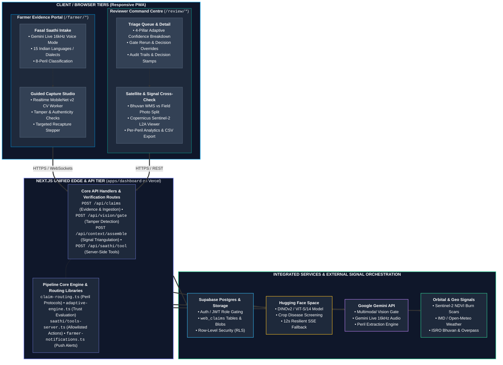
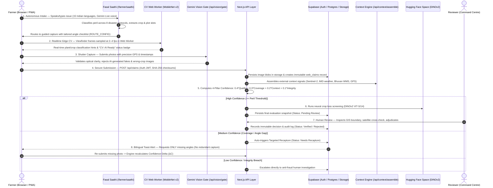

# Fasal-Pramaan (फसल प्रमाण)

<p align="center">
  
  
  
  
  
</p>
<p align="center">
  <a href="https://github.com/dhrrishitvdeka/Fasal-Pramaan/actions/workflows/ci.yml"></a>
  
  <a href="https://github.com/dhrrishitvdeka/Fasal-Pramaan/pulls"></a>
</p>

---

## Executive Summary

**Fasal-Pramaan (*फसल प्रमाण* — Capture. Verify. Protect.)** is an open-source agricultural evidence capture, trust evaluation, and verification webapp designed for agricultural insurance claim adjudication, disaster loss assessment, and crop monitoring programs.

The system addresses the fundamental trust deficit in rural crop insurance by pairing **verified multi-angle field evidence capture** with an explainable **Evidence Confidence & Trust Evaluation Engine**, a **Hugging Face crop-model screening Space**, and a **Human-in-the-Loop Reviewer Dashboard**. The platform includes **Fasal Saathi as autonomous first-line entry point at `/farmer/saathi`**, **variable claims routing per peril (`src/lib/claim-routing.ts`, 8 perils)**, an **evidence quality & authenticity filter (realtime CV + Gemini LLM gate)**, an **adaptive confidence engine (`src/lib/context/adaptive-engine.ts`)**, and **multi-signal context validation (IMD weather + GPS + Sentinel + Bhuvan + nearby fields via `POST /api/context/assemble`)**.

The v1.5.0 release makes every signal real: the CV worker runs **TF.js MobileNet v2 (alpha 0.5)** plant classification inside a Web Worker, Fasal Saathi speaks through a **full-duplex Gemini Live Voice Mode** whose function tools execute server-side via `POST /api/saathi/tool`, context checks hit **live free-tier sources** (Copernicus Sentinel process API, Open-Meteo forecast/archive, ISRO Bhuvan WMS, OpenStreetMap Overpass), and the adaptive engine **auto-creates bilingual recapture requests** instead of waiting for a reviewer.

The v1.6.0 wave closes the loop end-to-end: captures are checked against the **registered plot center** (`plot_match` haversine containment), weather signals become **sowing-date-aware** (drought rainfall since sowing, hail growth-stage estimates), farmers get **in-app recapture notifications** (`farmer-notifications.ts`), reviewers get a **Satellite Cross-Check card** (wide_field vs Bhuvan WMS + Copernicus Browser deep-link), a **Gate re-run button**, **per-peril analytics**, and **CSV export**, plus a bilingual **CV AI-ready warmup badge** in the capture studio.


```mermaid
flowchart TD
    subgraph ClientTier["<b>CLIENT / BROWSER TIERS (Responsive PWA)</b>"]
        direction LR
        subgraph FarmerPortal["<b>Farmer Evidence Portal</b> (<code>/farmer/*</code>)"]
            direction TB
            FP1["<b>Fasal Saathi Intake</b><br/>• Gemini Live 16kHz Voice Mode<br/>• 15 Indian Languages / Dialects<br/>• 8-Peril Classification"]
            FP2["<b>Guided Capture Studio</b><br/>• Realtime MobileNet v2 CV Worker<br/>• Tamper & Authenticity Checks<br/>• Targeted Recapture Stepper"]
            FP1 --> FP2
        end

        subgraph ReviewerPortal["<b>Reviewer Command Centre</b> (<code>/review/*</code>)"]
            direction TB
            RP1["<b>Triage Queue & Detail</b><br/>• 4-Pillar Adaptive Confidence Breakdown<br/>• Gate Rerun & Decision Overrides<br/>• Audit Trails & Decision Stamps"]
            RP2["<b>Satellite & Signal Cross-Check</b><br/>• Bhuvan WMS vs Field Photo Split<br/>• Copernicus Sentinel-2 L2A Viewer<br/>• Per-Peril Analytics & CSV Export"]
            RP1 --> RP2
        end
    end

    subgraph AppTier["<b>NEXT.JS UNIFIED EDGE & API TIER</b> (<code>apps/dashboard</code> on Vercel)"]
        direction TB
        APIs["<b>Core API Handlers & Verification Routes</b><br/><code>POST /api/claims</code> (Evidence & Ingestion) • <code>POST /api/vision/gate</code> (Tamper Detection)<br/><code>POST /api/context/assemble</code> (Signal Triangulation) • <code>POST /api/saathi/tool</code> (Server-Side Tools)"]
        
        CoreEngine["<b>Pipeline Core Engine & Routing Libraries</b><br/><code>claim-routing.ts</code> (Peril Protocols) • <code>adaptive-engine.ts</code> (Trust Evaluation)<br/><code>saathi/tools-server.ts</code> (Allowlisted Actions) • <code>farmer-notifications.ts</code> (Push Alerts)"]
        
        APIs --- CoreEngine
    end

    subgraph ServicesTier["<b>INTEGRATED SERVICES & EXTERNAL SIGNAL ORCHESTRATION</b>"]
        direction LR
        S_DB["<b>Supabase Postgres & Storage</b><br/>• Auth / JWT Role Gating<br/>• <code>web_claims</code> Tables & Blobs<br/>• Row-Level Security (RLS)"]
        S_HF["<b>Hugging Face Space</b><br/>• DINOv2 / ViT-S/14 Model<br/>• Crop Disease Screening<br/>• 12s Resilient SSE Fallback"]
        S_GEMINI["<b>Google Gemini API</b><br/>• Multimodal Vision Gate<br/>• Gemini Live 16kHz Audio<br/>• Peril Extraction Engine"]
        S_ORBITAL["<b>Orbital & Geo Signals</b><br/>• Sentinel-2 NDVI Burn Scars<br/>• IMD / Open-Meteo Weather<br/>• ISRO Bhuvan & Overpass"]
    end

    FarmerPortal ==>|"HTTPS / WebSockets"| APIs
    ReviewerPortal ==>|"HTTPS / REST"| APIs

    AppTier ==> S_DB
    AppTier ==> S_HF
    AppTier ==> S_GEMINI
    AppTier ==> S_ORBITAL

    style ClientTier fill:#0f172a,stroke:#38bdf8,stroke-width:2px,color:#f8fafc
    style FarmerPortal fill:#1e293b,stroke:#0284c7,stroke-width:1.5px,color:#f8fafc
    style ReviewerPortal fill:#1e293b,stroke:#0d9488,stroke-width:1.5px,color:#f8fafc
    style AppTier fill:#0f172a,stroke:#818cf8,stroke-width:2px,color:#f8fafc
    style ServicesTier fill:#0f172a,stroke:#34d399,stroke-width:2px,color:#f8fafc

    style FP1 fill:#334155,stroke:#64748b,color:#ffffff
    style FP2 fill:#334155,stroke:#64748b,color:#ffffff
    style RP1 fill:#334155,stroke:#64748b,color:#ffffff
    style RP2 fill:#334155,stroke:#64748b,color:#ffffff
    style APIs fill:#1e293b,stroke:#818cf8,color:#ffffff
    style CoreEngine fill:#1e293b,stroke:#818cf8,color:#ffffff

    style S_DB fill:#1e293b,stroke:#38bdf8,stroke-width:1.5px,color:#ffffff
    style S_HF fill:#1e293b,stroke:#fbbf24,stroke-width:1.5px,color:#ffffff
    style S_GEMINI fill:#1e293b,stroke:#c084fc,stroke-width:1.5px,color:#ffffff
    style S_ORBITAL fill:#1e293b,stroke:#34d399,stroke-width:1.5px,color:#ffffff
```

---

## Key Pillars

### 1. Fasal Saathi Autonomous Intake & Webapp Controller
`/farmer/saathi` is the first-line entry point. Farmers describe the problem by text or voice (Hindi/English); `src/lib/saathi-agent.ts` classifies one of **8 perils** via `classifyPerilHeuristic`, extracts slots (crop, village, plot), builds a `ClaimIntent`, and stores it in `farmerStore.activeIntent` before routing to the peril-aware capture studio.

A **Voice Mode mic toggle** upgrades the chat to a full-duplex Gemini Live session (`POST /api/voice/session` mints an ephemeral token; audio streams over WebSocket while text stays available as fallback). The Live model calls the full suite of `SAATHI_FUNCTION_DECLARATIONS` tools:
- **Intake & Routing**: `request_evidence_angles`, `call_context_signal`, `guide_capture`, `classify_claim`
- **Agentic Webapp Control**: `take_photo`, `switch_camera`, `select_angle`, `retake_angle`, `set_observation`, `submit_claim`, `check_evidence_quality`

Every tool call is executed **server-side** through auth-gated, rate-limited `POST /api/saathi/tool` with client synchronization via `webCaptureBridge` and `web-voice-broker.ts`, so `GEMINI_API_KEY` never reaches the browser bundle.

### 2. Variable Claims Routing per Peril
`src/lib/claim-routing.ts` defines `ROUTE_CONFIG`: required/optional capture angles, context checks, `minConfidence` (70–85), and `needsSatellite` per peril — e.g., `fire_burn` needs only `wide_field` + `closeup_damage` plus a Sentinel check, while `normal` requires the full 5-angle protocol.

### 3. Sequential Evidence Verification & Metadata Bundling
- **Comprehensive Image & Environmental Metadata Bundling**: Every shutter click in the capture studio bundles high-precision GPS (`lat`, `lon`, `accuracyM`), camera facing mode (`environment` vs `user`), video resolution (`width x height`), ISO 8601 timestamps, live agronomic indices (**ExG**, **GLI**, **ExR** canopy %), luma, 2D Laplacian sharpness score, MobileNet v2 classification tags, and client-side SHA-256 cryptographic hashes.
- **Stage 1 (Gemini Multimodal Vision & Environmental Gate)**: `POST /api/vision/gate` (`src/app/api/vision/gate/route.ts`, auth-gated) and server-side `gateSingleImage` evaluate raw image bytes + comprehensive metadata + spatial context. Cross-verifies peril congruence (fire charred ash, flood standing water, hailstorm shredding, lodging flattening, drought chlorosis) and rejects AI fakes, screen captures, printed photos, and non-field artifacts.
- **Stage 2 (Hugging Face DINOv2 Foundation Model)**: Only verified authentic outdoor crop evidence is dispatched to the Hugging Face Space (`dhrrishitvdeka/fasal-pramaan-api`, DINOv2 ViT-S/14) for deep neural crop screening and foliar damage grading ($A/B/C/U$). Fraudulent or unusable images bypass HF inference early, conserving compute quota and prompting targeted recapture.
- **Multi-Spectral Realtime Computer Vision & False Positive Rejection**: `src/lib/vision/realtime-cv.ts` (running in `src/lib/vision/cv-worker.ts`) samples viewfinder frames at 3–4 fps in a Web Worker using normalized agronomic chromatic indices (**ExG**, **GLI**, **ExR**), 2D spatial Laplacian variance (organic micro-texture filter), and **TF.js + MobileNet v2** plant taxonomy classification.
- **Seamless Camera Viewfinder UX**: Overlays dynamic autofocus corner reticles with color transitions (emerald glow when ready, amber when adjusting), a translucent glassmorphism HUD chip with live pulse dot indicator, and an interactive shutter ring that confirms optimal framing.

### 4. Multi-Signal Context Validation
`POST /api/context/assemble` assembles `ContextSignal[]` from **live free-tier sources**:
- `sentinel` — Tier 1: with `SENTINEL_TOKEN`, real NDVI burn-scar detection via `sh.dataspace.copernicus.eu` process API (JSON raster, burn when >5% of pixels have NDVI < 0.2). Tier 2: without a token, an honest free Open-Meteo archive proxy counts extreme-heat days (>40 °C in past 30 days).
- `imd` — Open-Meteo forecast proxy for 7-day rainfall plus hail (WMO codes 96/99 → `hailDays7d`) and wind gusts (`gustMaxKph > 60` supports lodging); `IMD_API_KEY` is a documented slot for the paid IMD upgrade.
- `bhuvan` — live ISRO Bhuvan WMS GetMap probe with reachable/unreachable status.
- `wildlife` / `nearby` / `gps` — Overpass API checks: forest/protected-area within 10 km (for `animal_damage`) and farmland-parcel count within 2 km.
- `plot_match` — haversine containment of the capture GPS against the registered plot center (`plotContainment()` in `src/lib/context/assemble.ts`); radius defaults to 200 m via `plotProximityMeters` (clamped 10–5000). Confidence 75 inside the radius, 40 outside, `unavailable` without a registered plot point.

Sowing-date-aware windows: for `drought` claims ≥30 days past sowing, the IMD signal adds cumulative rainfall since sowing from the Open-Meteo archive (window starts at `max(sowing, now−180d)`; `meta.windowRainfallMm/windowDays/daysSinceSowing`) and marks corroboration weak when rainfall averages <25 mm per 30 days. For `hailstorm`, an estimated crop growth stage (30/60/100-day thresholds) is appended to the summary.

Overall status is `strong`/`mixed`/`weak`/`pending`.

### 5. Adaptive Confidence Engine
`src/lib/context/adaptive-engine.ts` maps evidence scores against the peril threshold:

```
overall >= threshold && coverage>=60 && quality>=40  → High   → proceed
overall >= threshold-20 && coverage>=40              → Medium → request_missing (targeted angles)
otherwise                                            → Low    → retake / escalate_to_human
```

Special rules: integrity < 50 → `escalate_to_human`; gate flagged → `retake`; `fire_burn` without Sentinel available stays Medium/Low until satellite data arrives.

**Auto-recapture:** when the engine lands on a level with `nextStep = request_missing`, the claim moves straight to `needs_recapture` — no reviewer round-trip — with the adaptive reasons stored bilingually as `recapture_reason` / `recapture_reason_hi`. Re-submissions track `previousConfidence` and the exact `confidence_delta` inside `adaptive_result`, rendered as bilingual ▲/▼ delta chips on the review detail (`EvidenceConfidenceSection`) and the farmer claim page. Farmers are alerted in-app: `src/lib/farmer-notifications.ts` diffs `needs_recapture` claims against localStorage-seen IDs, the `/farmer` dashboard shows amber toast panels with a Capture-now deep link + Dismiss, and a nav badge dot marks unseen notices.

**Transparent overrides:** reviewers can act with `override_gate` on a gate-flagged image; the action stamps `overridden` / `overriddenBy` / `overriddenAt` into `gate_result` and renders an Authenticity Gate card on the review detail page.

### 6. Hardened API Surface
Every evidence route (`/api/claims`, `/api/vision/gate`, `/api/context/assemble`, `/api/saathi/tool`) requires a **Supabase Auth JWT** (`requireWebActor`) and is rate-limited per user (20–30 req/min per route via shared `src/lib/server/rate-limit.ts`). Inputs are clamped server-side (lat ±90 / lon ±180, canonical angle whitelists, ≤64 KB tool bodies, strict `sowingDate` date regex), and the site-lock unlock compares passwords in constant time.

### 7. Evidence Confidence & Trust Evaluation Engine
Deterministic score ($0 - 100$):

$$\text{Final Confidence} = 0.4 \times \text{Quality} + 0.3 \times \text{Coverage} + 0.2 \times \text{Context} + 0.1 \times \text{Integrity}$$

- **Threshold for evidence sufficiency**: $\ge 85.0$ (or the peril-specific `ROUTE_CONFIG.minConfidence`).
- **Zero false-accept policy**: integrity anomalies force mandatory human review.
- Every evaluation snapshot is immutable; re-evaluations track the exact confidence delta ($\Delta C$).

### Production readiness (v2.0.0)

- **Role-guarded routes** — all 8 reviewer pages gate on session roles (`useRequireRole` + `AccessGate`); queries stay idle until the gate passes.
- **Per-route rate limits with `Retry-After`** on every mutating route (claims 10/min, actions/milestones/context/saathi 30/min, gate 20/min, telemetry 5/min, system status 10/min).
- **Error boundaries + loading skeletons + EmptyState**, plus client error telemetry (ring buffer → authed log-only intake; Sentry DSN slot ready).
- **Installable PWA** — manifest + vanilla service worker (never caches `/api/*` or Supabase), prod-only registration, bilingual offline banner.
- **Playwright E2E scaffold** — desktop + mobile projects, manually-triggered CI job.
- **Bilingual `/privacy` + `/terms` placeholders** linked from landing and login footers.

---

## Intelligent Adaptive Evidence Collection & Validation

Every agricultural claim is evaluated dynamically via the **Variable Peril Routing Matrix (`ROUTE_CONFIG`)**, adapting camera requirements, multi-signal triangulation checks, and trust thresholds to the specific disaster type:

| Peril Protocol | Required Field Angles | External Signal Triangulation | Trust Threshold | Satellite Prerequisite |
|---|---|---|:---:|:---:|
| **Fire & Burn** (`fire_burn`) | **2 Angles**<br/>`wide_field` • `closeup_damage` | Sentinel-2 Burn Scar (L2A NDVI)<br/>IMD/Open-Meteo High Heat Proxy<br/>ISRO Bhuvan Land Use | **70%** | **Mandatory** *(Sentinel)* |
| **Flood & Inundation** (`flood`) | **3 Angles**<br/>`wide_field` • `mid_canopy` • `closeup` | IMD Extreme Precipitation & Runoff<br/>Sentinel-2 Water Index<br/>Cadastral Plot Proximity | **75%** | Standard |
| **Wildlife Damage** (`animal_damage`) | **3 Angles**<br/>`wide_field` • `mid_canopy` • `closeup` | Overpass Wildlife Buffer (5km)<br/>IMD Weather Station Data<br/>ISRO Bhuvan Reserve Boundary | **75%** | Standard |
| **Drought Stress** (`drought`) | **3 Angles**<br/>`wide_field` • `mid_canopy` • `closeup` | IMD Consecutive Dry-Spell Index<br/>Bhuvan Soil/Canopy Moisture<br/>Adjacent Plot Triangulation | **80%** | Standard |
| **Pest & Disease** (`pest_disease`) | **3 Angles**<br/>`closeup` • `mid_canopy` • `wide_field` | IMD Temperature/Humidity Trajectory<br/>Adjacent Field Infestation Clustered<br/>Bhuvan Crop Boundary | **85%** | Standard |
| **Hailstorm & Freeze** (`hailstorm`) | **3 Angles**<br/>`wide_field` • `closeup` • `mid_canopy` | IMD Radar & Severe Storm Log<br/>Neighborhood Damage Cluster<br/>ISRO Bhuvan Land Cover | **75%** | Standard |
| **Crop Lodging** (`lodging`) | **3 Angles**<br/>`wide_field` • `mid_canopy` • `closeup` | IMD Wind Gust & Cyclonic Pressure<br/>Neighboring Plot Lodging Cross-Check<br/>Bhuvan WMS Tile | **75%** | Standard |
| **General / Multi-Peril** (`normal`) | **5 Angles (Full)**<br/>`wide` • `left` • `canopy` • `right` • `closeup` | IMD Multi-Week Historical Weather<br/>ISRO Bhuvan Land Classification<br/>Cadastral Boundary Haversine Check | **85%** | Standard |

**Transparent reviewer dashboard:** the review queue and claim detail show adaptive level, threshold per peril, context signal statuses, visual score breakdowns, and the audit trail. The claim detail adds a **Multi-Signal Context & Satellite Cross-Check card** (per-signal status chips, side-by-side `wide_field` photo vs Bhuvan WMS tile, and a Copernicus Browser deep-link showing Sentinel-2 L2A for the last 3 days via `meta.burnMapUrl`), and both the queue and the executive overview offer **CSV export** (`src/lib/csv.ts` — dependency-free `toCsv`/`downloadCsv`) over the currently filtered rows; the overview's per-peril rows also show average confidence (color-coded) and recapture rate from `analyticsFromClaims().byPeril`.

---

## Webapp Portals & Access Points

Both roles sign in at `/login`. Users whose email appears in `REVIEWER_EMAILS` are reviewers; everyone else is a farmer.

| Route | Role | Purpose |
|---|---|---|
| `/farmer/saathi` | Farmer | Saathi autonomous intake — text/voice → peril classification → capture route |
| `/farmer/capture` | Farmer | Peril-aware guided capture with realtime CV hints |
| `/farmer/claims`, `/farmer/queue` | Farmer | Claim status tracking, targeted recapture requests |
| `/review`, `/review/[id]` | Reviewer | Review queue, adaptive confidence breakdown, adjudication |

Locally the app runs at `http://localhost:3000`. On Vercel it runs at your project domain.

---

## Layout

| Location | What it is |
|---|---|
| `apps/dashboard` | The Next.js webapp (farmer + reviewer). This is what Vercel builds — set **Root Directory** to this folder. |
| `docs/` | Webapp documentation. |
| `scripts/` | Supabase SQL setup (`setup_supabase.sql`, `setup_web_schema.sql`, `setup_web_schema_peril.sql`, `lock_web_rls.sql`) and `test_supabase_conn.py`. |
| `spaces/fasal-pramaan-api` | Hugging Face Space that serves the crop model used for screening. |

**Repository architecture:** one deployable Next.js webapp (`apps/dashboard`) + Supabase backend + HF Space — see [docs/architecture.md](docs/architecture.md) for the full system architecture, boundary models, and component contracts. Full environment configuration details are documented in [docs/environment-variables.md](docs/environment-variables.md) and [docs/supabase-integration.md](docs/supabase-integration.md).

---

## End-to-End Workflow Demonstration (8-Step Architecture)

The system operates across a coordinated **8-step pipeline** spanning on-device client edge processing, autonomous AI intake, multi-signal orbital and meteorological triangulation, and human-in-the-loop review.

### 1. Architectural Pipeline Flowchart


```mermaid
flowchart LR
    subgraph P1["<b>PHASE 1: FIELD EVIDENCE & EDGE VERIFICATION</b>"]
        direction TB
        A["<b>1. Farmer Intake</b><br/>Fasal Saathi (Voice/Text)"] --> B["<b>2. Peril Routing</b><br/>8 Disaster Protocols"]
        B --> C["<b>3. Guided Studio</b><br/>Edge MobileNet v2 CV"]
        C --> D["<b>4. Vision Gate</b><br/>Gemini 2.0 + SHA-256"]
    end

    subgraph BR["<b>HANDOVER BRIDGE</b>"]
        direction TB
        E["<b>Secure Cloud Ingestion</b><br/>POST /api/claims & Supabase"]
    end

    subgraph P2["<b>PHASE 2: SIGNAL TRIANGULATION & ADJUDICATION</b>"]
        direction TB
        F["<b>5. Multi-Signal Triangulation</b><br/>Sentinel-2 • IMD • Bhuvan • GPS"] --> G["<b>6. Adaptive 4-Pillar Trust</b><br/>0.4Q + 0.3C + 0.2X + 0.1I"]
        G --> H{"<b>Confidence Level</b>"}
        H -->|"High (≥ Threshold)"| I["<b>7. Reviewer Command Centre</b><br/>GIS Overlay & Satellite Cross-Check"]
        H -->|"Medium (Gap)"| J["<b>8. Targeted Recapture</b><br/>Auto-Request Missing Views (ΔC)"]
        H -->|"Low (Flagged)"| K["<b>Anti-Fraud Escrow</b><br/>Mandatory Field Survey"]
        I --> L["<b>Adjudication Decision</b><br/>Verified & Paid / Audit Log"]
    end

    D ==> E
    E ==> F

    style P1 fill:#1e293b,stroke:#38bdf8,stroke-width:2px,color:#f8fafc
    style BR fill:#0f172a,stroke:#94a3b8,stroke-width:2px,stroke-dasharray: 4 4,color:#f8fafc
    style P2 fill:#1e293b,stroke:#34d399,stroke-width:2px,color:#f8fafc

    style A fill:#334155,stroke:#64748b,color:#ffffff
    style B fill:#334155,stroke:#64748b,color:#ffffff
    style C fill:#334155,stroke:#64748b,color:#ffffff
    style D fill:#334155,stroke:#64748b,color:#ffffff
    style E fill:#0f172a,stroke:#38bdf8,stroke-width:2px,color:#ffffff
    style F fill:#334155,stroke:#64748b,color:#ffffff
    style G fill:#334155,stroke:#64748b,color:#ffffff
    style H fill:#0f172a,stroke:#fbbf24,stroke-width:2px,color:#ffffff
    style I fill:#064e3b,stroke:#34d399,stroke-width:2px,color:#ffffff
    style J fill:#78350f,stroke:#f59e0b,stroke-width:2px,color:#ffffff
    style K fill:#7f1d1d,stroke:#f87171,stroke-width:2px,color:#ffffff
    style L fill:#064e3b,stroke:#10b981,stroke-width:2px,color:#ffffff
```

### 2. End-to-End Sequence & State Machine


```mermaid
sequenceDiagram
  autonumber
  actor Farmer as Farmer (Browser / PWA)
  participant Saathi as Fasal Saathi (/farmer/saathi)
  participant Worker as CV Web Worker (MobileNet v2)
  participant Gate as Gemini Vision Gate (/api/vision/gate)
  participant API as Next.js API Layer
  participant DB as Supabase (Auth / Postgres / Storage)
  participant Ctx as Context Engine (/api/context/assemble)
  participant HF as Hugging Face Space (DINOv2)
  actor Reviewer as Reviewer (Command Centre)

  %% Step 1: Autonomous Intake
  Farmer->>Saathi: 1. Autonomous Intake — Speaks/types issue (15 Indian languages, Gemini Live voice)
  Saathi->>Saathi: Classifies peril across 8 disaster protocols, extracts crop & plot slots
  Saathi->>Farmer: Routes to guided capture with tailored angle checklist (ROUTE_CONFIG)

  %% Step 2: Edge CV & Shutter Guidance
  Farmer->>Worker: 2. Realtime Edge CV — Viewfinder frames sampled at 2–4 fps in Web Worker
  Worker-->>Farmer: Real-time plant/crop classification hints & "CV: AI Ready" status badge

  %% Step 3: Authenticity & Metadata
  Farmer->>Gate: 3. Shutter Capture — Submits photos with precision GPS & timestamps
  Gate-->>Farmer: Validates optical clarity, rejects AI-generated fakes & wrong-crop images

  %% Step 4: Submission & Triangulation
  Farmer->>API: 4. Secure Submission — POST /api/claims (Auth JWT, SHA-256 checksums)
  API->>DB: Persists image blobs in storage & creates immutable web_claims record
  API->>Ctx: Assembles external context signals (Sentinel-2, IMD weather, Bhuvan WMS, GPS)

  %% Step 5: Adaptive Evaluation
  API->>API: 5. Computes 4-Pillar Confidence: 0.4*Quality + 0.3*Coverage + 0.2*Context + 0.1*Integrity
  alt High Confidence (>= Peril Threshold)
      API->>HF: 6. Runs neural crop loss screening (DINOv2 ViT-S/14)
      API-->>DB: Persists final evaluation snapshot (Status: Pending Review)
      Reviewer->>API: 7. Human Review — Inspects GIS boundary, satellite cross-check, adjudicates
      API-->>DB: Records immutable decision & audit log (Status: Verified / Rejected)
  else Medium Confidence (Coverage / Angle Gap)
      API-->>DB: Auto-triggers Targeted Recapture (Status: Needs Recapture)
      DB-->>Farmer: 8. Bilingual Toast Alert — Requests ONLY missing angles (No redundant capture)
      Farmer->>API: Re-submits missing photo -> Engine recalculates Confidence Delta (ΔC)
  else Low Confidence / Integrity Breach
      API-->>DB: Escalates directly to anti-fraud human investigation
  end
```

### 3. Step-by-Step Pipeline Breakdown

| Step | Component | Technology / Protocol | Key Operational Output |
|:---|:---|:---|:---|
| **1. Autonomous Intake** | Fasal Saathi (`/farmer/saathi`) | Gemini Live Voice (full-duplex WebSocket) + heuristic slot extraction | 8-peril classification (`ClaimIntent`), crop slot, plot center binding |
| **2. Edge CV Assistance** | Capture Studio (`/farmer/capture`) | TF.js MobileNet v2 (Web Worker, 2–4 fps) + Green-pixel heuristic | Real-time plant framing guidance, shutter readiness, warmup badge |
| **3. Authenticity Gate** | Anti-Tamper Gate (`/api/vision/gate`) | Multimodal Gemini Vision + SHA-256 cryptographic hashing | Detection of fake/screen photos, blur filter, duplicate hash prevention |
| **4. Multi-Signal Triangulation** | Context Engine (`/api/context/assemble`) | Copernicus Sentinel-2, Open-Meteo IMD, ISRO Bhuvan, OSM Overpass | NDVI burn scars, sowing-aware rain/hail, plot haversine containment |
| **5. Adaptive Trust Engine** | Confidence Engine (`adaptive-engine.ts`) | 4-Pillar Formula: $0.4Q + 0.3C + 0.2X + 0.1I$ | Deterministic 0–100 score, High/Medium/Low confidence classification |
| **6. Neural Loss Screening** | Crop Screening Space (`fasal-pramaan-api`) | Hugging Face Space (DINOv2 ViT-S/14 Foundation Model) | Automated loss pattern grading, crop health screening |
| **7. Human Adjudication** | Reviewer Command Centre (`/review/[id]`) | GIS Leaflet polygon overlay, Bhuvan WMS, Copernicus Browser deep-link | Human verification, gate override audit stamp, one-click CSV export |
| **8. Targeted Recapture** | Continuous Recapture Protocol | Bilingual in-app alerts (`farmer-notifications.ts`) + $\Delta C$ tracking | Re-capture of missing angles only, transparent confidence progression |

For hands-on demonstration scripts and showcase scenarios, see [docs/demo-walkthrough.md](docs/demo-walkthrough.md).

---

## Repository Structure

```text
├── apps/
│   └── dashboard/                        # Next.js 16 farmer + reviewer webapp (TypeScript, Tailwind, React Query)
│       ├── src/lib/claim-routing.ts      # Peril ×8, ROUTE_CONFIG, ClaimIntent
│       ├── src/lib/saathi-agent.ts       # Saathi slot extraction & SAATHI_FUNCTION_DECLARATIONS
│       ├── src/lib/saathi/tools-server.ts# Server-side Saathi tool dispatcher (classify_claim LLM)
│       ├── src/app/farmer/saathi/page.tsx# Autonomous first-line intake + duplex Live voice
│       ├── src/lib/vision/realtime-cv.ts # On-device realtime CV
│       ├── src/lib/vision/cv-worker.ts   # Web Worker: TF.js MobileNet v2 α0.5 + heuristics
│       ├── src/app/api/vision/gate/route.ts      # Gemini LLM gate + heuristic fallback
│       ├── src/lib/context/types.ts      # ContextSignal / AssembledContext
│       ├── src/app/api/context/assemble/route.ts # Sentinel T1/T2, open-meteo IMD/hail/gust, Bhuvan WMS, Overpass
│       ├── src/lib/server/rate-limit.ts  # Shared per-user rate limiter (20–30 req/min)
│       ├── src/lib/context/adaptive-engine.ts    # Adaptive confidence (High/Medium/Low)
│       └── src/components/EvidenceConfidenceSection.tsx # Adaptive + multi-signal strip
├── docs/                                 # Webapp documentation
├── scripts/                              # Supabase SQL setup + connection test
│   ├── setup_supabase.sql
│   ├── setup_web_schema.sql
│   ├── setup_web_schema_peril.sql
│   ├── lock_web_rls.sql
│   └── test_supabase_conn.py
├── spaces/
│   └── fasal-pramaan-api/                # Hugging Face Space serving the crop model
├── .github/workflows/ci.yml              # CI: lint + typecheck + test + build (apps/dashboard)
└── package.json                          # Root scripts (--prefix apps/dashboard)
```

---

## Documentation Directory

| Document | Description |
|---|---|
| [**GETTING_STARTED.md**](GETTING_STARTED.md) | First-time setup, environment configuration, and local launch instructions |
| [**CONTRIBUTING.md**](CONTRIBUTING.md) | Contribution standards, pull request requirements, and QA checks |
| [**SECURITY.md**](SECURITY.md) | Security policy and vulnerability disclosure procedures |
| [**CHANGELOG.md**](CHANGELOG.md) | Version history and release notes |
| [**docs/architecture.md**](docs/architecture.md) | System architecture, boundary models, and component contracts |
| [**docs/evidence-evaluation.md**](docs/evidence-evaluation.md) | Mathematical specification of the 4-component Evidence Trust Engine |
| [**docs/adaptive-recapture.md**](docs/adaptive-recapture.md) | Targeted evidence recapture protocol, UX flows, and confidence delta calculations |
| [**docs/api.md**](docs/api.md) | API endpoint catalog including `POST /api/vision/gate`, `POST /api/context/assemble`, and `POST /api/saathi/tool` |
| [**docs/security.md**](docs/security.md) | Security architecture, RBAC, and anti-tamper controls |
| [**docs/governance-and-safety.md**](docs/governance-and-safety.md) | Ethical AI boundaries, human-in-the-loop guarantees, and risk controls |
| [**docs/known-limitations.md**](docs/known-limitations.md) | Operational scope boundaries and calibrated abstention policies |
| [**docs/VOICE_ASSISTANT_DEMO.md**](docs/VOICE_ASSISTANT_DEMO.md) | Fasal Saathi Gemini Live full-duplex voice assistant architecture and demo script |
| [**docs/EVIDENCE_REMINDERS.md**](docs/EVIDENCE_REMINDERS.md) | Recurring evidence schedules and farmer notifications |
| [**docs/deployment.md**](docs/deployment.md) | Vercel deployment topology |
| [**docs/environment-variables.md**](docs/environment-variables.md) | Environment configuration reference guide |
| [**docs/supabase-integration.md**](docs/supabase-integration.md) | Supabase tables, storage bucket, and RLS integration |
| [**docs/demo-walkthrough.md**](docs/demo-walkthrough.md) | Step-by-step demonstration scenarios |

---

## Verification & Quality Assurance Suite

Run the full testing and static analysis suite (from the repo root or inside `apps/dashboard`):

```bash
# From the repository root (proxies into apps/dashboard)
npm run lint
npm run typecheck
npm test
npm run build

# Or directly
cd apps/dashboard
npm run lint
npm run typecheck
npm test
npm run build
```

CI runs the same suite on every push and pull request (see `.github/workflows/ci.yml`).

To verify your Supabase connection after applying the SQL scripts:

```bash
python scripts/test_supabase_conn.py
```

---

## Future Roadmap & Upcoming Milestones

- **Enhance Vision Transformer (ViT) Models**: Continuous fine-tuning of the DINOv2 / ViT-S/14 crop health classifiers across multi-state localized Indian agro-climatic datasets with automated multi-spectral satellite band fusion.
- **Redesign & Engineer Dedicated Mobile App**: Build an offline-first native mobile application (Flutter / React Native) with embedded on-device ONNX runtime edge CV inference and sub-100ms conversational audio pipelines.
- **Full Containerization & One-Click Shipping**: Provide complete multi-container Docker compose topologies and Helm charts to effortlessly deploy and ship the full stack across cloud and edge servers.

---

## Community & Project Links

| | |
|---|---|
| **Contributing** | See [CONTRIBUTING.md](CONTRIBUTING.md) — workflow, branch naming, and required QA checks. |
| **Security** | See [SECURITY.md](SECURITY.md) — vulnerability reporting and security guidelines. |
| **Code of Conduct** | See [CODE_OF_CONDUCT.md](CODE_OF_CONDUCT.md). |
| **License** | MIT — see the [LICENSE](LICENSE) file. |

---

## Core Contributors

<p align="left">
  <a href="https://github.com/dhrrishitvdeka">
    
  </a>
  <a href="https://github.com/parasdwivedi26">
    
  </a>
</p>

- **Dhrrishit V Deka** ([@dhrrishitvdeka](https://github.com/dhrrishitvdeka)) — Project Lead, Architecture & Core Systems
- **Paras Dwivedi** ([@parasdwivedi26](https://github.com/parasdwivedi26)) — Co-Author, Modeling & Evaluation

---

## License

This project is licensed under the **MIT License** — see the [LICENSE](LICENSE) file for details.
