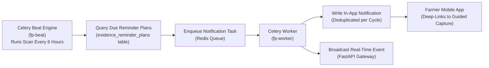

# Recurring Geo-Tagged Evidence Schedules

Fasal-Pramaan maintains an automated, verifiable time-series record of crop growth and health across the entire agricultural lifecycle. A recurring evidence reminder plan is automatically initialized whenever a new crop cycle is created, ensuring systematic before-and-after historical evidence for insurance underwriting and disaster baseline verification.

---

## 1. Recurring Schedule Protocol

- **Default Cadence**: 30 days (configurable from 14 to 90 days per crop cycle).
- **Advance Reminder Window**: 3 days prior to due date (configurable from 0 to 7 days).
- **Target Evidence Contract**: Full 5-angle guided spatial capture (`wide_field`, `left_context`, `mid_canopy`, `right_context`, `closeup_damage`).
- **Due Date Advancement**: The next scheduled due date advances **only** after a complete evidence submission has been successfully uploaded, verified, and finalized.

---

## 2. Background Scheduling & Delivery Architecture

---

## 3. Farmer Controls & Voice Management

Farmers can manage their reminder schedules directly via the mobile app interface or hands-free via the **Fasal Saathi** voice assistant:

1. **Start Scheduled Capture**: Tapping a reminder notification opens guided capture pre-configured for the specific plot and crop cycle.
2. **Adjust Cadence**: Modify the reminder interval (e.g., set to 14 days during critical monsoon flowering periods).
3. **Snooze Reminders**: Postpone an active reminder by 1 to 7 days (e.g., *"धान का प्रमाण 3 दिन के लिए स्नूज़ करो"*).
4. **Pause / Resume**: Temporarily suspend reminder notifications during post-harvest fallow periods.

All plan modifications are cryptographically signed with the farmer's Bearer JWT and recorded in the system audit log.
