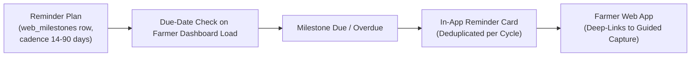
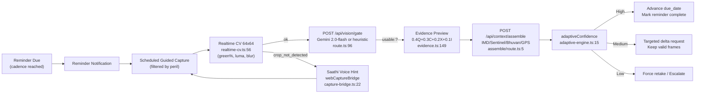

# Recurring Geo-Tagged Evidence Schedules

Fasal-Pramaan maintains an automated, verifiable time-series record of crop growth and health across the entire agricultural lifecycle. A recurring evidence reminder plan is automatically initialized whenever a new crop cycle is created, ensuring systematic before-and-after historical evidence for insurance underwriting and disaster baseline verification.

---

## 1. Recurring Schedule Protocol

- **Default Cadence**: 30 days (configurable from 14 to 90 days per crop cycle).
- **Advance Reminder Window**: 3 days prior to due date (configurable from 0 to 7 days).
- **Target Evidence Contract**: Full 5-angle guided spatial capture (`wide_field`, `left_context`, `mid_canopy`, `right_context`, `closeup_damage`).
- **Due Date Advancement**: The next scheduled due date advances **only** after a complete evidence submission has been successfully uploaded, verified, and finalized.

---

## 2. Scheduling & Delivery Architecture



Scheduling is computed in-request by the webapp (`GET /api/farmer/state`, `PATCH /api/milestones/{id}`) against Supabase Postgres — no background worker queue is required.

### 2.1 In-App Recapture Notification Path

Alongside scheduled milestone reminders, the webapp now delivers **adaptive recapture notifications** through `src/lib/farmer-notifications.ts`: claims that land in `needs_recapture` (auto-created by the adaptive engine) are diffed against localStorage-seen IDs (`fp_seen_recapture_notices_v1`) on farmer-dashboard load via `diffNewRecaptures()`. Unseen notices render as **amber toast panels** on `/farmer` with the bilingual recapture reason, missing angles, a **Capture-now deep link** into guided capture, and **Dismiss**; `markSeen()` records dismissal and the farmer nav shows a badge dot while any notice is unseen.

---

## 3. Farmer Controls & Voice Management

Farmers can manage their reminder schedules directly via the farmer web app interface or hands-free via the **Fasal Saathi** voice assistant:

1. **Start Scheduled Capture**: Tapping a reminder notification opens guided capture pre-configured for the specific plot and crop cycle.
2. **Adjust Cadence**: Modify the reminder interval (e.g., set to 14 days during critical monsoon flowering periods).
3. **Snooze Reminders**: Postpone an active reminder by 1 to 7 days (e.g., *"धान का प्रमाण 3 दिन के लिए स्नूज़ करो"*).
4. **Pause / Resume**: Temporarily suspend reminder notifications during post-harvest fallow periods.

All plan modifications are cryptographically signed with the farmer's Bearer JWT and recorded in the system audit log.

---

## 4. Webapp Evidence Authenticity Flow (Per-Reminder Capture)

Each scheduled reminder now opens the **PDF-driven webapp guided capture** which enforces authenticity **at capture time** before due-date advancement, rather than only at backend review.

### 4.1 4-Pillar Formula With Adaptive Thresholds

The same canonical evidence confidence formula applies to reminder submissions:

```
C_final = 0.4·S_Quality + 0.3·S_Coverage + 0.2·S_Context + 0.1·S_Integrity
  // apps/dashboard/src/lib/evidence.ts:149-151, apps/dashboard/src/components/EvidenceConfidenceSection.tsx:78-80
threshold = ROUTE_CONFIG[peril].minConfidence
  // apps/dashboard/src/lib/claim-routing.ts:47-160, apps/dashboard/src/lib/context/adaptive-engine.ts:26
```

| Peril | Threshold | Reminder Note |
|---|---|---|
| normal, pest_disease | 85 | Default healthy growth baseline; full 5 angles |
| drought | 80 | Wilting canopy + soil cracks; IMD dry spell |
| animal_damage, flood, hailstorm, lodging | 75 | GPS/water/hail context needed |
| fire_burn | 70 | Charred low-green allowed; satellite pending |

Only submissions achieving `adaptiveConfidence().level==="high"` (`proceed`) count toward due-date advancement; `Medium` keeps reminder open with targeted delta request, `Low` forces retake, preventing empty or unusable history.

### 4.2 Multi-Spectral Realtime CV & Usability Guidance

**Source:** `apps/dashboard/src/lib/vision/realtime-cv.ts` and `apps/dashboard/src/lib/vision/cv-worker.ts`

During scheduled capture the viewfinder samples frames in a Web Worker at 3-4 fps:

* **Agronomic Chromatic Indices**: Computes Excess Green ($ExG = 2g_n - r_n - b_n$), Green Leaf Index (GLI), and Excess Red ($ExR = 1.4r_n - g_n$) across biological HSV bands to classify lush vegetative foliage, ripe golden grains (wheat/paddy), bright yellow blooms (mustard/canola), drought scorch, and fire burn scars.
* **Organic Micro-Texture & Anti-Spoofing**: Evaluates 2D spatial Laplacian variance to reject flat synthetic surfaces (green plastic tarps, clothes, painted walls) with near-zero texture. Automatically filters atmospheric sky, asphalt/concrete, and human skin tones.
* **Sensor-Only Field GPS Geo-Tagging**: Field coordinates are locked strictly to device hardware sensors (`navigator.geolocation`) without manual text overrides, ensuring authentic geo-spatial baseline tracking compliant with PMFBY regulations.
* **Dynamic Camera Reticles & Glassmorphism HUD**: Renders autofocus corner reticles with color transitions (emerald when ready, amber when adjusting) and a floating translucent glass HUD chip with live pulse dot indicator and localized guidance.
* Hints are bridged to **Fasal Saathi** voice (`apps/dashboard/src/lib/voice/capture-bridge.ts`) so farmers hear actionable voice guidance hands-free while positioning the camera for the reminder.

Without this, historical reminders could drift with dark/duplicate frames; now a `crop_not_detected` reminder frame is blocked **before** shutter and never counts as a 5-angle completion.

### 4.3 Gemini Authenticity Gate (Post-Capture)

**Source:** `apps/dashboard/src/app/api/vision/gate/route.ts:1-121` — `src/app/api/vision/gate/route.ts`

Each reminder frame is POSTed to:

```
POST /api/vision/gate { imageDataUrl, angleType, expectedCrop, peril } →
  { usable, reason: ok|wrong_crop|ai_generated|too_dark|too_blurry|no_field|unusable, crop_detected, confidence }
```

* **Gemini 2.0-flash path** (`route.ts:26-93`): if `GEMINI_API_KEY` present, parses base64 (`route.ts:28-32`), builds PMFBY prompt (`route.ts:37-45`) — “Expected crop is ${expectedCrop}. If different crop, mark not_usable. Fire may show charred little green — do not reject for low green. Reject AI-generated/screenshot/meme/no_field/wrong angle. Return ONLY JSON … Angle / Peril”, calls `generateContent` with `inlineData` + `temperature 0.1, maxOutputTokens 512, responseMimeType application/json` (`route.ts:48-63`), 8 s timeout, enforces `wrong_crop` override unless `peril==="fire_burn"` (`route.ts:76-82`).
* **Heuristic fallback** (`route.ts:13-23`): `!data:image/→not_image(0)`, `<8000B→too_small_or_blank(0.1)`, `fire_burn→ok 0.7`, `expectedCrop→ok 0.62`, else `ok 0.6 + fallback:true`; 18 MB limit (`route.ts:111`).
* **Integration:** `usable:false` → `image.qualityPassed=false` → excluded from `usable = images.filter(i=>i.qualityPassed)` → `coverageScore = usable.length/5*100` (`evidence.ts:127-128`) and `overallConfidence` drop; `adaptiveConfidence(gateFailed=true)` forces `Low→retake` (`adaptive-engine.ts:40-44`), so a reminder tainted by AI/screenshot never advances the schedule — farmer is re-prompted for that specific angle.

### 4.4 Adaptive Routing & Recapture During Reminders

**Source:** `apps/dashboard/src/lib/context/adaptive-engine.ts:15-91`, `apps/dashboard/src/lib/claim-routing.ts:47-225`

Reminder evidence is evaluated with `adaptiveConfidence({quality,coverage,context,integrity,overall,peril,signals,gateFailed})`:

* **High→proceed** (`overall≥threshold && coverage≥60 && quality≥40`): reminder marked complete, `due_date = now + cadence`.
* **Medium→request_missing** (`overall≥threshold-20 && coverage≥40`): preserves valid frames, re-opens guided capture with `required_angles = missing/blurry` (see `docs/adaptive-recapture.md §6`).
* **Low→retake** (`coverage<40 || quality<30` or gateFailed) or **Low→escalate_to_human** (`integrity<50` or fire without Sentinel and `overall<threshold`).

Special guards directly affect reminders:

* **Fire needs Sentinel:** `peril==="fire_burn" && sentinel.status!=="available"` → Medium if `overall≥threshold` else escalate (`adaptive-engine.ts:52-57`); reminder stays open pending `SENTINEL_TOKEN`/`dataspace.copernicus.eu` satellite.
* **Animal needs GPS:** `animal_damage && gps.status!=="available"` → Medium at `overall≥70` requesting trail (`adaptive-engine.ts:59-63`).

### 4.5 Multi-Signal Context Schema (Assembled Per Reminder)

**Source:** `apps/dashboard/src/app/api/context/assemble/route.ts:1-208`, `apps/dashboard/src/lib/context/types.ts:1-34`

Every reminder view (and post-capture) calls `POST /api/context/assemble {lat,lon,peril,sowingDate}` (`assemble/route.ts:5`):

```ts
// types.ts:4-14
type ContextSource = "imd"|"sentinel"|"bhuvan"|"wildlife"|"nearby"|"gps";
type ContextStatus = "pending"|"available"|"unavailable"|"error";
interface ContextSignal { source, status, labelEn/labelHi, summaryEn/summaryHi, confidence?:0-100, meta?, checkedAt }
interface AssembledContext { signals: ContextSignal[], overall:{status:"strong"|"mixed"|"weak"|"pending"}, sentinelThumbnailUrl?, imdRainfallMm? }
```

| Signal | How Assembled | Status & Code |
|---|---|---|
| **Sentinel-2** | fire_burn + `SENTINEL_TOKEN` → `pending 55` (2.5 s probe `dataspace.copernicus.eu`; real `POST sh.dataspace…/process`), non-fire→`unavailable` | `route.ts:23-78` |
| **IMD (open-meteo 7d rain)** | `GET open-meteo.com/v1/forecast?lat&lon&past_days=7&daily=precipitation_sum` 3 s → sum `rainfall_7d_mm`; `available 70` else `pending`; notes `flood>60mm, drought<5mm` | `route.ts:82-137` `meta: rainfall_7d_mm,daily,proxy:"open-meteo"` |
| **Bhuvan** | lat/lon→`available` deep link `bhuvan.nrsc.gov.in/...?lat&lon` | `route.ts:140-162` |
| **Wildlife** | only animal_damage→`pending` forest edge | `route.ts:165-175` |
| **Nearby** | always `pending` anomaly queue | `route.ts:176-184` |
| **GPS** | lat/lon→`available` else `unavailable` | `route.ts:187-195` |

`contextOverall()` (`types.ts:27-34`): `pending&&available===0→pending`, `available≥2→strong`, `1→mixed`, else `weak`. Rendered in reminder detail as “Multi-signal Context” (`EvidenceConfidenceSection.tsx:398-422`) and fed to adaptive routing; historical time-series thus accumulates not just photos but verified IMD rainfall + Sentinel/Bhuvan context for later underwriting.

---

## 5. Updated Delivery Flow (With Authenticity)


