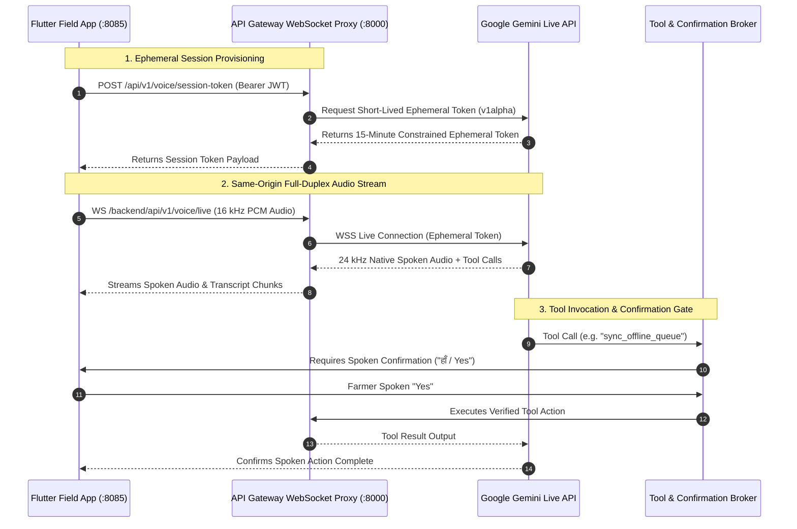

# Farmer Voice Assistant (Fasal Saathi)

**Fasal Saathi (*फसल साथी*)** is a conversational, full-duplex spoken assistant built for the Fasal-Pramaan field application. Powered by Google Gemini Live, it enables hands-free operation in **Hindi** and **English** for smallholder farmers and field officers working in outdoor agricultural environments.

The client streams 16 kHz PCM microphone audio and renders native 24 kHz audio responses in real time. To maintain strict security and data governance, Gemini executes operations exclusively through an allowlisted, server-mediated tool broker with mandatory spoken confirmation gates for state-mutating actions.

---

## 1. Architecture & Audio Protocol



---

## 2. Configuration & Setup

Add server-side Gemini configuration to `.env`:

```dotenv
VOICE_ASSISTANT_ENABLED=true
GEMINI_API_KEY=your_google_ai_studio_key
GEMINI_LIVE_MODEL=gemini-3.1-flash-live-preview
GEMINI_LIVE_VOICE=Kore
GEMINI_LIVE_SESSION_MINUTES=15
```

*Security Assurance: The `GEMINI_API_KEY` resides strictly within the backend API container and is never compiled into Flutter binaries, JavaScript assets, or client bundles. Clients connect exclusively via short-lived ephemeral tokens.*

Rebuild and start the services:
```bash
docker compose up -d --build api mobile
```

Verify backend token generation without exposing credentials:
```bash
docker compose exec -T api python scripts/verify_gemini_live.py
```

---

## 3. Spoken Demonstration Script (Hindi & English)

Access `http://localhost:8085`, sign in as `farmer@fasalpramaan.local` / `Demo@12345`, and click **Talk to Fasal Saathi**.

| Intended Action | Spoken Prompt (Hindi) | Spoken Prompt (English) | Expected Behavior |
|---|---|---|---|
| **Query Farms** | *"मेरे खेत बताओ"* | *"List my registered farms."* | Reads list of farms and associated acreage. |
| **Query Cycles** | *"मेरे फसल चक्र बताओ"* | *"Show my active crop cycles."* | Lists active crops (e.g., Kharif Paddy 2026). |
| **Start Capture** | *"धान के लिए कैप्चर शुरू करो"* | *"Start capture for my paddy crop."* | Deep-links directly into 5-angle guided capture. |
| **Capture Shutter** | *"फोटो खींचो"* | *"Take the photo."* | Triggers camera shutter for active canonical angle. |
| **Add Observation** | *"ऑब्जर्वेशन लिखो: पत्तों पर भूरे धब्बे हैं"* | *"Note observation: brown leaf spots visible."* | Records spoken observation into the draft container. |
| **Trigger Sync** | *"क्यू सिंक करो"* | *"Synchronize my offline queue."* | Requests spoken confirmation before initiating upload. |

---

## 4. Tool Allowlist & Confirmation Security

### Immediate Operations (Read-Only & Navigation)
- Switch application interface language between Hindi and English.
- Query registered farms, plots, crop cycles, growth stages, and past submissions.
- Navigate to specific farmer application routes.
- Trigger camera shutter during an active guided capture session.
- Record spoken text into the farmer observation field.

### Confirmation-Gated Operations (State-Mutating)
- Synchronize the encrypted offline queue to the server.
- Finalize an uploaded evidence submission for review triage.
- Create a new farm, plot, or crop cycle.
- Update or snooze recurring evidence reminder plans.
- Mark critical notifications as read.

*Security Gate Implementation: The action broker requires a prepare turn, an unexpired pending action, and an explicit spoken affirmative ("हाँ", "Yes", "Confirm"). Rejection ("नहीं", "Cancel") immediately clears the pending action from memory.*

---

## 5. Protocol Characteristics & Operational Notes

- **Audio Framing**: Microphone audio is resampled to 16 kHz PCM 16-bit mono. Gemini responses are rendered at 24 kHz native audio.
- **Half-Duplex Shutter**: During audio playback turns, the client pauses microphone ingestion to prevent acoustic feedback loop cancellation.
- **Session Renewal**: If a live WebSocket session expires after the configured 15-minute window, the client automatically requests a fresh ephemeral token to continue the session seamlessly.
