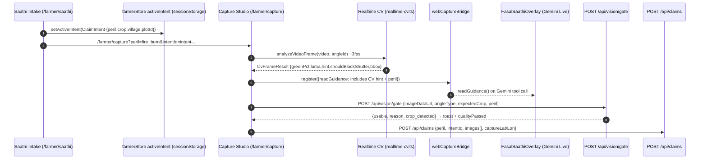

# Farmer Voice Assistant (Fasal Saathi)

**Fasal Saathi (*फसल साथी*)** is a conversational, full-duplex spoken assistant built for the Fasal-Pramaan field application. Powered by Google Gemini Live, it enables hands-free operation in **Hindi** and **English** for smallholder farmers and field officers working in outdoor agricultural environments.

The client streams 16 kHz PCM microphone audio and renders native 24 kHz audio responses in real time. To maintain strict security and data governance, Gemini executes operations exclusively through an allowlisted, server-mediated tool broker with mandatory spoken confirmation gates for state-mutating actions.

On the **Vercel web path**, Saathi is now the **first-line entry** (`/farmer/saathi`): autonomous text+voice intake that classifies peril, builds a `ClaimIntent`, and routes to a peril-aware capture studio. The Gemini Live overlay runs in parallel, fed live CV + peril context via `webCaptureBridge`.

---

## 1. Autonomous Saathi Intake — First-Line Entry (Web)

**Route:** `GET /farmer/saathi` (`apps/dashboard/src/app/farmer/saathi/page.tsx`) — linked as **Saathi** in the farmer layout and as a tip on `/farmer/capture` when no intent exists.

**Intake:** Text input + voice (`webkitSpeechRecognition` / `SpeechRecognition`, `lang` hi-IN/en-IN, `interimResults=false`). Voice support detected at runtime; fallback is typing. Quick peril chips (`fire_burn`, `animal_damage`, `flood`, `pest_disease`, `hailstorm`, `normal`) call the same handler.

**Agent:** `apps/dashboard/src/lib/saathi-agent.ts`

- `extractSlotsFromText(text, plots)` → `{peril, perilConfidence, crop, village, farmerNote}` using `classifyPerilHeuristic(text)` (keywords: fire/aag, animal/jaanwar, flood/paani, drought/sukha, pest/keet/rog/spot, hail/ola, lodging/gira + confidence 0.82–0.92, threshold ≥0.55).
- `mergeSlots(a,b)`, `buildSaathiReply(slots, lang)`, `nextQuestion(slots, lang)` (asks crop if missing), `slotsToIntent(slots, source)` → `ClaimIntent`.
- `isRouteReady(slots) === Boolean(slots.peril)`.

**ClaimIntent** (`apps/dashboard/src/lib/claim-routing.ts`):

```ts
type ClaimIntent = {
  id: string; // newIntentId() — crypto.randomUUID
  peril: Peril; perilLabelEn: string; perilLabelHi: string;
  crop?: string; village?: string; district?: string;
  plotId?: string; sowingDate?: string; farmerNote?: string;
  createdAt: string; source: "saathi_voice"|"saathi_text"|"manual";
}
type Peril = "normal"|"fire_burn"|"animal_damage"|"flood"|"drought"|"pest_disease"|"hailstorm"|"lodging";
```

Persisted in `farmerStore` (`apps/dashboard/src/lib/farmerStore.tsx`) as `activeIntent` via `sessionStorage` key `fp_active_claim_intent_v1` (`INTENT_STORAGE_KEY`). Hydrated on revisit; Saathi shows "Previous intent: {label} — continue or new issue."

**Routing:** `routeForPeril(peril)` → `RouteConfig {requiredAngles, optionalAngles, contextChecks, needsSatellite, guidanceExtraEn/Hi}`; `anglesForPeril(peril)` filters `CANONICAL_ANGLES`. On **Open Capture**, `setActiveIntent(intent)` then:

```
/farmer/capture?intentId=<intent.id>&peril=<peril>[&plotId][&crop]
```

Example: `POST /api/claims` later carries `peril: "fire_burn", intentId: "intent-..."` (see `docs/api.md`).

**Capture studio peril-awareness** (`apps/dashboard/src/app/farmer/capture/page.tsx`):

- `requestedPeril = normalizePeril(perilParam || activeIntent?.peril || "normal")`
- `intentAngles = anglesForPeril(requestedPeril)` → `activeAngleDefs` (recapture `?angles=` overrides). `activeRoute = routeForPeril(requestedPeril)` drives header badge, angle count pill, and guidance.
- Realtime CV (`apps/dashboard/src/lib/vision/realtime-cv.ts` `analyzeVideoFrame` ~3 fps) → `cvResult {greenPct, luma, hintEn/Hi, shouldBlockShutter, bbox}`. Shutter blocked if `shouldBlockShutter && peril!=="fire_burn"` (charred field relaxes green check). Hint chip + bbox overlay in viewfinder.
- `webCaptureBridge.register({readGuidance})` now returns `"${angle.name}: ${instructions} | Live CV: ${hint} (green X%, luma Y) | Peril: ${peril}"` — see §2.

**Parallel LLM gate:** After each capture, `POST /api/vision/gate` with `{imageDataUrl, angleType, expectedCrop, peril}`; `usable:false` (e.g., `wrong_crop`, `ai_generated`) marks `qualityPassed=false` and toasts in hi/en. Second opinion via `analyzeDataUrl`.

---

## 2. Voice Parallel Context — Realtime CV + Peril → Gemini Live

On the Vercel web path, **two voice systems run in parallel**:

1. **Saathi intake** (`/farmer/saathi`) uses `webkitSpeechRecognition` for lightweight Hindi/English utterance → `saathi-agent.ts` (no Gemini needed, works offline).
2. **Gemini Live overlay** (`FasalSaathiOverlay`, `apps/dashboard/src/components/FasalSaathiOverlay.tsx`) is an audio-only session (`video:false`) so it never contests the capture camera. It streams 16 kHz PCM and renders 24 kHz audio.

Bridge: `apps/dashboard/src/lib/voice/capture-bridge.ts` (`webCaptureBridge`). Capture studio registers handlers:

```ts
webCaptureBridge.register({
  readGuidance: async () => ({ message: `${angle.name}: ${instructions} | Live CV: ${hint} | Peril: ${peril}` }),
  readProgress: async () => ({ captured, total, currentAngle }),
  captureCurrentAngle, setObservation, submitDraft
})
```

Gemini tools `read_capture_guidance` / `read_capture_progress` call these; the overlay pushes portal context (`PORTAL CONTEXT` text turn) with `peril`, `recapture_count`, `plot_count`, current `path`/`screen`/`language` on `session_start` and on state change. Result: Saathi can say e.g. *"Good framing — move a bit closer, 2 of 3 angles done, fire_burn — include burn edge"* without the farmer leaving the viewfinder.

LLM vision gate runs **in parallel** to Gemini: after shutter, capture page `POST /api/vision/gate` (Gemini `generateContent` with `inlineData` if `GEMINI_API_KEY` set, else heuristic) validates crop presence / AI-generation; `usable:false` toasts and marks `qualityPassed=false`.

---

## 3. Architecture & Audio Protocol



**Vercel web path:** `POST /api/voice/session` (`apps/dashboard/src/app/api/voice/session/route.ts`) mints `{token, websocketUrl, model, expiresAt}` → client opens `wss://generativelanguage.googleapis.com/...?access_token=...` via `FasalSaathiOverlay` with tools `captureCurrentAngle`, `readGuidance`, `readProgress`, `setObservation`, `submitDraft`. The ephemeral token keeps `GEMINI_API_KEY` server-only; the browser never sees it.

## 4. Configuration & Setup

All keys are **server-only** (set on Vercel or in `apps/dashboard/.env.local`):

```dotenv
VOICE_ASSISTANT_ENABLED=true
GEMINI_API_KEY=your_google_ai_studio_key
GEMINI_LIVE_MODEL=gemini-3.1-flash-live-preview
GEMINI_LIVE_VOICE=Kore
GEMINI_LIVE_SESSION_MINUTES=15
# optional external signals (see §7, docs/environment-variables.md)
SENTINEL_TOKEN=your_dataspace_copernicus_token
IMD_API_KEY=optional
HF_TOKEN=hf_...
```

*Security Assurance: The `GEMINI_API_KEY` (and `SENTINEL_TOKEN`, `IMD_API_KEY`, `HF_TOKEN`) reside strictly server-side (never in client bundles). Clients receive only short-lived ephemeral Live tokens via `/api/voice/session`.*

Vercel: set the same vars in Project → Settings → Environment Variables (Production + Preview). No `NEXT_PUBLIC_*` prefix for secrets. Local dev: put them in `apps/dashboard/.env.local` and run `npm run dev`.

---

## 5. Spoken Demonstration Script (Hindi & English)

**Web Saathi intake:** Open `/farmer/saathi` (autonomous, no login gate bypass). Type or tap 🎙️ and say e.g. *"khet me aag lag gayi"* → Saathi replies with peril route (e.g. `fire_burn: wide_field, closeup_damage — Show burnt patch + surrounding edge. Satellite will be cross-checked.`) → **Open Capture** → capture studio shows `fire_burn` badge, 2-angle pill, CV hint chip. During capture, tap the floating **Talk to Fasal Saathi** overlay — Gemini now answers with live guidance (`Live CV: Good framing — ready to capture (green 42%, luma 58) | Peril: fire_burn`).

| Intended Action | Spoken Prompt (Hindi) | Spoken Prompt (English) | Expected Behavior |
|---|---|---|---|
| **Query Farms** | *"मेरे खेत बताओ"* | *"List my registered farms."* | Reads list of farms and associated acreage. |
| **Query Cycles** | *"मेरे फसल चक्र बताओ"* | *"Show my active crop cycles."* | Lists active crops (e.g., Kharif Paddy 2026). |
| **Start Capture** | *"धान के लिए कैप्चर शुरू करो"* | *"Start capture for my paddy crop."* | Deep-links directly into peril-aware guided capture. |
| **Capture Shutter** | *"फोटो खींचो"* | *"Take the photo."* | Triggers camera shutter for active canonical angle. |
| **Add Observation** | *"ऑब्जर्वेशन लिखो: पत्तों पर भूरे धब्बे हैं"* | *"Note observation: brown leaf spots visible."* | Records spoken observation into the draft container. |
| **Submit Claim** | *"क्लेम सबमिट करो"* | *"Submit my claim."* | Requests spoken confirmation before submitting via `/api/claims`. |

---

## 6. Tool Allowlist & Confirmation Security

### Immediate Operations (Read-Only & Navigation)
- Switch application interface language between Hindi and English.
- Query registered farms, plots, crop cycles, growth stages, and past submissions.
- Navigate to specific farmer application routes.
- Trigger camera shutter during an active guided capture session.
- Record spoken text into the farmer observation field.

### Confirmation-Gated Operations (State-Mutating)
- Submit a completed guided-capture claim to the server.
- Finalize an uploaded evidence submission for review triage.
- Create a new farm, plot, or crop cycle.
- Update or snooze recurring evidence reminder plans.
- Mark critical notifications as read.

*Security Gate Implementation: The action broker requires a prepare turn, an unexpired pending action, and an explicit spoken affirmative ("हाँ", "Yes", "Confirm"). Rejection ("नहीं", "Cancel") immediately clears the pending action from memory.*

---

## 7. Protocol Characteristics & Operational Notes

- **Audio Framing**: Microphone audio is resampled to 16 kHz PCM 16-bit mono. Gemini responses are rendered at 24 kHz native audio.
- **Half-Duplex Shutter**: During audio playback turns, the client pauses microphone ingestion to prevent acoustic feedback loop cancellation.
- **Session Renewal**: If a live WebSocket session expires after the configured 15-minute window, the client automatically requests a fresh ephemeral token to continue the session seamlessly.

---

## 8. External Signals Referenced

Saathi routes may attach external context (see `POST /api/context/assemble`, `docs/api.md`):

- **Copernicus Sentinel-2** via **Sentinel Data Space Ecosystem** — `dataspace.copernicus.eu` and **Sentinel Hub APIs** (`sh.dataspace.copernicus.eu/api/v1/process`). ESA open data; burn-scar / water-extent for `fire_burn` / `flood` perils when `SENTINEL_TOKEN` set.
- **ISRO Bhuvan** (`bhuvan.nrsc.gov.in`) — land-use / forest-edge proximity for `animal_damage` / `flood`.
- **IMD** — `mausam.imd.gov.in`, `dsp.imdpune.gov.in`, **GKMS** (Gramin Krishi Mausam Sewa), **Meghdoot** app. 7-day rainfall via IMD/open-meteo proxy when `IMD_API_KEY` (optional) or `lat`/`lon` present; `imd_weather` context check for most perils.

No extra keys required for local demo — stubs return `pending`/`available` with `stub:true`.
