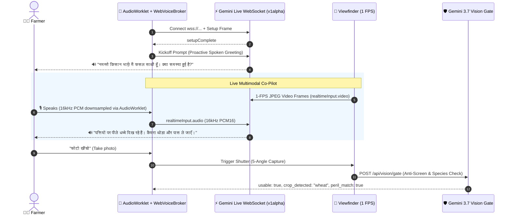

# Farmer Voice Assistant (Fasal Saathi v3.0)

**Fasal Saathi (*फसल साथी*)** is a multimodal, full-duplex spoken and visual AI companion built for the Fasal-Pramaan agricultural platform. Powered by **Google Gemini Live (Gemini 3.1 Flash / v1alpha)** and **Gemini 3.7 Flash Vision**, it delivers zero-friction, hands-free operation across 15 Indian languages for smallholder farmers and field officers.

---

## 🌟 Key Capabilities in v3.0

1. **High-Performance AudioWorklet Engine:**
   - Microphone input is sampled off the main UI thread via `AudioWorkletNode` (`FasalAudioProcessor`), eliminating UI stutter during heavy Mapbox/Leaflet renders.
   - Built-in in-worklet 16 kHz PCM16 downsampling and RMS noise-floor calculation.
   - Automatic half-duplex acoustic echo suppression prevents speaker audio from looping back into the microphone, while detecting deliberate user speech for instant barge-in interruptions.

2. **1-FPS Live Viewfinder Multimodal Video Streaming:**
   - While on the `/farmer/capture` camera studio, the client streams 1-FPS live viewfinder frames (`realtimeInput: { video: { mimeType: "image/jpeg", data: base64 } }`) directly to Gemini Live over WebSocket.
   - Saathi **sees what the farmer sees in real-time** and provides proactive agronomic guidance on framing, foliage coverage, and pest/disease symptoms aloud.

3. **Proactive Spoken Opening Greeting:**
   - As soon as the WebSocket connection completes its handshake (`setupComplete`), Saathi automatically greets the farmer aloud without waiting for the user to speak first (*"नमस्ते किसान भाई! मैं फसल साथी हूँ। आपके खेत में क्या समस्या हुई है? मुझे बताएं।"*).

4. **Soothing Natural Voice (`Aoede`):**
   - Configured with Google's warm, natural `Aoede` voice timbre tailored for accessible agricultural dialogue.

5. **Hierarchical Multi-Agent Tools:**
   - `register_plot`: Spoken parcel registration with automatic khasra/crop assignment.
   - `check_plot_geofence`: GPS boundary validation against cadastral survey records.
   - `fetch_agro_weather_alerts`: Live 72-hour precipitation, hail probability, and temperature stress.
   - `explain_claim_audit`: Plain-language explanation of the 3-stage AI confidence breakdown (Gemini Vision Gate + DINOv2 Disease Classifier + Sentinel-2 Satellite Cross-Check).

---

## 1. Autonomous Saathi Intake — First-Line Entry (Web)

**Route:** `GET /farmer/saathi` (`apps/dashboard/src/app/farmer/saathi/page.tsx`) — linked as **Saathi** in the farmer layout and as a tip on `/farmer/capture` when no intent exists.

**Intake:** Text input + voice (`webkitSpeechRecognition` / `SpeechRecognition`, `lang` hi-IN/en-IN, `interimResults=false`). Voice support detected at runtime; fallback is typing. Quick peril chips (`fire_burn`, `animal_damage`, `flood`, `pest_disease`, `hailstorm`, `normal`) call the same handler.

**Agent:** `apps/dashboard/src/lib/saathi-agent.ts`

- `extractSlotsFromText(text, plots)` → `{peril, perilConfidence, crop, village, farmerNote}` using `classifyPerilHeuristic(text)` (keywords in English and Devanagari Hindi: fire/aag/आग, animal/jaanwar/जानवर, flood/paani/बाढ़, drought/sukha/सूखा, pest/keet/rog/कीट/रोग, hail/ola/ओलावृष्टि, lodging/gira/गिराव + confidence 0.82–0.92, threshold ≥0.55).
- `resolveAgenticAction(text, currentSlots, plots, currentLang)` → Autonomous Agentic Controller:
  - **Camera Launch Orders**: *"खेत में आग लग गई है, फोटो खींचनी है"* / *"Open camera for flood damage"* automatically extracts peril/plot/crop and routes straight to `/farmer/capture`.
  - **Plot Registration**: *"मेरा 2 एकड़ गेहूँ का खेत जोड़ो"* registers the plot in state and prompts next steps.
  - **Navigation Orders**: *"सत्यापित दावे दिखाओ"* / *"Show verified claims"* filters `/farmer/claims?status=verified`.
  - **Dynamic Language Switching**: *"हिंदी में बात करो"* / *"Talk in English"* switches the app locale and voice synthesizer dynamically across 15 Indian languages.

---

## 2. AudioWorklet & Multimodal Live Stream Protocol



---

## 3. Configuration & Setup

All secrets are **server-only** (configured in Vercel or `apps/dashboard/.env.local`):

```dotenv
VOICE_ASSISTANT_ENABLED=true
GEMINI_API_KEY=your_google_ai_studio_key
GEMINI_LIVE_MODEL=gemini-3.1-flash-live-preview
GEMINI_VISION_MODEL=gemini-3.7-flash
GEMINI_LIVE_VOICE=Aoede
GEMINI_LIVE_SESSION_MINUTES=30
# optional external signals
SENTINEL_TOKEN=your_dataspace_copernicus_token
IMD_API_KEY=optional
HF_TOKEN=hf_...
```

---

## 4. Spoken Commands Reference

| Intended Action | Spoken Prompt (Hindi) | Spoken Prompt (English) | Expected Behavior |
|---|---|---|---|
| **Auto Greeting** | *(Automatic on connect)* | *(Automatic on connect)* | Assistant immediately speaks opening welcome aloud. |
| **Register Plot** | *"मेरा नया गेहूँ का खेत जोड़ो"* | *"Register a new wheat plot."* | Calls `register_plot` with crop/village attributes. |
| **Check Geofence** | *"खेत की सीमा जांचो"* | *"Check my plot geofence."* | Calls `check_plot_geofence` and checks GPS accuracy. |
| **Weather Alerts** | *"मौसम का हाल बताओ"* | *"Check agro-weather alerts."* | Calls `fetch_agro_weather_alerts` for 72h precipitation & hail. |
| **Explain Audit** | *"मेरे दावे का स्कोर समझाओ"* | *"Explain my claim AI audit."* | Calls `explain_claim_audit` for 3-stage breakdown. |
| **Capture Shutter** | *"फोटो खींचो"* | *"Take the photo."* | Triggers camera shutter for active angle with metadata. |
| **Switch Camera** | *"कैमरा बदलो"* | *"Switch camera."* | Toggles between front and back environment cameras. |
| **Select Angle** | *"नजदीकी फोटो दिखाओ"* | *"Select closeup damage angle."* | Switches active capture angle in the viewfinder. |
| **Retake Angle** | *"यह फोटो दोबारा लो"* | *"Retake this angle."* | Clears current frame and opens angle for recapture. |
| **Check Quality** | *"फोटो की क्वालिटी जांचो"* | *"Check evidence quality."* | Inspects realtime CV metrics (canopy %, blur, luma). |
| **Add Observation** | *"ऑब्जर्वेशन: ओले से पत्ते फट गए"* | *"Observation: hailstorm tore foliage."* | Records spoken observation into the claim draft. |
| **Submit Claim** | *"क्लेम सबमिट करो"* | *"Submit my claim."* | Requests spoken confirmation before submitting to PMFBY queue. |

---

## 5. Security & Action Confirmation Protocol

- **Immediate Operations (Read-Only & Optics):** Camera shutter, angle selection, camera flipping, navigation, geofence checks, and weather alerts execute immediately upon spoken command.
- **Confirmation-Gated Operations (State-Mutating):** Submitting a claim draft (`prepare_submit_claim`), snoozing growth milestones (`prepare_snooze_evidence_reminder`), or marking milestones complete require a preparation turn and an explicit spoken affirmative (*"हाँ"*, *"Yes"*, *"Confirm"*). Rejection (*"नहीं"*, *"Cancel"*) clears the pending action from memory.
