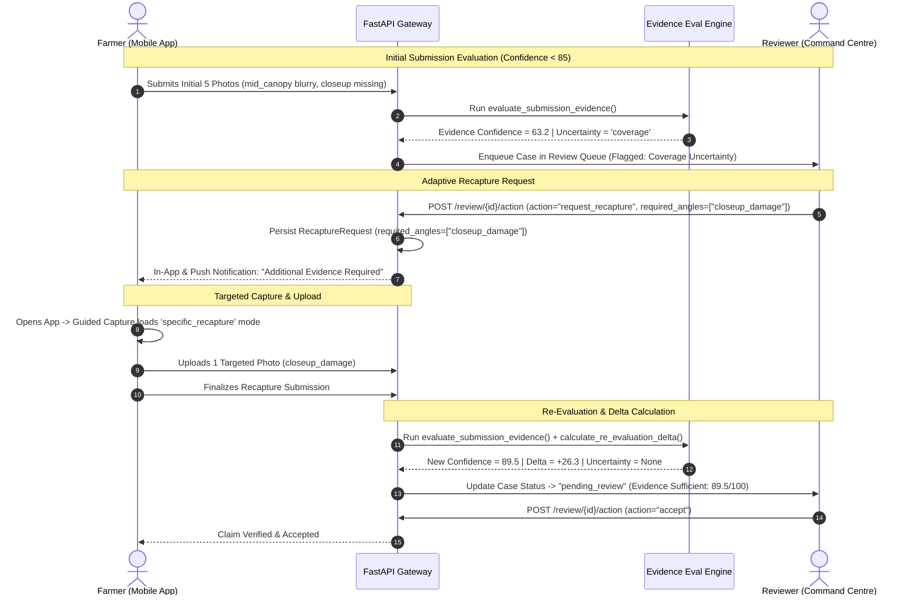

# Adaptive Evidence Recapture Workflow

The **Adaptive Evidence Recapture Workflow** is an intelligent evidence-correction mechanism in Fasal-Pramaan that resolves evidence uncertainty without overburdening farmers with full, repetitive re-captures.

In legacy agricultural insurance systems, any defect in submission photos (such as a blurry close-up or a missing boundary angle) forces the farmer to re-visit the field and capture the entire 5-photo protocol from scratch. Fasal-Pramaan replaces blanket re-audits with **targeted, angle-specific evidence requests**, preserving verified existing evidence and tracking confidence improvements across iterations.

---

## 1. Core Principles of Adaptive Recapture

1. **Targeted Delta Requests**: The system asks only for the specific missing or defective angles (e.g., `["closeup_damage"]` or `["wide_field"]`).
2. **Preservation of Valid Evidence**: Existing high-quality, verified photos are retained and combined with new evidence during re-evaluation.
3. **Automated Angle Guidance**: Farmers receive specific, localized instructions (in Hindi and English) explaining exactly what is needed and why.
4. **Historical Snapshot Auditing**: Every recapture event creates a new immutable evaluation snapshot while calculating exact confidence deltas ($\Delta C$).
5. **Human-in-the-Loop Override**: Reviewers can either trigger automated AI-guided recapture recommendations or customize the requested angles and instructions manually.

---

## 2. End-to-End Recapture Lifecycle



---

## 3. Reason Codes and Angle Targeting

The Evidence Evaluation Engine maps specific uncertainty signals to canonical reason codes and targeted angle requirements:

| Uncertainty Type | Detected Issue | Generated Reason Code | Targeted Angles | Farmer Instruction (EN / HI) |
|---|---|---|---|---|
| **Coverage** | Close-up missing or low resolution | `missing_closeup` | `["closeup_damage"]` | **EN:** Move closer to the affected crop area and capture a sharp macro shot.<br/>**HI:** प्रभावित फसल के पास जाएं और पत्तों की साफ क्लोज़-अप फोटो लें। |
| **Coverage** | Wide field perspective missing | `poor_wide_context` | `["wide_field"]` | **EN:** Capture the field from farther back to show surrounding plot context.<br/>**HI:** खेत से थोड़ा पीछे हटकर पूरे खेत और आस-पास की फसल की फोटो लें। |
| **Visual** | Canopy or leaf photo motion blurred | `blur` | `["mid_canopy"]` | **EN:** Hold the phone steady and capture the crop clearly in good lighting.<br/>**HI:** फोन को स्थिर रखें और अच्छी रोशनी में साफ फोटो लें। |
| **Visual** | Severe underexposure / dark lighting | `poor_quality` | `["mid_canopy", "closeup_damage"]` | **EN:** Avoid heavy shadows; capture clearly during daylight.<br/>**HI:** छाया से बचें और दिन की रोशनी में साफ फोटो लें। |
| **Context** | GPS coordinate missing or inaccurate | `missing_gps` | `[]` *(Location fix)* | **EN:** Enable GPS on device and stand within the registered farm plot.<br/>**HI:** फोन में GPS ऑन करें और पंजीकृत खेत के अंदर खड़े होकर फोटो लें। |
| **Integrity** | Hash collision, mock GPS, screen replay | `integrity_failed` | *None* | **Routed directly to senior reviewer for anti-fraud investigation.** |

---

## 4. Re-Evaluation & Confidence Delta Computation

When targeted evidence is uploaded, the engine merges newly uploaded active images with existing verified images, executes a fresh evaluation run, and computes the delta against the immediate prior snapshot:

$$\Delta C = C_{\text{current}} - C_{\text{previous}}$$

### API Re-Evaluation Payload Contract

```json
{
  "submission_id": "f8a1e230-b741-4cf0-9852-192a8310c952",
  "re_evaluation_summary": {
    "previous_confidence": 63.2,
    "new_confidence": 89.5,
    "confidence_delta": 26.3,
    "previous_uncertainty": "coverage",
    "new_uncertainty": null,
    "is_sufficient": true,
    "status": "pending_review"
  },
  "current_evaluation": {
    "quality_score": 88.0,
    "coverage_score": 100.0,
    "context_score": 85.0,
    "integrity_score": 100.0,
    "final_confidence": 89.5,
    "confidence_threshold": 85.0,
    "uncertainty_type": null,
    "recommended_action": "normal_review"
  }
}
```

---

## 5. Reviewer Command Centre Interface

In the Next.js Reviewer Dashboard, cases under adaptive recapture display a dedicated **Evidence Trust Timeline**:

```text
┌────────────────────────────────────────────────────────────────────────┐
│ CASE FP-2026-0894 — EVIDENCE TRUST TIMELINE                            │
├────────────────────────────────────────────────────────────────────────┤
│ Initial Submission (v1)                                                │
│ Confidence: 63.2 / 100  [Threshold: 85.0]       Status: NEEDS_RECAPTURE│
│ Uncertainty: Coverage (High) — closeup_damage is missing               │
│ Quality: 71.0  |  Coverage: 60.0  |  Context: 85.0  |  Integrity: 100  │
│ ────────────────────────────────────────────────────────────────────── │
│ Recapture Upload (v2)                                                  │
│ Confidence: 89.5 / 100  (+26.3 Delta)           Status: PENDING_REVIEW │
│ Uncertainty: None — Evidence Sufficient                                │
│ Quality: 88.0  |  Coverage: 100.0 |  Context: 85.0  |  Integrity: 100  │
├────────────────────────────────────────────────────────────────────────┤
│ [ Accept Claim ]   [ Correct Assessment ]   [ Request Inspection ]     │
└────────────────────────────────────────────────────────────────────────┘
```

Reviewers can inspect side-by-side comparisons of the original versus replacement photos, verify EXIF capture timestamps, and confirm location geofences before making a final adjudication decision.

---

## 6. Adaptive Confidence Levels & NextStep Routing (PDF-Driven Webapp)

The **canonical 4-pillar formula remains** `C_{\text{final}} = 0.4Q+0.3C+0.2X+0.1I` (`apps/dashboard/src/lib/evidence.ts:149-151`, `apps/dashboard/src/components/EvidenceConfidenceSection.tsx:78-80`), but **sufficiency is now peril-adaptive** via `adaptiveConfidence()` rather than a fixed 85:

**Source:** `apps/dashboard/src/lib/context/adaptive-engine.ts:15-91`, `apps/dashboard/src/lib/claim-routing.ts:47-177`, `apps/dashboard/src/components/EvidenceConfidenceSection.tsx:232-242`

```ts
// apps/dashboard/src/lib/context/adaptive-engine.ts:24-27
const cfg = routeForPeril(peril); // from ROUTE_CONFIG
const threshold = cfg.minConfidence; // 85 normal/pest_disease, 80 drought, 75 animal/flood/hail/lodging, 70 fire_burn
adaptiveConfidence({ quality, coverage, context, integrity, overall: C_final, peril, signals, gateFailed })
```

| Adaptive Level | NextStep | Exact Condition | Typical Trigger |
|---|---|---|---|
| **High** | `proceed` | `overall ≥ threshold && coverage ≥60 && quality ≥40 && integrity ≥50 && !gateFailed` + peril guards pass | All 4 pillars strong for that peril; Sentinel/GPS satisfied |
| **Medium** | `request_missing` | `overall ≥ threshold-20 && coverage ≥40` (or fire without Sentinel but `overall≥threshold` → Medium) | Some angles missing or mild blur; fixable with delta |
| **Low** | `retake` | `coverage<40 \|\| quality<30` and integrity ok, or any `gateFailed` | Most frames unusable; need fresh capture |
| **Low** | `escalate_to_human` | `integrity<50` or `fire_burn && !sentinelOk && overall<threshold` or `overall < threshold-20` without coverage hole | Fraud/tamper or satellite-missing fire claim; no automated retake |

Hard overrides in order (`adaptive-engine.ts:40-63`):

1. **Gate failed** (`gateFailed=true` from `POST /api/vision/gate` → `usable:false`) → `Low/retake` with bilingual reason “Authenticity gate flagged image as unusable” — no threshold check.
2. **Integrity <50** → `Low/escalate_to_human` “Integrity check failed — possible duplicate or tamper”.
3. **Fire needs Sentinel** (`peril==="fire_burn" && sentinel.status!=="available"`) → if `overall≥threshold` then `Medium/request_missing` (explain “Fire claim needs satellite burn-scar confirmation — keeping as medium until Sentinel available”), else `Low/escalate_to_human`.
4. **Animal needs GPS** (`peril==="animal_damage" && gps.status!=="available"`) → if `overall≥70` then `Medium/request_missing` “Animal damage benefits from GPS trail — request location”.

The Reviewer Dashboard renders this as `Adaptive: high · proceed (threshold 85, peril normal)` plus first reason (`EvidenceConfidenceSection.tsx:384-395`), with a live **Multi-signal Context strip** fetched from `POST /api/context/assemble` (`EvidenceConfidenceSection.tsx:210-231; 398-422`).

### 6.1 Mapping to Recommended Actions

| Adaptive nextStep | Legacy `recommended_action` | System Action Stored (`recapture_reason`) |
|---|---|---|
| `proceed` | `normal_review` / `none` | No recapture; queue for accept/correct |
| `request_missing` | `request_specific_evidence` | `required_angles = missing or blurry` + `reasonsHi` |
| `retake` | `retake_image` | Full angle retake prompt (Saathi voice: `webCaptureBridge` readGuidance) |
| `escalate_to_human` | `human_review` | `status=physical_inspection` or senior reviewer queue; automated retake disabled |

Delta computation unchanged: `ΔC = C_current − C_previous` after merging verified + new `qualityPassed` frames (`claim-pipeline.ts:530-551`).

---

## 7. Realtime CV & Gemini Gate Inside the Recapture Loop

### 7.1 Realtime Viewfinder (Before Retake Shutter)

**Source:** `apps/dashboard/src/lib/vision/realtime-cv.ts:56-116`

During guided retake (`specific_recapture` mode) the viewfinder runs `analyzeVideoFrame(video, angleId)` at 2-4 fps on a 64×64 canvas:

* **Green%** vegetation proxy: `g>60 && g>r+10 && g>b+10` → `greenPct` (`realtime-cv.ts:86`), luma mean (`realtime-cv.ts:88`), blur variance (`realtime-cv.ts:90-92`).
* **Hint codes:** `ok | crop_not_detected | too_dark | too_bright | too_close | too_far | hold_steady | center_crop` via `hintFor()` (`realtime-cv.ts:35-50`): thresholds `luma<12 → too_dark (block)`, `blur<35 → hold_steady`, `greenPct<14 (8 if closeup_damage) → crop_not_detected (block)`.
* **Shutter blocking:** `shouldBlockShutter = hint.block && !isFire` (`realtime-cv.ts:98-100`) — fire_burn allows low green charred fields. Farmers receive bilingual hints (EN/HI) and `bbox` stub `0.2,0.2,0.6,0.6` when `cropDetected`.
* **Saathi parallel feed:** `cvResultToSaathiHint(result, lang)` (`realtime-cv.ts:179-182`) → `webCaptureBridge` (`apps/dashboard/src/lib/voice/capture-bridge.ts:22-62`) so the voice assistant narrates guidance without extra latency. Still-image re-check `analyzeDataUrl()` (`realtime-cv.ts:122-177`) uses 256 px, stride 16.

This **prevents a known-bad retake from being uploaded**; a blocked frame never increments `coverageScore` because `usable = images.filter(img.qualityPassed)` (`evidence.ts:127-128`).

### 7.2 Gemini Authenticity Gate (On Capture)

**Source:** `apps/dashboard/src/app/api/vision/gate/route.ts:1-121`

Every captured retake frame is POSTed before persist:

```
POST /api/vision/gate { imageDataUrl, angleType, expectedCrop, peril }
→ Gemini 2.0-flash generateContent(inlineData) → { usable, reason, crop_detected, confidence }
→ Fallback heuristic if no GEMINI_API_KEY
```

* **Prompt** (`route.ts:37-45`): crop-only check + peril note (“Fire/burn may show charred field — do not reject for low green”), reject `ai_generated | too_dark | too_blurry | no_field | wrong_crop | unusable`, `Angle`+`Peril` injected, `temperature:0.1, maxOutputTokens:512, responseMimeType:"application/json"` (`route.ts:63`), 8 s timeout.
* **Crop-only enforcement** (`route.ts:76-82`): if `expectedCrop` given and `crop_detected` mismatch (case-insensitive substring) and `peril!=="fire_burn"` → override to `usable:false, reason:"wrong_crop"`.
* **Heuristic fallback** (`route.ts:13-23`): `!data:image/ → not_image`, `<8000 bytes → too_small_or_blank`, `peril==="fire_burn" → usable:true (0.7)`, `expectedCrop → usable:true (0.62)`, else `0.6` with `fallback:true`.
* **Effect on recapture:** `usable:false` → `image.qualityPassed=false` → excluded from `usable.length` → `coverageScore = usable.length/5*100` drops, `overallConfidence` recomputed (`evidence.ts:128-151`), and `adaptiveConfidence(gateFailed=true)` forces `Low→retake` with bilingual reason (`adaptive-engine.ts:40-44`), so reviewer sees “Authenticity gate flagged image” instead of a generic “missing_closeup”.

### 7.3 Retake vs Escalate Decision with New Signals

| Signal Trigger | Adaptive Result | Recapture Behavior |
|---|---|---|
| `too_dark`/`crop_not_detected` blocked in viewfinder | Never reaches gate | Farmer must adjust before shutter; Saathi repeats hint |
| Gemini `wrong_crop` or `ai_generated` | `gateFailed → Low/retake` | System discards frame, re-prompts same angle, marks `gate_result` on claim (`claim-pipeline.ts:93-94`) |
| Integrity duplicate/Mock GPS | `integrity<50 → Low/escalate_to_human` | No retake prompt; case locked for fraud review (priority 1) |

---

## 8. Multi-Signal Context Assembly During Recapture

**Source:** `apps/dashboard/src/app/api/context/assemble/route.ts:1-208`, `apps/dashboard/src/lib/context/types.ts:1-34`

On every proof view (and after recapture submit) the dashboard calls:

```
POST /api/context/assemble { lat, lon, peril, sowingDate }
→ { signals: ContextSignal[], overall: {status, summaryEn/Hi}, imdRainfallMm, sentinelThumbnailUrl, peril }
```

### 8.1 ContextSignal Schema (Validated Type)

```ts
// apps/dashboard/src/lib/context/types.ts:1-14
type ContextSource = "imd" | "sentinel" | "bhuvan" | "wildlife" | "nearby" | "gps";
type ContextStatus = "pending" | "available" | "unavailable" | "error";
interface ContextSignal {
  source: ContextSource;
  status: ContextStatus;
  labelEn: string; labelHi: string;
  summaryEn: string; summaryHi: string;
  confidence?: number; // 0-100
  meta?: Record<string, unknown>;
  checkedAt: string; // ISO
}
```

`contextOverall()` (`types.ts:27-34`): `pending>0 && available===0 → pending`, `available≥2 → strong`, `available===1 → mixed`, else `weak`.

### 8.2 Signal-by-Signal Behavior (What the Assembler Actually Does)

| Source | Status Logic | Example Summary | Meta |
|---|---|---|---|
| **Sentinel-2** | `peril==="fire_burn"` → `pending` (55) if `SENTINEL_TOKEN`/`COPERNICUS_TOKEN` present else `pending` with `needsToken:true`; liveness probe `fetch(dataspace.copernicus.eu)` 2.5 s timeout (`route.ts:29-55`); non-fire → `unavailable` | “Sentinel check queued — burn scar verification will be attached after satellite pass.” | `meta:{lat,lon,stub:true}` |
| **IMD (open-meteo proxy)** | If `lat/lon` → `GET open-meteo forecast past_days=7 daily=precipitation_sum` 3 s timeout, sum → `total`; `available` (70) else `pending` (`route.ts:82-137`); `peril==="flood" && total>60 → Heavy rain supports flood`, `drought && total<5 → Very low supports drought` (`route.ts:94-101`) | `7-day rainfall 72.3 mm` | `meta:{rainfall_7d_mm, daily, proxy:"open-meteo", hasImdKey}` + top-level `imdRainfallMm` |
| **Bhuvan** | `lat/lon` → `available` with deep link `bhuvan.nrsc.gov.in/...?lat=&lon=` (`route.ts:140-151`) else `unavailable` | “Bhuvan view available for cross-check (manual).” | `meta:{bhuvanUrl}` |
| **Wildlife** | Only `animal_damage` → `pending` “forest edge proximity … via Bhuvan/forest layer” (`route.ts:165-175`) | — | — |
| **Nearby fields** | Always `pending` “Nearby field anomaly comparison is queued.” (`route.ts:176-184`) | — | — |
| **GPS** | `lat/lon!=null → available` else `unavailable` (`route.ts:187-195`) | `GPS 28.61390, 77.20900` | — |

All signals are stored on `WebClaimRow.context_signals` (`claim-pipeline.ts:94`) and fed into `adaptiveConfidence(signals)` — e.g., missing GPS turns `animal_damage` High into Medium, missing Sentinel holds fire claims at Medium pending satellite, directly affecting whether the system says `request_missing` vs `proceed`.

---

## 9. Adaptive Peril Routing Table (Full)

**Source:** `apps/dashboard/src/lib/claim-routing.ts:47-160` (`ROUTE_CONFIG`), `adaptive-engine.ts:24-27`

| Peril | Label (EN/HI) | `minConfidence` | Required Angles `requiredAngles` | Optional | Context Checks `contextChecks` | Guidance Extra |
|---|---|---|---|---|---|---|
| `normal` | Normal / सामान्य क्षति | **85** | wide_field, left_context, mid_canopy, right_context, closeup_damage | — | imd, bhuvan, nearby | “Capture all 5 angles clearly. Keep crop in frame.” |
| `fire_burn` | Fire/Burn / आग/जलना | **70** | wide_field, closeup_damage | mid_canopy | sentinel_fire, imd, bhuvan | “Show burnt patch + surrounding unburnt edge. Satellite will be cross-checked.” |
| `animal_damage` | Animal / जानवर क्षति | **75** | wide_field, mid_canopy, closeup_damage | left/right_context | wildlife_proximity, imd, bhuvan | “Include footprints/trail if visible. Capture damaged stem at 15 cm.” |
| `flood` | Flood / बाढ़ | **75** | wide_field, mid_canopy, closeup_damage | left/right_context | imd_weather, sentinel_fire, nearby | “Capture standing water line + submerged base. IMD 7-day rain will be checked.” |
| `drought` | Drought / सूखा | **80** | wide_field, mid_canopy, closeup_damage | left/right_context | imd_weather, bhuvan, nearby | “Show wilting canopy + soil cracks if any.” |
| `pest_disease` | Pest/Disease / कीट/रोग | **85** | closeup_damage, mid_canopy, wide_field | left/right_context | imd_weather, nearby, bhuvan | “Closeup must fill frame with lesions. Keep leaf steady.” |
| `hailstorm` | Hailstorm / ओलावृष्टि | **75** | wide_field, closeup_damage, mid_canopy | left/right_context | imd_weather, nearby, bhuvan | “Show shredded leaves + scattered hail if present.” |
| `lodging` | Lodging / गिराव | **75** | wide_field, mid_canopy, closeup_damage | left/right_context | imd_weather, nearby, bhuvan | “Stand 10 m back; include lodged vs standing boundary.” |

Normalization `normalizePeril(raw)` handles aliases `fire/burn→fire_burn, animal/grazing→animal_damage, flood/waterlogging→flood, dry→drought, pest/disease→pest_disease, hail→hailstorm, wind/lodging→lodging` (`claim-routing.ts:162-173`). Reviewer can override peril; threshold updates reactively.

---

## 10. Updated Recapture Timeline (With Authenticity & Context)

```text
┌────────────────────────────────────────────────────────────────┐
│ CASE FP-2026-0894 — EVIDENCE TRUST TIMELINE (Adaptive)          │
├────────────────────────────────────────────────────────────────┤
│ Initial Submission (v1)  peril=fire_burn  threshold=70          │
│ Capture Gate: Gemini flagged 1 frame wrong_crop → qualityPassed │
│              false (coverage 40→60 after filter)                │
│ Realtime CV: wide_field hint=crop_not_detected blocked 1 retry  │
│ Confidence: 63.2 / 100  [Adaptive threshold: 70]  Status: MEDIUM│
│ Adaptive: medium · request_missing (Fire needs Sentinel-pending)│
│ Context: Sentinel pending, IMD 2.1 mm, Bhuvan available, GPS ok │
│ Quality: 71 | Coverage: 60 | Context: 85 | Integrity: 100      │
│ ─────────────────────────────────────────────────────────────── │
│ Recapture Upload (v2)  Sentinel now available (stub)            │
│ Confidence: 89.5 / 100  (+26.3 Δ)  Adaptive: high · proceed     │
│ Uncertainty: None — Evidence Sufficient (threshold 70 met)      │
│ Quality: 88 | Coverage: 100 | Context: 85 | Integrity: 100     │
├────────────────────────────────────────────────────────────────┤
│ [ Accept Claim ] [ Correct Assessment ] [ Request Inspection ]  │
└────────────────────────────────────────────────────────────────┘
```

*The same `calculate_re_evaluation_delta()` merges verified + new `qualityPassed` frames before `adaptiveConfidence` re-evaluates, so a fire retake with good closeup + wide can jump from Medium (pending satellite) to High once `sentinel.status==="available"`.*

