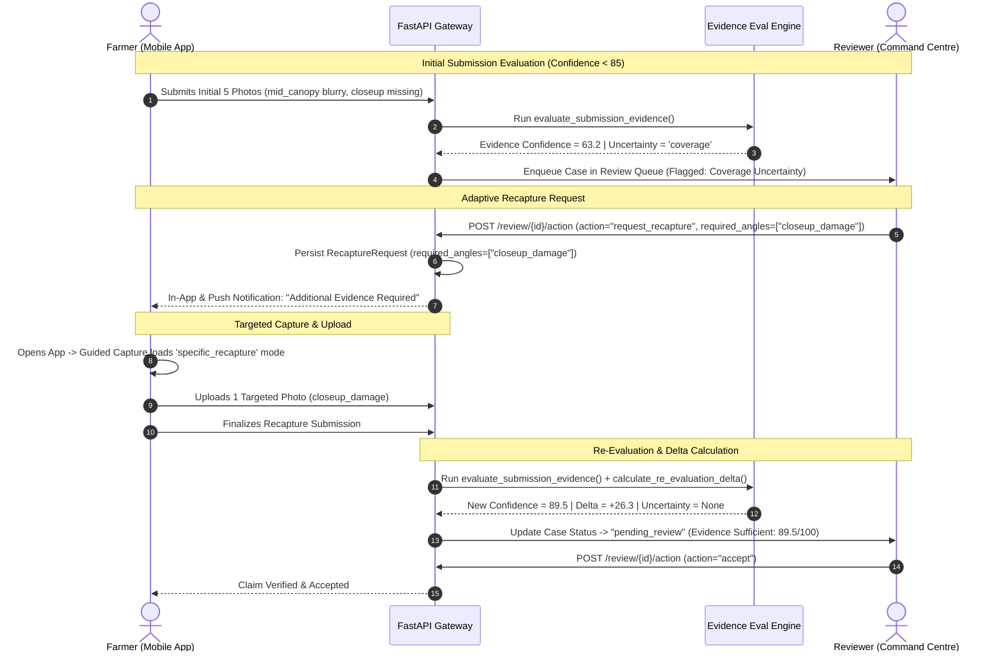

# Adaptive Evidence Recapture Workflow

The **Adaptive Evidence Recapture Workflow** is an intelligent evidence-correction mechanism in Fasal-Pramaan that resolves evidence uncertainty without overburdening farmers with full, repetitive re-captures.

In legacy agricultural insurance systems, any defect in submission photos (such as a blurry close-up or a missing boundary angle) forces the farmer to re-visit the field and capture the entire 5-photo protocol from scratch. Fasal-Pramaan replaces blanket re-audits with **targeted, angle-specific evidence requests**, preserving verified existing evidence and tracking confidence improvements across iterations.

---

## 1. Core Principles of Adaptive Recapture

1. **Targeted Delta Requests**: The system asks only for the specific missing or defective angles (e.g., `["closeup_damage"]` or `["wide_field"]`).
2. **Preservation of Valid Evidence**: Existing high-quality, verified photos are retained and combined with new evidence during re-evaluation.
3. **Automated Angle Guidance**: Farmers receive specific, localized instructions (in Hindi and English) explaining exactly what is needed and why.
4. **Historical Snapshot Auditing**: Every recapture event creates a new immutable evaluation snapshot while calculating exact confidence deltas ($\Delta C$).
5. **Human-in-the-Loop Override**: Reviewers can either trigger automated AI-guided recapture recommendations or customize the requested angles and instructions manually.

---

## 2. End-to-End Recapture Lifecycle



---

## 3. Reason Codes and Angle Targeting

The Evidence Evaluation Engine maps specific uncertainty signals to canonical reason codes and targeted angle requirements:

| Uncertainty Type | Detected Issue | Generated Reason Code | Targeted Angles | Farmer Instruction (EN / HI) |
|---|---|---|---|---|
| **Coverage** | Close-up missing or low resolution | `missing_closeup` | `["closeup_damage"]` | **EN:** Move closer to the affected crop area and capture a sharp macro shot.<br/>**HI:** प्रभावित फसल के पास जाएं और पत्तों की साफ क्लोज़-अप फोटो लें। |
| **Coverage** | Wide field perspective missing | `poor_wide_context` | `["wide_field"]` | **EN:** Capture the field from farther back to show surrounding plot context.<br/>**HI:** खेत से थोड़ा पीछे हटकर पूरे खेत और आस-पास की फसल की फोटो लें। |
| **Visual** | Canopy or leaf photo motion blurred | `blur` | `["mid_canopy"]` | **EN:** Hold the phone steady and capture the crop clearly in good lighting.<br/>**HI:** फोन को स्थिर रखें और अच्छी रोशनी में साफ फोटो लें। |
| **Visual** | Severe underexposure / dark lighting | `poor_quality` | `["mid_canopy", "closeup_damage"]` | **EN:** Avoid heavy shadows; capture clearly during daylight.<br/>**HI:** छाया से बचें और दिन की रोशनी में साफ फोटो लें। |
| **Context** | GPS coordinate missing or inaccurate | `missing_gps` | `[]` *(Location fix)* | **EN:** Enable GPS on device and stand within the registered farm plot.<br/>**HI:** फोन में GPS ऑन करें और पंजीकृत खेत के अंदर खड़े होकर फोटो लें। |
| **Integrity** | Hash collision, mock GPS, screen replay | `integrity_failed` | *None* | **Routed directly to senior reviewer for anti-fraud investigation.** |

---

## 4. Re-Evaluation & Confidence Delta Computation

When targeted evidence is uploaded, the engine merges newly uploaded active images with existing verified images, executes a fresh evaluation run, and computes the delta against the immediate prior snapshot:

$$\Delta C = C_{\text{current}} - C_{\text{previous}}$$

### API Re-Evaluation Payload Contract

```json
{
  "submission_id": "f8a1e230-b741-4cf0-9852-192a8310c952",
  "re_evaluation_summary": {
    "previous_confidence": 63.2,
    "new_confidence": 89.5,
    "confidence_delta": 26.3,
    "previous_uncertainty": "coverage",
    "new_uncertainty": null,
    "is_sufficient": true,
    "status": "pending_review"
  },
  "current_evaluation": {
    "quality_score": 88.0,
    "coverage_score": 100.0,
    "context_score": 85.0,
    "integrity_score": 100.0,
    "final_confidence": 89.5,
    "confidence_threshold": 85.0,
    "uncertainty_type": null,
    "recommended_action": "normal_review"
  }
}
```

---

## 5. Reviewer Command Centre Interface

In the Next.js Reviewer Dashboard, cases under adaptive recapture display a dedicated **Evidence Trust Timeline**:

```text
┌────────────────────────────────────────────────────────────────────────┐
│ CASE FP-2026-0894 — EVIDENCE TRUST TIMELINE                            │
├────────────────────────────────────────────────────────────────────────┤
│ Initial Submission (v1)                                                │
│ Confidence: 63.2 / 100  [Threshold: 85.0]       Status: NEEDS_RECAPTURE│
│ Uncertainty: Coverage (High) — closeup_damage is missing               │
│ Quality: 71.0  |  Coverage: 60.0  |  Context: 85.0  |  Integrity: 100  │
│ ────────────────────────────────────────────────────────────────────── │
│ Recapture Upload (v2)                                                  │
│ Confidence: 89.5 / 100  (+26.3 Delta)           Status: PENDING_REVIEW │
│ Uncertainty: None — Evidence Sufficient                                │
│ Quality: 88.0  |  Coverage: 100.0 |  Context: 85.0  |  Integrity: 100  │
├────────────────────────────────────────────────────────────────────────┤
│ [ Accept Claim ]   [ Correct Assessment ]   [ Request Inspection ]     │
└────────────────────────────────────────────────────────────────────────┘
```

Reviewers can inspect side-by-side comparisons of the original versus replacement photos, verify EXIF capture timestamps, and confirm location geofences before making a final adjudication decision.
