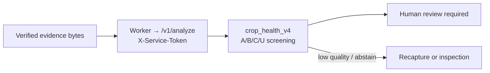

# AI service and model boundary

Service location: `services/ai`
Local health: `http://localhost:8001/health`

The AI service is an **assistive** component in the evidence workflow. It is never a final insurance-decision engine.

## Adapters

| Adapter | Use | Presentation status |
|---|---|---|
| `crop_health_v4` | Local DINOv2 ViT-S/14 four-crop health screening | **Default**; internal gates passed; non-production |
| `crop_health_v3` | Previous locally trained ViT-Tiny screening model | First rollback; non-production |
| `crop_vit` | Original local quantized public ViT-Tiny | Second rollback; non-production |
| `plant_disease` | Legacy MobileNetV2 leaf-disease checkpoint | Optional; non-production |
| `hierarchical` | Quality/OOD → crop consistency → damage pipeline | Optional multi-stage route; non-production |
| `baseline` | Image heuristics | Development aid only |
| `mock` | Deterministic test output | Development/test only |

All current adapters return `is_production_validated: false`.

## How AI fits into the workflow

The worker calls `/v1/analyze` with `X-Service-Token` (Compose default token for local demos; production requires a strong token). The AI service returns a structured assistive result; it does not write a final claim decision. Default grades do **not** include severity or affected area. Errors and unavailable models produce safe, sanitized outcomes.

## Default local ViT MVP

The default adapter runs a locally vendored ONNX export of a DINOv2 ViT-S/14
with four crop-conditioned `[healthy, disease, invalid]` heads. It covers
maize, potato, rice/paddy, and wheat and requires trusted expected-crop
metadata. The model file, label order, preprocessing contract, source licences,
SHA-256, frozen evaluation, model card, and rollback instructions are stored
under `services/ai/models/crop_health_dinov2_v14/`.

Its presentation screening grades are:

| Grade | Meaning |
|---|---|
| A | Confident healthy-leaf signal |
| B | Uncertain signal; manual review |
| C | Confident disease-pattern signal |
| U | Unusable, unsupported, OOD, or crop mismatch |

These are not ordinal disease-severity or commodity-quality grades. The
internal frozen test measured macro-F1 0.8068, balanced accuracy 0.8193,
source-held-out field macro-F1 0.6393, OOD rejection recall 0.9353, ID coverage
0.8362, and ECE 0.0162. Potato healthy is the weakest class (16 examples,
recall 0.25, F1 0.32). These internal results do not replace independent,
capture-protocol-matched field validation.

## Legacy measured result

| Item | Result |
|---|---|
| Architecture | MobileNetV2 |
| Label set | 15 PlantVillage-style leaf classes across apple, corn, potato and tomato |
| Shipped evaluation | 25 correct / 60 synthetic validation images |
| Accuracy | 0.4167 |
| Production validation | No |

The synthetic evaluation has no exact train/validation hash overlap, but it is still not an independent field evaluation. The model is therefore unsuitable for insurance accuracy claims.

## Presentation-safe explanation

“The AI helps triage image quality and provides an experimental disease signal. When it cannot provide a trustworthy assessment, the workflow asks for recapture or a human physical inspection. A reviewer owns the final decision.”

## Configuration

| Variable | Meaning |
|---|---|
| `AI_MODEL_ADAPTER` | `crop_health_v4` (default), `crop_health_v3` or `crop_vit` (rollback), `plant_disease`, `hierarchical`, `baseline`, or `mock` |
| `AI_SERVICE_TOKEN` | API/worker-to-AI shared credential; production requires 32+ characters |
| `AI_ALLOW_MOCK_FALLBACK` | Development-only fallback; must be `false` in production |
| `AI_ENABLE_HF_CROP_VIT` | Optional experimental hook; not required for the demo |

For field-data, evaluation and governance requirements, see [finetune-public-data.md](./finetune-public-data.md) and [known-limitations.md](./known-limitations.md).
