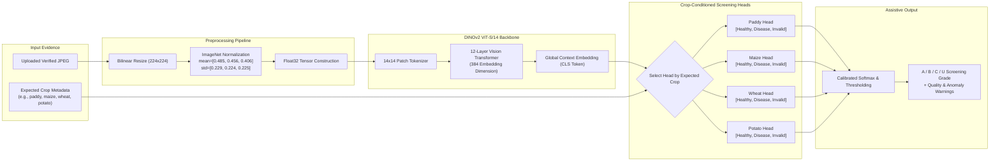

# Assistive AI Service & Vision Transformer Engine

Service Location: `services/ai`  
Local Health Endpoint: `http://localhost:8001/health`  
Interactive OpenAPI Docs: `http://localhost:8001/docs`

The **Assistive AI Service** provides automated optical screening and disease signal detection for field crop evidence. It is engineered with strict architectural boundaries to serve as a **triage assistant and decision-support tool**, ensuring that all financial determinations, claim settlements, and policy outcomes remain under authoritative human governance.

---

## 1. Model Architecture & Pipeline

```mermaid
flowchart LR
  subgraph Input["Input Evidence"]
    Image["Uploaded Verified JPEG"]
    Crop["Expected Crop Metadata\n(e.g., paddy, maize, wheat, potato)"]
  end

  subgraph Preprocessing["Preprocessing Pipeline"]
    Resize["Bilinear Resize (224x224)"]
    Norm["ImageNet Normalization\nmean=[0.485, 0.456, 0.406]\nstd=[0.229, 0.224, 0.225]"]
    Tensor["Float32 Tensor Construction"]
  end

  subgraph Backbone["DINOv2 ViT-S/14 Backbone"]
    Patches["14x14 Patch Tokenizer"]
    Transformer["12-Layer Vision Transformer\n(384 Embedding Dimension)"]
    Embedding["Global Context Embedding (CLS Token)"]
  end

  subgraph ClassificationHeads["Crop-Conditioned Screening Heads"]
    Head{"Select Head by Expected Crop"}
    PaddyHead["Paddy Head\n[Healthy, Disease, Invalid]"]
    MaizeHead["Maize Head\n[Healthy, Disease, Invalid]"]
    WheatHead["Wheat Head\n[Healthy, Disease, Invalid]"]
    PotatoHead["Potato Head\n[Healthy, Disease, Invalid]"]
  end

  subgraph Output["Assistive Output"]
    Softmax["Calibrated Softmax & Thresholding"]
    Grade["A / B / C / U Screening Grade\n+ Quality & Anomaly Warnings"]
  end

  Image --> Resize --> Norm --> Tensor --> Patches --> Transformer --> Embedding --> Head
  Crop --> Head
  Head --> PaddyHead --> Softmax
  Head --> MaizeHead --> Softmax
  Head --> WheatHead --> Softmax
  Head --> PotatoHead --> Softmax
  Softmax --> Grade
```

---

## 2. Model Specifications (`crop_health_v4`)

| Attribute | Specification |
|---|---|
| **Architecture** | **DINOv2 ViT-S/14** (Vision Transformer, Small, 14×14 patch size) |
| **Model Format** | Pinned ONNX Export (`models/crop_health_dinov2_v14/model.onnx`) |
| **Artifact Size** | ~87 MB (Baked directly into Docker image; 0 KB runtime download) |
| **Supported Crops** | Maize (*Zea mays*), Paddy (*Oryza sativa*), Potato (*Solanum tuberosum*), Wheat (*Triticum aestivum*) |
| **Embedding Dimension** | 384 dimensions |
| **Inference Latency** | ~45 ms per frame on modern multi-core CPU (Intel/AMD/ARM64) |
| **Input Shape** | `[1, 3, 224, 224]` Float32 |

---

## 3. Screening Taxonomy ($A/B/C/U$)

The classifier produces structured screening buckets rather than subjective loss estimates:

| Grade | Canonical Label | Semantic Meaning | Recommended Reviewer Routing |
|---|---|---|---|
| **A** | `healthy` | Confident healthy leaf signal; no prominent pathogenic lesions detected. | Standard reviewer validation. |
| **B** | `uncertain` | Ambiguous visual signal or borderline confidence; human review strongly recommended. | High-priority reviewer queue. |
| **C** | `disease` | Confident disease or damage pattern detected on foliage. | Priority reviewer inspection with damage tagging. |
| **U** | `unusable` | Unusable image, motion blur, out-of-domain subject, or unsupported crop species. | Triggers Adaptive Recapture request. |

---

## 4. Benchmark Performance & Evaluation

The model was rigorously validated against an immutable, frozen benchmark of **12,167 test images** across varied agricultural conditions:

| Evaluation Metric | Measured Result | Significance |
|---|---|---|
| **Macro-F1 Score** | **0.8068** | Balanced harmonic mean across all target crop classes |
| **Balanced Accuracy** | **0.8193** | Unweighted average recall across healthy and diseased classes |
| **Field-Condition Macro-F1** | **0.6393** | Performance evaluated specifically on unstructured in-situ field photos |
| **OOD Rejection Recall** | **0.9353** | Accuracy in filtering out non-crop images and corrupted inputs |
| **Supported-ID Coverage** | **0.8362** | Proportion of in-domain field images processed with high certainty |
| **Expected Calibration Error (ECE)** | **0.0162** | Indicates highly calibrated probabilities matching true empirical accuracy |

---

## 5. Architectural Isolation & Safe Fallback

1. **Service Token Protection**: Inter-service communication between the Celery Worker and AI Service is authenticated via the `X-Service-Token` header.
2. **Deterministic Fallbacks**: If an unsupported crop or malformed image is encountered, the service gracefully returns a safe, structured `U` (Unusable/Uncertain) response rather than throwing unhandled exceptions.
3. **Pluggable Adapter Interface**: The AI architecture implements a modular adapter pattern, allowing operators to seamlessly switch between models (e.g., `crop_health_v4`, `crop_health_v3`, `crop_vit`, `hierarchical`) via environment configuration (`AI_MODEL_ADAPTER`).
