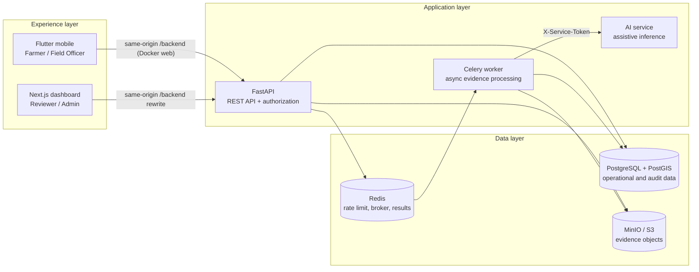
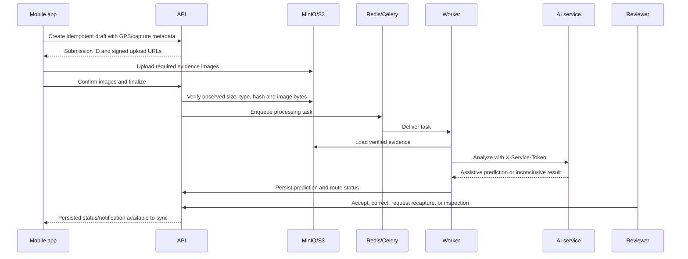
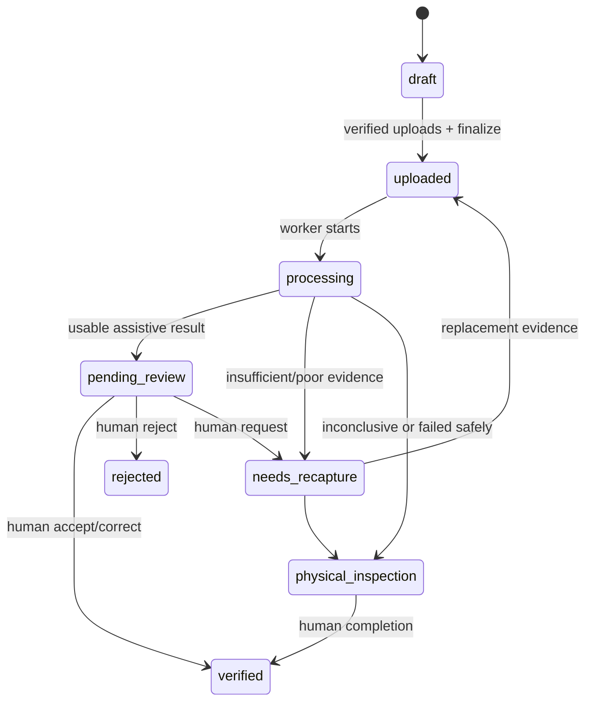
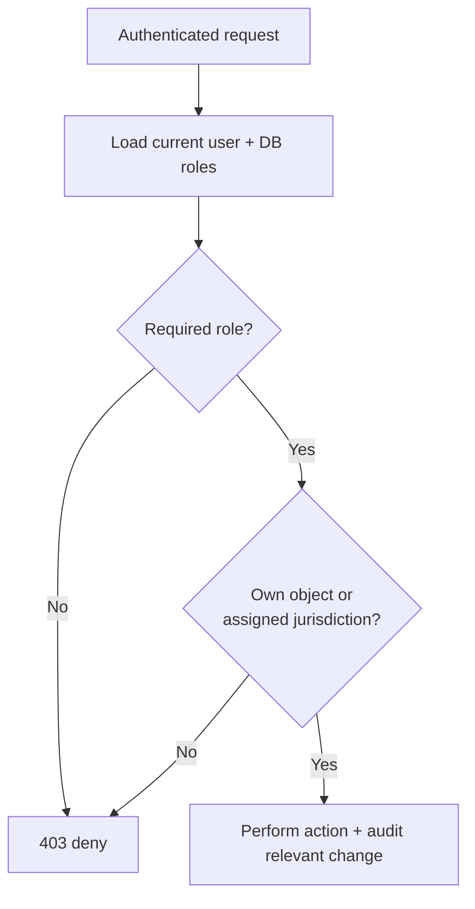

# Architecture and solution structure

FasalPramaan is a local, presentation-ready implementation of an evidence-first crop-assessment workflow. It separates capture, evidence storage, asynchronous AI assistance, and human review so no model response silently becomes a final outcome.

## System boundaries



## Responsibility by component

| Layer | Component | Responsibility |
|---|---|---|
| Capture | Flutter mobile app | Guided evidence capture, device location, encrypted offline queue, resumable sync |
| Review | Command Centre dashboard | Case queue, map, evidence inspection, human correction, audit visibility |
| Rules | FastAPI API | Authentication, role/jurisdiction checks, farms/cycles, upload issuance, review state machine |
| Processing | Celery worker | Verifies queued evidence, calls AI with service authentication, persists outcome, sends cases to review/inspection |
| AI | FastAPI AI service | Default `crop_health_v4` DINOv2 ViT-S/14 leaf-health screening (A/B/C/U); non-production |
| Data | PostgreSQL/PostGIS | Users, roles, farms, geometry, submissions, predictions, reviews, audits |
| Evidence | MinIO/S3 | Private immutable-by-key evidence objects; server verification after upload |
| Coordination | Redis | Auth rate-limit counters, Celery broker and result backend |

## Evidence processing sequence



## Case-state flow



## Trust and authorization model



- Farmers can access their own data.
- Field officers are restricted to their assigned jurisdiction and descendants.
- Reviewers perform review actions; administrators manage administrative functions.
- AI is reachable through the backend/worker service boundary, not as an unauthenticated public decision engine.

## Repository structure

```text
apps/
  mobile/                 Flutter capture + offline web (nginx :8085, /backend proxy)
  dashboard/              Next.js Command Centre (:3000, /backend rewrite)
services/
  api/                    FastAPI routes, auth, models, Alembic, Celery tasks
  ai/                     Adapters + DINOv2/ONNX artifacts (default crop_health_v4)
docs/                     Presentation and engineering documentation
scripts/                  start-portable, fp.ps1, demo-model, verify-e2e helpers
docker-compose.yml        Full local stack: db, redis, minio, api, worker, ai, migrate, seed, dashboard, mobile
```

## Client → API linking

| Client | Public URL | API path used by browser |
|---|---|---|
| Field app (Docker) | `http://localhost:8085` | `/backend/*` → nginx → `api:8000` |
| Dashboard (Docker) | `http://localhost:3000` | `/backend/*` → Next rewrite → `api:8000` |
| Native Flutter / host API | host:8000 | Absolute `API_BASE_URL` (e.g. emulator `http://10.0.2.2:8000`) |

Default AI adapter is `crop_health_v4` in Compose, API settings, and the AI service. Rollbacks: `crop_health_v3`, `crop_vit`, legacy `plant_disease`.

## Architectural decisions for the demo

1. **Human-in-the-loop:** the model cannot make a final claim outcome.
2. **Evidence before inference:** the server verifies uploaded bytes before processing.
3. **Offline first:** a local queue lets capture proceed during connectivity loss, then resumes idempotently.
4. **Replaceable AI:** adapters isolate experimental model choices from the evidence/review workflow.
5. **Auditable decisions:** reviewer changes and overrides include reasons and audit history.

See [README.md](../README.md) for the presentation narrative, [ai-service.md](./ai-service.md) for the current model, and [SVH26007 audit readiness](./SVH26007_AUDIT_READINESS_2026-07-18.md) for historical audit evidence (read the current-status addendum first).
