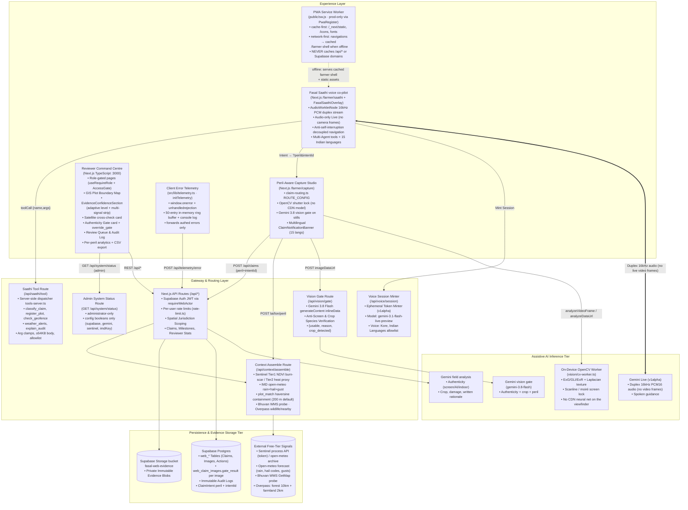
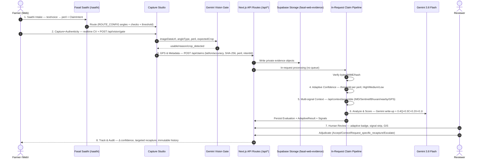
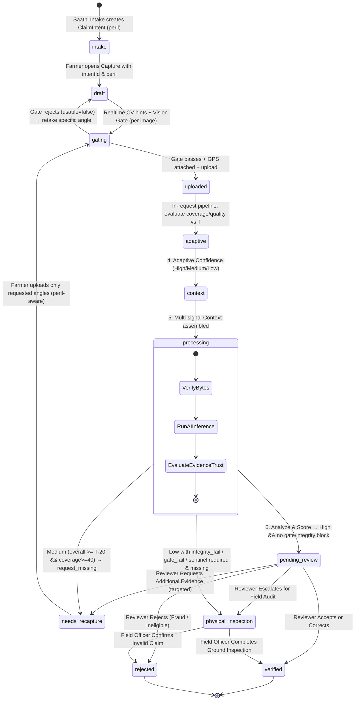
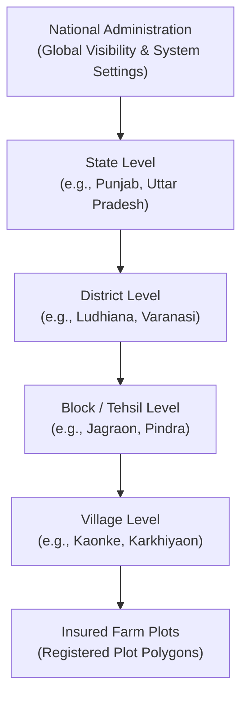

# System Architecture & Technical Specifications

Fasal-Pramaan is a web-first platform (Next.js on Vercel + Supabase + Gemini vision) for agricultural evidence verification and claims adjudication. Capture is guided on-device; submitted stills are analysed by Gemini; a human reviewer decides.

**Authoritative MVP (2026-09):** on-device OpenCV shutter lock (no MobileNet/TF.js); Gemini Live audio-only (`gemini-3.1-flash-live-preview`); submitted stills use `gemini-3.8-flash` for authenticity + written analysis; no Hugging Face Space; no live viewfinder streaming. Older diagrams in this file that mention DINOv2, MobileNet, or 1-FPS video are historical.

---

## 1. High-Level System Topology


```mermaid
flowchart TB
  subgraph ExperienceLayer["Experience Layer"]
    direction TB
    SaathiWeb["Fasal Saathi voice co-pilot\n(Next.js /farmer/saathi + FasalSaathiOverlay)\n• AudioWorkletNode 16kHz PCM duplex stream\n• Audio-only Live (no camera frames)\n• Anti-self-interruption decoupled navigation\n• Multi-Agent tools + 15 Indian languages"]
    CaptureWeb["Peril-Aware Capture Studio\n(Next.js /farmer/capture)\n• claim-routing.ts ROUTE_CONFIG\n• OpenCV shutter lock (no CDN model)\n• Gemini 3.8 vision gate on stills\n• Multilingual ClaimNotificationBanner (15 langs)"]
    Dashboard["Reviewer Command Centre\n(Next.js TypeScript :3000)\n• Role-gated pages (useRequireRole + AccessGate)\n• GIS Plot Boundary Map\n• EvidenceConfidenceSection\n  (adaptive level + multi-signal strip)\n• Satellite cross-check card\n• Authenticity Gate card + override_gate\n• Review Queue & Audit Log\n• Per-peril analytics + CSV export"]
    TelemetryPath["Client Error Telemetry\n(src/lib/telemetry.ts · initTelemetry)\n• window.onerror + unhandledrejection\n• 50-entry in-memory ring buffer + console log\n• forwards authed errors only"]
    PwaShell["PWA Service Worker\n(public/sw.js · prod-only via PwaRegister)\n• cache-first: /_next/static, /icons, fonts\n• network-first: navigations → cached\n  /farmer shell when offline\n• NEVER caches /api/* or Supabase domains"]
  end

  subgraph GatewayLayer["Gateway & Routing Layer"]
    API["Next.js API Routes (/api/*)\n• Supabase Auth JWT via requireWebActor\n• Per-user rate limits (rate-limit.ts)\n• Spatial Jurisdiction Scoping\n• Claims, Milestones, Reviewer Stats"]
    VisionGate["Vision Gate Route\n(/api/vision/gate)\n• Gemini 3.8 Flash generateContent inlineData\n• Anti-Screen & Crop Species Verification\n• {usable, reason, crop_detected}"]
    SaathiTool["Saathi Tool Route\n(/api/saathi/tool)\n• Server-side dispatcher tools-server.ts\n• classify_claim, register_plot, check_geofence\n• weather_alerts, explain_audit\n• Arg clamps, ≤64KB body, allowlist"]
    VoiceSession["Voice Session Minter\n(/api/voice/session)\n• Ephemeral Token Minter (v1alpha)\n• Model: gemini-3.1-flash-live-preview\n• Voice: Kore, Indian Languages allowlist"]
    ContextAssemble["Context Assemble Route\n(/api/context/assemble)\n• Sentinel Tier1 NDVI burn-scar / Tier2 heat proxy\n• IMD open-meteo rain+hail+gust\n• plot_match haversine containment (200 m default)\n• Bhuvan WMS probe · Overpass wildlife/nearby"]
    SystemStatus["Admin System Status Route\n(GET /api/system/status)\n• administrator-only\n• config booleans only (supabase, gemini, sentinel, imdKey)"]
  end

  subgraph AIServiceTier["Assistive AI Inference Tier"]
    GeminiLive["Gemini Live (v1alpha)\n• Duplex 16kHz PCM16 audio (no video frames)\n• Spoken guidance"]
    GeminiAnalysis["Gemini field analysis\n• Authenticity (screen/AI/indoor)\n• Crop, damage, written rationale"]
    OnDeviceCV["On-Device OpenCV Worker\n(vision/cv-worker.ts)\n• ExG/GLI/ExR + Laplacian texture\n• Scanline / moiré screen lock\n• No CDN neural net on the viewfinder"]
    GeminiLLM["Gemini vision gate\n(gemini-3.8-flash)\n• Authenticity + crop + peril"]
  end

  subgraph StorageTier["Persistence & Evidence Storage Tier"]
    Postgres[("Supabase Postgres\n• web_* Tables (Claims, Images, Actions)\n• web_claim_images.gate_result per image\n• Immutable Audit Logs\n• ClaimIntent peril + intentId")]
    Storage[("Supabase Storage bucket\nfasal-web-evidence\n• Private Immutable Evidence Blobs")]
    ExternalSignals[("External Free-Tier Signals\n• Sentinel process API (token) / open-meteo archive\n• Open-meteo forecast (rain, hail codes, gusts)\n• Bhuvan WMS GetMap probe\n• Overpass: forest 10km + farmland 2km")]
  end

  SaathiWeb <== "Duplex 16kHz audio (no live video frames)" ==> GeminiLive
  API --> GeminiAnalysis
  SaathiWeb -->|"Mint Session"| VoiceSession
  SaathiWeb -->|"Intent → ?peril&intentId"| CaptureWeb
  SaathiWeb -->|"toolCall {name,args}"| SaathiTool
  CaptureWeb -->|"analyzeVideoFrame / analyzeDataUrl"| OnDeviceCV
  CaptureWeb -->|"POST imageDataUrl"| VisionGate
  VisionGate --> GeminiLLM
  CaptureWeb -->|"POST lat/lon/peril"| ContextAssemble
  ContextAssemble --> ExternalSignals
  Dashboard -->|"REST /api/*"| API
  Dashboard -->|"GET /api/system/status (admin)"| SystemStatus
  CaptureWeb -->|"POST /api/claims (peril+intentId)"| API
  PwaShell -.->|"offline: serves cached farmer shell\n+ static assets"| SaathiWeb
  TelemetryPath -->|"POST /api/telemetry/error"| API

  API --> Postgres
  API --> Storage
  API --> ContextAssemble
```

---

## 2. Layer & Component Responsibilities

### 2.1 Experience Layer

#### A. Farmer Web Application (`apps/dashboard/src/app/farmer/*`)
- **Technology**: Next.js 14 farmer web (TypeScript, Tailwind, React Query). The single webapp covers the full farmer flow — there is no separate mobile client.
- **Key Subsystems**:
  - **Fasal Saathi Autonomous Intake & Agentic Webapp Controller** (`src/app/farmer/saathi/page.tsx`, `src/lib/saathi-agent.ts`, `src/lib/claim-routing.ts`): First-line entry point. Free text or voice (Web Speech API, `hi-IN`/`en-IN`/15 regional locales) classified via `classifyPerilHeuristic` into 8 perils, slot extraction (crop, village, plot from known plots), `ClaimIntent` (`id`, `peril`, `perilLabelEn/Hi`, `crop`, `village`, `plotId`, `farmerNote`, `createdAt`, `source`). Persisted in `farmerStore.activeIntent` (`sessionStorage` key `fp_active_claim_intent_v1`), routed as `?peril&intentId&plotId&crop` to capture studio. Integrates **`resolveAgenticAction`** to autonomously execute direct camera triggers with pre-configured damage protocols, dynamic language switching, plot inspection, and claim status filtering upon spoken or typed orders.
  - **Peril-Aware Guided Capture Engine** (`src/lib/claim-routing.ts` `ROUTE_CONFIG` + `farmerStore`): Replaces fixed 5-angle with `anglesForPeril(peril)` filtered to `requiredAngles` + `optionalAngles` per peril; UI shows only needed angles, peril-specific `guidanceExtraEn/Hi`, satellite notice, and context check list. Features the **`ClaimNotificationBanner`** (`claim-notifications.ts`, `ClaimNotificationBanner.tsx`): accessible, top-docked multilingual notification system translating 16 discrete states (invalid session 401, submission failures 500, duplicate hashes, unusable lighting, blurry angles, missing plots) into actionable farmer-friendly guidance across all 15 Indian languages with 4-second debouncing.
  - **Multi-Spectral On-Device Realtime CV** (`src/lib/vision/realtime-cv.ts` + `src/lib/vision/cv-worker.ts`): Frame sampling runs off the main thread in a Web Worker. Computes normalized agronomic indices: **Excess Green Index ($ExG = 2g_n - r_n - b_n$)** and **Green Leaf Index (GLI)** for vegetative foliage, **Excess Red Index ($ExR = 1.4r_n - g_n$)** for ripe wheat/paddy heads, luminous yellow bloom filters (mustard/canola/sunflower), drought scorch, and fire burn scar ash.
  - **Screen & Display Anti-Spoofing Detector (`detectScreenArtifacts`)**: Analyzes pixel gradient orientation histograms to calculate the ratio of orthogonal ($0^\circ, 90^\circ, 180^\circ, 270^\circ$) vs diagonal gradients, detecting digital display raster scanlines, pixel subgrids, and Moiré interference (orthogonal ratio $> 0.80$) along with rectilinear bezel edges to prevent screen fraud (`⚠️ Screen Detected`).
  - **Strict 75%+ Crop Quality Shutter Lock & Person / Screen Protection**: Prevents shutter actuation unless the live frame achieves $\ge 75\%$ crop match (or $\ge 40\%$ under fire burn perils), eliminating false captures, non-field images, indoor walls, selfies/human presence (`person_detected`), and digital monitor screen fraud (`screen_detected`) before upload.
  - **Organic Micro-Texture & Anti-Spoofing Filter**: Evaluates 2D spatial Laplacian variance strictly across candidate canopy pixels ($STD = \frac{1}{|Canopy|} \sum |\nabla^2 I|$). Flat artificial surfaces (green plastic tarps, clothes, painted walls with $STD < 0.6$) are immediately suppressed, while cellular living plant matter ($STD \ge 1.5$) is verified. Automatically filters atmospheric sky, asphalt/concrete, and human skin locus (Fitzpatrick I-VI).
  - **On-device OpenCV shutter lock**: `cv-worker.ts` runs `analyzeFrame` (ExG/GLI/ExR, Laplacian texture, scanline/moiré, skin). No CDN neural net. Hints: `ok` / `too_dark` / `screen_detected` / `person_detected` / `crop_not_detected`.
  - **Dynamic Autofocus Reticles & Viewfinder Glass HUD**: Renders corner reticles that dynamically track crop canopies (emerald glow when ready, amber when adjusting), a translucent glassmorphism HUD chip with live pulse dot indicator, real-time phenology tags (e.g. `🌾 Ripe Golden`, `🌼 Yellow Bloom`, `🌿 Vegetative`), and an interactive shutter ring with capture feedback.
  - **Sensor-Only Field GPS Geo-Tagging**: Field coordinates are locked strictly to device hardware sensors (`navigator.geolocation`) without manual text overrides, ensuring authentic geo-spatial baseline tracking compliant with PMFBY regulations.
  - **Authenticity Filter Integration**: After shutter, `POST /api/vision/gate` validates each image before upload (see Gateway layer). Rejected frames require retake.
  - **Client Quality & Integrity Probes**: Real-time Laplacian edge detection for blur, exposure boundary validation, resolution checks; GPS accuracy validated server-side on submit.
  - **Session Storage & Encryption**: `farmerStore` state persisted in encrypted `sessionStorage` envelopes (`farmerStore.activeIntent`, plots).
  - **Reviewer Multi-Tab Session Isolation (`review-session.ts`)**: Decouples reviewer authentication and inspection profiles into isolated `sessionStorage` namespaces (`fasal_reviewer_email_v1`), ensuring multi-tab usage never leaks state across portals.
  - **Fasal Saathi Voice Interface**: A **Voice Mode mic toggle** on `/farmer/saathi` opens a full-duplex Gemini Live session — `POST /api/voice/session` mints an ephemeral token, the page opens the Live WebSocket with `bidiGenerateContentSetup` carrying `SAATHI_FUNCTION_DECLARATIONS`, and decoded audio frames play back while the farmer speaks. Incorporates **Anti-Self-Interruption Navigation Architecture**: checks active PCM audio playback via `LiveAudioSession.isPlaying()`. Agent-initiated navigation routes silently via `updateCurrentPath` without emitting barge-in turns, while user route changes defer context synchronization until speech turn completion. Spoken camera orders (`capture_current_angle`) anywhere across the app automatically verify registered plots and launch the capture studio (`/farmer/capture?plotId=...`). Tool calls (`toolCalls`) are answered by `POST /api/saathi/tool` and returned as `toolResponse.functionResponses`. Text intake (`webkitSpeechRecognition` + typed chat, server-side `classify_claim`) remains the fallback when voice is unavailable. The system prompt (`src/lib/saathi-agent.ts buildSystemPrompt`) hard-pins Hindi (Devanagari)/English-only replies, and the Live setup pins the `Kore` voice via `speechConfig`.
  - **Recapture Notifications** (`src/lib/farmer-notifications.ts`): client-side diffing of `needs_recapture` claims against localStorage-seen IDs (`diffNewRecaptures`/`markSeen`, key `fp_seen_recapture_notices_v1`). Unseen notices render as amber toast panels on `/farmer` with a Capture-now deep link + Dismiss; the farmer nav shows a badge dot while any notice is unseen.
  - **PWA Offline Shell** (`public/manifest.webmanifest` + `public/sw.js`, registered prod-only by `src/components/pwa-register.tsx`): installable farmer app (start URL `/farmer`, theme `#1c1915`). The service worker is cache-first for immutable static assets (`/_next/static/*`, icons, fonts), network-first for navigations with a cached `/farmer` shell fallback when offline, and passes `/api/*` and Supabase traffic straight through untouched — evidence and auth are always live. A bilingual offline banner (`src/components/offline-banner.tsx`, shared `use-online-status` hook) shows while the browser reports offline. Honest scope: the shell makes pages *openable* offline; captures are not queued across sessions.

#### B. Reviewer Command Centre (`apps/dashboard`)
- **Technology**: Next.js 14, React 18, TypeScript, TailwindCSS, React Query, Lucide Icons, Leaflet GIS.
- **Key Subsystems**:
  - **Role-Gated Route Protection (AccessGuard)** (`src/lib/use-require-role.ts` + `src/components/AccessGate.tsx`): every reviewer page wraps its content in `useRequireRole([...])` + `<AccessGate status={gate.status}>`. `/review`, `/review/[id]`, `/overview`, `/analytics`, `/alerts`, and `/map` require `reviewer|administrator`; `/audit` and `/admin` require `administrator`. The hook fetches roles once via `GET /api/me` (positive results cached module-level; unauthenticated results re-check on mount so signing in unblocks the SPA immediately) and renders four states — loading spinner, bilingual sign-in card with a `?next=` return link, bilingual access-denied card, or the gated content. React Query calls are additionally gated with `enabled: gate.status === "ok"` so no data is fetched before the gate passes.
  - **Review Queue & Triage**: Real-time filtering and sorting by Evidence Confidence, Uncertainty Type, Integrity Status, and Severity; now includes peril filter and adaptive level.
  - **Evidence Trust Inspector (EvidenceConfidenceSection)** (`src/components/EvidenceConfidenceSection.tsx`): 4-component visual score cards (Quality, Coverage, Context, Integrity) with detailed deduction explanations **plus** adaptive confidence badge (`High`/`Medium`/`Low` + `nextStep` + peril threshold from `adaptive-engine.ts`) and **multi-signal context strip** (IMD/Sentinel/Bhuvan/Wildlife/Nearby/GPS statuses) fetched via `POST /api/context/assemble`. Re-evaluation deltas render as bilingual ▲/▼ chips from `adaptive_result.confidence_delta`.
  - **Multi-Signal Context & Satellite Cross-Check card** (review detail): per-signal status chips for persisted `context_signals`, a side-by-side `wide_field` photo vs live Bhuvan WMS tile comparison, and a Copernicus Browser deep-link (`meta.burnMapUrl`, Sentinel-2 `S2_L2A_CDAS`, last 3 days).
  - **Per-peril analytics & CSV export**: the executive overview renders `analyticsFromClaims().byPeril` rows (count, color-coded average confidence, recapture rate); the review queue and overview export filtered rows via dependency-free `src/lib/csv.ts` (`toCsv`/`downloadCsv`).
  - **Multi-Angle Visual Grid**: Synchronized multi-angle photo viewer with high-resolution pan/zoom and original vs. recapture comparison; grid adapts to `requiredAngles` per peril.
  - **Spatial GIS Mapping**: Interactive plot polygon boundary overlays (Supabase Postgres geometry) with GPS capture pin accuracy circles; context strip links to Bhuvan.
  - **Authenticity Gate Card**: Per-image verdicts persisted in `web_claim_images.gate_result` render on the review detail page (usable/reason/crop_detected/confidence). Reviewers can execute the `override_gate` adjudication action, which stamps `overridden: true`, `overriddenBy`, and `overriddenAt` into the gate blob — shown as "Overridden by …" on the card and recorded in the audit trail. Crucially, overriding the gate unblocks the `predictionIsAcceptable` check, allowing the reviewer to click **Accept & Verify** directly even if the initial screening stamped Grade U.
  - **PMFBY Financial Settlement & DBT Integration**: When an officer approves a claim (`accept` or `correct`), `applyReviewerAction` computes the final financial settlement (`estimated_loss_inr` and `payout_amount_inr`) using regional Scale-of-Finance rates and marks `payout_status = "approved"`. This immediately updates the farmer portal's live DBT Bank Sanctioned card with the exact approved payout.
  - **Agronomic Crop Synonym Matching Engine (`crop-synonyms.ts`)**: Resolves dialect variations and taxonomies across Indian agricultural crops (paddy $\leftrightarrow$ rice, maize $\leftrightarrow$ corn, gram $\leftrightarrow$ chickpea, etc.) across both the vision gate and reviewer queue search queries.
  - **Immutable Audit History**: Chronological timeline of AI predictions, reviewer overrides, adaptive decisions, context signals, and state transitions.

---

### 2.2 Application Layer

#### A. Next.js API Routes (`apps/dashboard/src/app/api/*`)
- **Technology**: Route Handlers (TypeScript) on Vercel, Supabase client libraries, server-only service-role key.
- **Key Subsystems**:
  - **Authentication & Security**: Supabase Auth JWTs verified by `requireWebActor` on every evidence route; reviewers identified via `REVIEWER_EMAILS` / `app_metadata.roles`; privileged writes use the server-only `SUPABASE_SERVICE_ROLE_KEY` (never exposed to the browser). Shared in-memory per-user rate limiter (`src/lib/server/rate-limit.ts`, fixed 60 s window) with a `Retry-After` header on every 429 — see [api.md](./api.md#8-rate-limits) for the full per-route table (`/api/claims` POST 10 req/min, gate 20, context + saathi/tool + claim actions + milestones 30, telemetry/error 5, system/status 10). Inputs are clamped server-side (lat ±90 / lon ±180, angle whitelists from `REQUIRED_ANGLES`/`CANONICAL_ANGLES`, ≤64 KB tool bodies with 18 MB image ceiling, strict `^\d{4}-\d{2}-\d{2}$` sowingDate). The site-lock unlock route compares passwords in constant time.
  - **Spatial Jurisdiction Scoping**: Farmer data is ownership-scoped (farmers only see their own claims/plots); reviewer access is role-gated.
  - **Evidence Upload Pipeline**: `POST /api/claims` accepts base64 image payloads with per-image SHA-256, byte size, and GPS metadata; validates and writes private objects to the `fasal-web-evidence` bucket; claims persist `peril`, `intentId`, and `capture_lat/lon/accuracy`.
  - **Vision Gate Route** (`src/app/api/vision/gate/route.ts`): `POST { imageDataUrl, angleType, expectedCrop, peril }` → `{ usable, reason, crop_detected, warnings, confidence, fallback? }`. If `GEMINI_API_KEY`/`GOOGLE_API_KEY` set, calls `https://generativelanguage.googleapis.com/v1beta/models/{model}:generateContent` with `inlineData` and JSON prompt (rejects `ai_generated`/`not_crop`/`wrong_crop`/`too_dark`/`too_blurry`/`unusable`); enforces `expectedCrop` vs `crop_detected` for non-fire perils. Otherwise `heuristicGate` (size/type, fire pass-through at 0.7 confidence). Verdicts persist per image into `web_claim_images.gate_result`.
  - **Saathi Tool Route** (`src/app/api/saathi/tool/route.ts`): `POST { name, args }` executes the Saathi function tools server-side (`src/lib/saathi/tools-server.ts`) so secrets and the LLM peril classifier never reach the browser: `register_plot` (saves plot metadata and automatically seeds growth stage milestones into `web_milestones`), `check_plot_geofence` (haversine device GPS containment against registered parcel boundary), `fetch_agro_weather_alerts` (72-hour precipitation, temperature extremes, and wind gusts via Open-Meteo), `explain_claim_audit` (3-stage Vision Gate / Gemini / Sentinel breakdown and targeted recapture instructions), `request_evidence_angles` (peril → ROUTE_CONFIG angles/checks/threshold), `call_context_signal` (clamped lat/lon → compact context signals), `guide_capture` (canonical-angle guidance EN/HI), and `classify_claim` (Gemini `classifyPerilWithLLM` function-call classification of free text, ≤1000 chars). Auth-gated + rate-limited; unknown tools or malformed args return 400.
  - **Context Assemble Route** (`src/app/api/context/assemble/route.ts`): `POST { lat, lon, peril, sowingDate }` → `AssembledContext { signals, overall, imdRainfallMm, sentinelThumbnailUrl }`. Builds live `ContextSignal[]`: `sentinel` Tier 1 (with `SENTINEL_TOKEN`/`COPERNICUS_TOKEN`: NDVI burn-scar JSON raster from `sh.dataspace.copernicus.eu` process API, burn when >5% of valid pixels have NDVI < 0.2) or Tier 2 (without token: free Open-Meteo archive extreme-heat days >40 °C over past 30 days as an honest proxy), `imd` (open-meteo forecast proxy for 7-day `precipitation_sum` plus hail days from WMO codes 96/99 and max wind gusts supporting lodging; **sowing-date-aware**: drought ≥30 days since sowing adds cumulative archive rainfall since sowing — window starts at `max(sowing, now−180d)` — with weak corroboration below ~25 mm per 30 days, and hailstorm summaries append an estimated growth stage at 30/60/100-day thresholds), `bhuvan` (WMS GetMap reachability probe), `wildlife` (Overpass forest/protected area within 10 km, `animal_damage` only), `nearby` (Overpass farmland parcels within 2 km), `gps`, and `plot_match` (haversine containment of the capture point vs registered plot center; radius defaults to 200 m via `plotProximityMeters`, clamped 10–5000). Overall via `contextOverall()` (`strong`/`mixed`/`weak`/`pending`).
  - **System Status Route** (`src/app/api/system/status/route.ts`): `GET /api/system/status` — administrator-only configuration summary powering the `/admin` page. Rate-limited to 10 req/min/user; returns booleans only (`supabase`, `gemini`, `sentinel`, `imdKey`, `version`) and never secret values.
  - **Telemetry Error Intake** (`src/app/api/telemetry/error/route.ts`): `POST /api/telemetry/error` — auth-gated client error sink (5 req/min/user). Fields are clamped server-side (message ≤500 chars, stack ≤2000, URL ≤2048, UA ≤512) and printed as structured JSON to the server console for log-drain collection; **no persistence by design** in v1.

#### B. In-Request Claim Processing Pipeline (`POST /api/claims`)
- **Technology**: Executed within the Next.js claim request — no external queue or worker processes.
- **Key Subsystems**:
  - **Server-Side Evidence Verification**: Validates declared SHA-256 checksums, MIME types, and byte sizes before writing to storage; flags duplicates across angles.
  - **Evidence Trust & Confidence Engine**: Calculates the 4-component scores ($0.4Q + 0.3C + 0.2X + 0.1I$) and classifies deterministic uncertainty.
  - **Adaptive Confidence Engine** (`src/lib/context/adaptive-engine.ts`): Wraps evidence scores with peril-specific `ROUTE_CONFIG.minConfidence` and `ContextSignal[]`. Returns `{ level: high|medium|low, nextStep: proceed|request_missing|retake|escalate_to_human, threshold, overall, reasons, reasonsHi, missingAngles }`. Rules: `gateFailed` → `low/retake`, `integrity<50` → `escalate`, `fire_burn` without `sentinel==available` → `medium` until satellite, `animal_damage` without GPS → `medium` (request location), else tiered by `overall` vs `threshold` and `coverage`/`quality`. When `nextStep == request_missing`, the pipeline **auto-creates the recapture request**: the claim is patched straight to status `needs_recapture` with `missing_angles` plus bilingual `recapture_reason`/`recapture_reason_hi` taken from the adaptive reasons — no reviewer round-trip. The persisted `adaptive_result` also carries `previousConfidence` and `confidence_delta` for re-submissions.
  - **AI Dispatcher**: Calls Gemini vision with the submitted stills (`GEMINI_API_KEY`) for authenticity plus a written field analysis.

---

### 2.3 Assistive AI Inference Tier (Gemini vision + on-device OpenCV)

- **Technology**: Gemini vision (`GEMINI_VISION_MODEL`, default `gemini-3.8-flash`) for submitted stills + on-device OpenCV worker for the live shutter lock. No Hugging Face Space.
- **Default Model**: Gemini 2.0 Flash — authenticity, crop, damage description, and reviewer rationale. A/B/C/U remain workflow buckets, not payout.
- **Supported Crops**: Maize (*Zea mays*), Paddy / Rice (*Oryza sativa*), Potato (*Solanum tuberosum*), Wheat (*Triticum aestivum*).
- **Classification Output**: Crop-conditioned $A/B/C/U$ screening signal:
  - `A`: Confident healthy leaf signal.
  - `B`: Borderline / uncertain signal requiring human inspection.
  - `C`: Confident disease/damage pattern.
  - `U`: Unusable image, unsupported crop, or out-of-domain input.
- **On-Device Vision (web)** (`src/lib/vision/cv-worker.ts`): 128×128 OpenCV heuristics (ExG/GLI/ExR, Laplacian, scanline/moiré). No TF.js. Fire/burn relaxes the green check.
- **Authenticity LLM Gate** (`src/app/api/vision/gate/route.ts`): Gemini `generateContent` JSON `{ usable, reason, crop_detected, warnings, confidence }`; prompt checks expected crop, rejects AI-generated/screenshot/meme/blurry/no-field/wrong angle; heuristic fallback when no key.
- **Architectural Isolation**: The AI models are strictly assistive; model probabilities are isolated from the Evidence Trust calculation and cannot approve financial payouts. Gate failures force `adaptiveConfidence → retake`, never auto-approval.

---

### 2.4 Persistence & Storage Tier + External Signals

- **Supabase Postgres**: Managed relational schema (`web_claims`, `web_claim_images`, `web_plots`, `web_milestones`, `web_review_actions`) with JSONB component details, spatial plot data (PostGIS extension enabled by `scripts/setup_supabase.sql`), and closed anon RLS. Claims persist `peril`/`claim_type`, `intentId`, and `capture_lat/lon/accuracy` for adaptive routing and context assembly.
- **Supabase Storage (`fasal-web-evidence`)**: Private bucket storing original, immutable evidence JPEGs using server-generated object keys; uploads flow through the service-role API routes only.
- **External Signals (context layer)** (`src/lib/context/types.ts` + `/api/context/assemble`): `ContextSignal` (`source` `imd|sentinel|bhuvan|wildlife|nearby|gps|plot_match`, `status` `pending|available|unavailable|error`, `labelEn/Hi`, `summaryEn/Hi`, `confidence`, `meta`, `checkedAt`). `AssembledContext` with `overall` (`strong|mixed|weak|pending` via `contextOverall()`). All sources are live and free-tier:

  | Source | Tier 1 (with key/token) | Tier 2 / free fallback | Peril scope |
  |---|---|---|---|
  | `sentinel` | Real Sentinel-2 L2A NDVI burn-scar check via `POST https://sh.dataspace.copernicus.eu/api/v1/process` (`application/json` FLOAT32 raster; **burn detected when >5% of valid pixels have NDVI < 0.2**, confidence 80, needs `SENTINEL_TOKEN`/`COPERNICUS_TOKEN`) | Free Open-Meteo archive proxy: counts extreme-heat days (>40 °C) over the past ~30 days and reports them honestly as a heat-anomaly plausibility signal (confidence 55, `needsToken: true` in meta) | `fire_burn` only |
  | `imd` | Reserved hook: paid IMD grid/AWS API when `IMD_API_KEY` is set (signal shape unchanged) | Free Open-Meteo forecast: 7-day `precipitation_sum` mapped to IMD categories (0–2 light / 2–10 moderate / >60 heavy), hail days from WMO codes 96/99 (`hailDays7d`), max `wind_gust_10m_max` (>60 km/h supports lodging). **Sowing-window logic**: drought ≥30 days since sowing adds cumulative rainfall since sowing from the Open-Meteo ARCHIVE endpoint — window starts at `max(sowingDate, now−180d)` — persisted in `meta.windowRainfallMm/windowDays/daysSinceSowing`; corroboration is flagged weak below ~25 mm per 30 days. Hailstorm appends an estimated growth stage (early vegetative <30 d, vegetative <60 d, reproductive <100 d, maturity ≥100 d) | all |
  | `bhuvan` | Live WMS GetMap probe against `bhuvan-app1.nrsc.gov.in` — tile fetched → `available` with thumbnail URL; unreachable → `pending` with manual-check link | Same probe (no key exists) | all |
  | `wildlife` | Free Overpass API: forest/`landuse=forest`/protected-area ways within ~10 km (count + names → incursion plausibility, confidence 65) | — (single free source; unreachable → `pending`) | `animal_damage` only |
  | `nearby` | Free Overpass API: farmland parcels within 2 km; ≥3 parcels → `available`, sparse → `pending` | — (unreachable → `pending`) | all |
  | `gps` | Browser capture coordinates validated server-side (clamped to ±90/±180) | — | all |
  | `plot_match` | Haversine containment (`plotContainment()`, `src/lib/context/assemble.ts`): capture GPS vs registered plot center; radius = `plotProximityMeters` clamped 10–5000 m, default 200 m. Inside radius → confidence 75; outside → 40; no registered plot point → `unavailable`; missing capture GPS → `pending`. Radius clamp happens server-side during assembly — the claims route itself accepts only `plotLat`/`plotLon` (clamped) | — | all |

---

## 3. Intelligent Adaptive Evidence Collection & Validation

**Variable claims routing (`src/lib/claim-routing.ts`):** `Peril` union `normal | fire_burn | animal_damage | flood | drought | pest_disease | hailstorm | lodging` (8). `ROUTE_CONFIG: Record<Peril, RouteConfig>` where `RouteConfig = { peril, labelEn/Hi, descriptionEn/Hi, requiredAngles, optionalAngles, contextChecks: ContextCheck[], minConfidence, needsSatellite, guidanceExtraEn/Hi }`. Helpers: `normalizePeril(raw)`, `routeForPeril(peril)`, `anglesForPeril(peril)`, `requiredAnglesForPeril(peril)`, `classifyPerilHeuristic(text)`, `ClaimIntent` (`id`, `peril`, `perilLabelEn/Hi`, `crop`, `village`, `plotId`, `sowingDate`, `farmerNote`, `createdAt`, `source: saathi_voice|saathi_text|manual`), `INTENT_STORAGE_KEY`.

**Routing table:**

| Peril | Required angles | Optional angles | Context checks | `minConfidence` | `needsSatellite` |
|---|---|---|---|---|---|
| `normal` | `wide_field`, `left_context`, `mid_canopy`, `right_context`, `closeup_damage` (5) | — | `imd_weather`, `bhuvan_landuse`, `nearby_fields` | 85 | false |
| `fire_burn` | `wide_field`, `closeup_damage` | `mid_canopy` | `sentinel_fire`, `imd_weather`, `bhuvan_landuse` | 70 | **true** |
| `animal_damage` | `wide_field`, `mid_canopy`, `closeup_damage` | `left_context`, `right_context` | `wildlife_proximity`, `imd_weather`, `bhuvan_landuse` | 75 | false |
| `flood` | `wide_field`, `mid_canopy`, `closeup_damage` | `left_context`, `right_context` | `imd_weather`, `sentinel_fire`, `nearby_fields` | 75 | false |
| `drought` | `wide_field`, `mid_canopy`, `closeup_damage` | `left_context`, `right_context` | `imd_weather`, `bhuvan_landuse`, `nearby_fields` | 80 | false |
| `pest_disease` | `closeup_damage`, `mid_canopy`, `wide_field` | `left_context`, `right_context` | `imd_weather`, `nearby_fields`, `bhuvan_landuse` | 85 | false |
| `hailstorm` | `wide_field`, `closeup_damage`, `mid_canopy` | `left_context`, `right_context` | `imd_weather`, `nearby_fields`, `bhuvan_landuse` | 75 | false |
| `lodging` | `wide_field`, `mid_canopy`, `closeup_damage` | `left_context`, `right_context` | `imd_weather`, `nearby_fields`, `bhuvan_landuse` | 75 | false |

**Adaptive confidence engine (`src/lib/context/adaptive-engine.ts`):**

```
Inputs: { quality, coverage, context, integrity, overall, peril, signals?, gateFailed? }
threshold = ROUTE_CONFIG[peril].minConfidence
gateFailed                          → low / retake (authenticity)
integrity < 50                      → low / escalate_to_human
peril==fire_burn && sentinel!=avail → medium (if overall>=threshold) else low / escalate
peril==animal && gps!=available     → medium (if overall>=70) else fall through
overall>=threshold && coverage>=60 && quality>=40 → high / proceed
overall>=threshold-20 && coverage>=40              → medium / request_missing
otherwise  (coverage<40||quality<30 → retake else escalate) → low
```

**Sequential Two-Stage Evidence Verification Pipeline:**
- **Stage 1 (Gemini Multimodal Vision & Environmental Gate)**:
  - Triggered at capture (`POST /api/vision/gate`) and validated during claim ingestion (`gateSingleImage` in `claim-pipeline.ts`).
  - Evaluates raw image bytes along with complete sensory and agronomic metadata: GPS (`lat`, `lon`, `accuracyM`), capture timestamp, camera facing mode, resolution (`width x height`), edge CV scores (ExG/GLI/ExR canopy %, luma, blur), and farmer observations.
  - Verifies peril congruence (e.g. fire charred ash, flood standing water, hailstorm shredding, lodging flattening, drought chlorosis), rejects screen captures, synthetic AI images, printed photos, and non-agricultural artifacts.
- **Stage 2 (Gemini field analysis)**:
  - Only images that pass the authenticity gate are sent to Gemini for a written analysis (crop, visible damage, severity estimate, per-angle notes).
  - Screen replays, AI images, and indoor fakes are graded `U` and never treated as healthy/diseased canopy.

**Fasal Saathi Autonomous Agentic Control:**
- Equipped with a complete agentic tool suite: `take_photo`, `switch_camera`, `select_angle`, `retake_angle`, `set_observation`, `submit_claim`, `check_evidence_quality`, `read_capture_guidance`, and `read_capture_progress`.
- Operates bidirectionally via `WebCaptureBridge` and `WebVoiceBroker`, enabling farmers to control the entire capture studio hands-free via natural voice in 15 Indian languages.

**Auto-recapture loop:** a Medium result (`request_missing`) no longer waits for a reviewer — the claim is moved directly to `needs_recapture`, the farmer sees bilingual reasons (`recapture_reason` / `recapture_reason_hi`), and only the missing angles are re-requested. Re-evaluation records `previousConfidence` → `confidence_delta` in `adaptive_result`.

**Multi-signal context strip:** `EvidenceConfidenceSection` fetches `POST /api/context/assemble` with GPS + peril, renders `ContextSignal[]` badges (`available`/`pending`/`unavailable`) and `overall` summary; reviewer sees transparent validation.

---

## 4. Submission State Machine & 8-Step Workflow

The lifecycle now follows an 8-step workflow with peril-adaptive branching:

**Workflow steps:** **1 Saathi Intake → 2 Capture+Authenticity → 3 GPS & Metadata → 4 Adaptive Confidence → 5 Multi-signal Context → 6 Analyze & Score → 7 Human Review → 8 Track & Audit**


```mermaid
sequenceDiagram
  autonumber
  actor Farmer as Farmer (Web)
  participant Saathi as Fasal Saathi (/saathi)
  participant Capture as Capture Studio
  participant Gate as Gemini Vision Gate
  participant API as Next.js API Routes (/api/*)
  participant Store as Supabase Storage (fasal-web-evidence)
  participant Pipeline as In-Request Claim Pipeline
  participant AI as Gemini 3.8 Flash
  actor Reviewer as Reviewer

  Farmer->>Saathi: 1. Saathi Intake — text/voice → peril + ClaimIntent
  Saathi->>Capture: Route (ROUTE_CONFIG angles + checks + threshold)
  Farmer->>Capture: 2. Capture+Authenticity — realtime CV + POST /api/vision/gate
  Capture->>Gate: imageDataUrl, angleType, peril, expectedCrop
  Gate-->>Capture: usable/reason/crop_detected
  Capture->>API: 3. GPS & Metadata — POST /api/claims (lat/lon/accuracy, SHA-256, peril, intentId)
  API->>Store: Write private evidence objects
  API->>Pipeline: In-request processing (no queue)
  Pipeline->>Pipeline: Verify bytes/MIME/hash
  Pipeline->>Pipeline: 4. Adaptive Confidence — threshold per peril, High/Medium/Low
  Pipeline->>Pipeline: 5. Multi-signal Context — /api/context/assemble (IMD/Sentinel/Bhuvan/nearby/GPS)
  Pipeline->>AI: 6. Analyze & Score — Gemini write-up + 0.4Q+0.3C+0.2X+0.1I
  Pipeline->>API: Persist Evaluation + AdaptiveResult + Signals
  Reviewer->>API: 7. Human Review — adaptive badge, signal strip, GIS
  Reviewer->>API: Adjudicate (Accept/Correct/Request_specific_recapture/Escalate)
  API-->>Farmer: 8. Track & Audit — Δ confidence, targeted recapture, immutable history
```

Deterministic state machine (adapted for peril threshold `T = ROUTE_CONFIG[peril].minConfidence`):


```mermaid
stateDiagram-v2
  [*] --> intake: Saathi Intake creates ClaimIntent (peril)
  intake --> draft: Farmer opens Capture with intentId & peril
  draft --> gating: Realtime CV hints + Vision Gate (per image)
  gating --> draft: Gate rejects (usable=false) → retake specific angle
  gating --> uploaded: Gate passes + GPS attached + upload
  uploaded --> adaptive: In-request pipeline: evaluate coverage/quality vs T
  adaptive --> context: 4. Adaptive Confidence (High/Medium/Low)
  context --> processing: 5. Multi-signal Context assembled

  state processing {
    [*] --> VerifyBytes
    VerifyBytes --> RunAIInference
    RunAIInference --> EvaluateEvidenceTrust
    EvaluateEvidenceTrust --> [*]
  }

  processing --> pending_review: 6. Analyze & Score → High && no gate/integrity block
  processing --> needs_recapture: Medium (overall >= T-20 && coverage>=40) → request_missing
  processing --> physical_inspection: Low with integrity_fail / gate_fail / sentinel required & missing

  needs_recapture --> gating: Farmer uploads only requested angles (peril-aware)
  
  pending_review --> verified: Reviewer Accepts or Corrects
  pending_review --> rejected: Reviewer Rejects (Fraud / Ineligible)
  pending_review --> needs_recapture: Reviewer Requests Additional Evidence (targeted)
  pending_review --> physical_inspection: Reviewer Escalates for Field Audit

  physical_inspection --> verified: Field Officer Completes Ground Inspection
  physical_inspection --> rejected: Field Officer Confirms Invalid Claim

  verified --> [*]
  rejected --> [*]
```

---

## 5. Spatial Jurisdiction & Security Hierarchy

Access to farmer data, plot boundaries, and review queues is strictly governed by a hierarchical jurisdiction model:


```mermaid
flowchart TD
  National["National Administration\n(Global Visibility & System Settings)"]
  State["State Level\n(e.g., Punjab, Uttar Pradesh)"]
  District["District Level\n(e.g., Ludhiana, Varanasi)"]
  Block["Block / Tehsil Level\n(e.g., Jagraon, Pindra)"]
  Village["Village Level\n(e.g., Kaonke, Karkhiyaon)"]
  
  FarmPlot["Insured Farm Plots\n(Registered Plot Polygons)"]

  National --> State
  State --> District
  District --> Block
  Block --> Village
  Village --> FarmPlot
```

- **Farmers**: Can only create, view, and modify farms, plots, crop cycles, and submissions belonging to their authenticated `farmer_profile`.
- **Field Officers**: Can only access and assist submissions belonging to villages within their assigned `jurisdiction_id` (and all sub-jurisdictions).
- **Reviewers**: Authorized across designated administrative regions to perform claim adjudication.
- **System Administrators**: Retain platform-wide observability, audit log inspection, and configuration governance.
