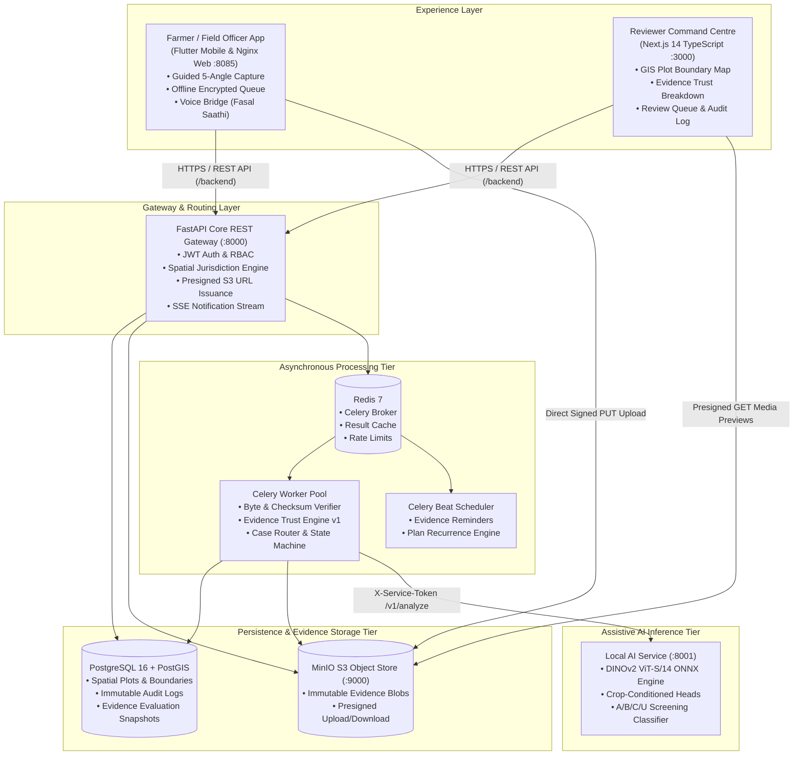
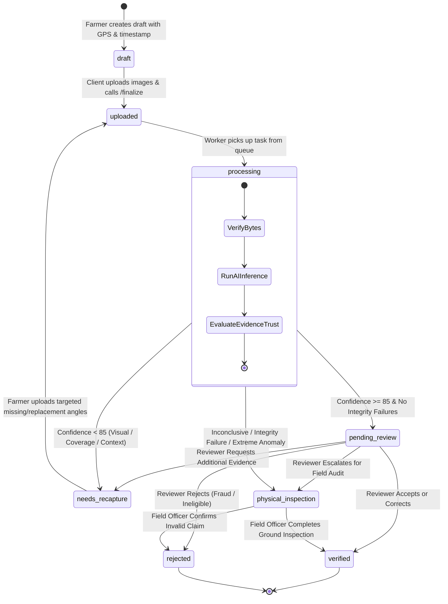
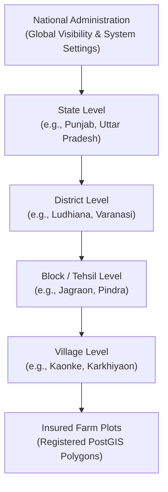

# System Architecture & Technical Specifications

Fasal-Pramaan is architected as a distributed, decoupled, offline-resilient microservice platform designed for high-concurrency agricultural evidence verification and claims adjudication.

---

## 1. High-Level System Topology

```mermaid
flowchart TB
  subgraph ExperienceLayer["Experience Layer"]
    direction TB
    Mobile["Farmer / Field Officer App\n(Flutter Mobile & Nginx Web :8085)\n• Guided 5-Angle Capture\n• Offline Encrypted Queue\n• Voice Bridge (Fasal Saathi)"]
    Dashboard["Reviewer Command Centre\n(Next.js 14 TypeScript :3000)\n• GIS Plot Boundary Map\n• Evidence Trust Breakdown\n• Review Queue & Audit Log"]
  end

  subgraph GatewayLayer["Gateway & Routing Layer"]
    API["FastAPI Core REST Gateway (:8000)\n• JWT Auth & RBAC\n• Spatial Jurisdiction Engine\n• Presigned S3 URL Issuance\n• SSE Notification Stream"]
  end

  subgraph AsyncProcessing["Asynchronous Processing Tier"]
    Redis[("Redis 7\n• Celery Broker\n• Result Cache\n• Rate Limits")]
    Worker["Celery Worker Pool\n• Byte & Checksum Verifier\n• Evidence Trust Engine v1\n• Case Router & State Machine"]
    Beat["Celery Beat Scheduler\n• Evidence Reminders\n• Plan Recurrence Engine"]
  end

  subgraph AIServiceTier["Assistive AI Inference Tier"]
    AI["Local AI Service (:8001)\n• DINOv2 ViT-S/14 ONNX Engine\n• Crop-Conditioned Heads\n• A/B/C/U Screening Classifier"]
  end

  subgraph StorageTier["Persistence & Evidence Storage Tier"]
    Postgres[("PostgreSQL 16 + PostGIS\n• Spatial Plots & Boundaries\n• Immutable Audit Logs\n• Evidence Evaluation Snapshots")]
    MinIO[("MinIO S3 Object Store (:9000)\n• Immutable Evidence Blobs\n• Presigned Upload/Download")]
  end

  Mobile -->|"HTTPS / REST API (/backend)"| API
  Dashboard -->|"HTTPS / REST API (/backend)"| API
  Mobile -->|"Direct Signed PUT Upload"| MinIO
  Dashboard -->|"Presigned GET Media Previews"| MinIO

  API --> Postgres
  API --> MinIO
  API --> Redis

  Redis --> Worker
  Redis --> Beat
  Worker --> Postgres
  Worker --> MinIO
  Worker -->|"X-Service-Token /v1/analyze"| AI
```

---

## 2. Layer & Component Responsibilities

### 2.1 Experience Layer

#### A. Farmer & Field Officer Mobile Application (`apps/mobile`)
- **Technology**: Flutter 3.x (compiled to native Android, iOS, and containerized Web).
- **Key Subsystems**:
  - **Guided 5-Angle Capture Engine**: Overlays visual framing guides enforcing the capture of `wide_field`, `left_context`, `mid_canopy`, `right_context`, and `closeup_damage`.
  - **Client Quality & Integrity Probes**: Real-time Laplacian edge detection for blur, exposure boundary validation, resolution checks, and Android mock-location detection.
  - **Offline Storage & Encryption**: Local SQLite database encrypted using field-level AES-GCM envelopes, securing evidence when disconnected from cellular networks.
  - **Resumable Synchronization**: Idempotent background sync engine with exponential backoff and jitter.
  - **Fasal Saathi Voice Interface**: Dual-channel 16 kHz PCM audio streaming bridge connected to Gemini Live via the API gateway proxy.

#### B. Reviewer Command Centre (`apps/dashboard`)
- **Technology**: Next.js 14, React 18, TypeScript, TailwindCSS, React Query, Lucide Icons, Leaflet GIS.
- **Key Subsystems**:
  - **Review Queue & Triage**: Real-time filtering and sorting by Evidence Confidence, Uncertainty Type, Integrity Status, and Severity.
  - **Evidence Trust Inspector**: 4-component visual score cards (Quality, Coverage, Context, Integrity) with detailed deduction explanations.
  - **Multi-Angle Visual Grid**: Synchronized multi-angle photo viewer with high-resolution pan/zoom and original vs. recapture comparison.
  - **Spatial GIS Mapping**: Interactive PostGIS plot polygon boundary overlays with GPS capture pin accuracy circles.
  - **Immutable Audit History**: Chronological timeline of AI predictions, reviewer overrides, and state transitions.

---

### 2.2 Application Layer

#### A. Core API Gateway (`services/api`)
- **Technology**: FastAPI (Python 3.11), Pydantic v2, SQLAlchemy 2.0 async/sync ORM, GeoAlchemy2.
- **Key Subsystems**:
  - **Authentication & Security**: Argon2id password hashing, JWT access token versioning, opaque refresh token family rotation, and rate-limiting.
  - **Spatial Jurisdiction RBAC**: Hierarchical boundary enforcement ($State \rightarrow District \rightarrow Block \rightarrow Village$), ensuring field officers only access plots within their assigned territory.
  - **Presigned Upload Pipeline**: Issuance of cryptographically signed S3 PUT URLs with strict content-length and content-type enforcement.
  - **Real-Time Notification SSE**: Server-Sent Events (SSE) broadcasting real-time queue updates to connected reviewers.

#### B. Asynchronous Worker Pool (`services/api/app/workers`)
- **Technology**: Celery 5.x on Redis 7.
- **Key Subsystems**:
  - **Server-Side Evidence Verification**: Inspects uploaded S3 objects, validates SHA-256 and perceptual hash ($pHash$) signatures, decodes image headers, and checks byte integrity.
  - **Evidence Trust & Confidence Engine**: Calculates the 4-component scores ($0.4Q + 0.3C + 0.2X + 0.1I$) and classifies deterministic uncertainty.
  - **AI Dispatcher**: Dispatches verified image streams to the AI service with mutual service token authentication (`X-Service-Token`).
  - **Evidence Reminders (`fp-beat`)**: Scans active crop cycles and enqueues scheduled geo-tagged evidence prompts.

---

### 2.3 Assistive AI Inference Tier (`services/ai`)

- **Technology**: FastAPI, ONNX Runtime (CPU/GPU-optimized), NumPy, Pillow.
- **Default Model**: `crop_health_v4` — **DINOv2 ViT-S/14** (Vision Transformer, Small, 14×14 patch size, ~87 MB ONNX artifact).
- **Supported Crops**: Maize (*Zea mays*), Paddy / Rice (*Oryza sativa*), Potato (*Solanum tuberosum*), Wheat (*Triticum aestivum*).
- **Classification Output**: Crop-conditioned $A/B/C/U$ screening signal:
  - `A`: Confident healthy leaf signal.
  - `B`: Borderline / uncertain signal requiring human inspection.
  - `C`: Confident disease/damage pattern.
  - `U`: Unusable image, unsupported crop, or out-of-domain input.
- **Architectural Isolation**: The AI model is strictly assistive; model probabilities are isolated from the Evidence Trust calculation and cannot approve financial payouts.

---

### 2.4 Persistence & Storage Tier

- **PostgreSQL 16 + PostGIS 3.4**: Relational schema with spatial geometry types (`POLYGON`, `POINT`, SRID 4326), JSONB component details, optimistic locking (`VersionMixin`), and soft-delete support.
- **Redis 7 Cluster**: In-memory message broker for Celery queues, task result backend, and distributed rate-limiting counters.
- **MinIO / AWS S3**: S3-compliant object storage storing original, immutable evidence JPEGs using private server-generated object keys (`submissions/{sub_id}/{img_id}.jpg`).

---

## 3. Submission State Machine

The lifecycle of a crop evidence submission follows a strict, deterministic state machine:

```mermaid
stateDiagram-v2
  [*] --> draft: Farmer creates draft with GPS & timestamp
  draft --> uploaded: Client uploads images & calls /finalize
  uploaded --> processing: Worker picks up task from queue

  state processing {
    [*] --> VerifyBytes
    VerifyBytes --> RunAIInference
    RunAIInference --> EvaluateEvidenceTrust
    EvaluateEvidenceTrust --> [*]
  }

  processing --> pending_review: Confidence >= 85 & No Integrity Failures
  processing --> needs_recapture: Confidence < 85 (Visual / Coverage / Context)
  processing --> physical_inspection: Inconclusive / Integrity Failure / Extreme Anomaly

  needs_recapture --> uploaded: Farmer uploads targeted missing/replacement angles
  
  pending_review --> verified: Reviewer Accepts or Corrects
  pending_review --> rejected: Reviewer Rejects (Fraud / Ineligible)
  pending_review --> needs_recapture: Reviewer Requests Additional Evidence
  pending_review --> physical_inspection: Reviewer Escalates for Field Audit

  physical_inspection --> verified: Field Officer Completes Ground Inspection
  physical_inspection --> rejected: Field Officer Confirms Invalid Claim

  verified --> [*]
  rejected --> [*]
```

---

## 4. Spatial Jurisdiction & Security Hierarchy

Access to farmer data, plot boundaries, and review queues is strictly governed by a hierarchical jurisdiction model:

```mermaid
flowchart TD
  National["National Administration\n(Global Visibility & System Settings)"]
  State["State Level\n(e.g., Punjab, Uttar Pradesh)"]
  District["District Level\n(e.g., Ludhiana, Varanasi)"]
  Block["Block / Tehsil Level\n(e.g., Jagraon, Pindra)"]
  Village["Village Level\n(e.g., Kaonke, Karkhiyaon)"]
  
  FarmPlot["Insured Farm Plots\n(Registered PostGIS Polygons)"]

  National --> State
  State --> District
  District --> Block
  Block --> Village
  Village --> FarmPlot
```

- **Farmers**: Can only create, view, and modify farms, plots, crop cycles, and submissions belonging to their authenticated `farmer_profile`.
- **Field Officers**: Can only access and assist submissions belonging to villages within their assigned `jurisdiction_id` (and all sub-jurisdictions).
- **Reviewers**: Authorized across designated administrative regions to perform claim adjudication.
- **System Administrators**: Retain platform-wide observability, audit log inspection, and configuration governance.
