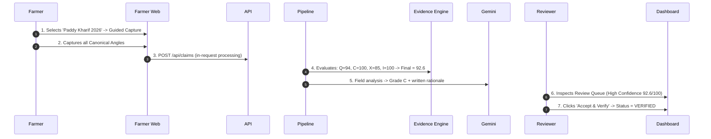

# MUN Exhibition Walkthrough & Showcase Guide

This guide provides a structured, presentation-ready script and walkthrough for demonstrating **Fasal-Pramaan** at Model United Nations (MUN) exhibitions, agricultural tech conferences, and policy stakeholder reviews.

---

## Pre-Demonstration Setup

1. **Start the Platform**: Run the webapp locally:
   ```bash
   cd apps/dashboard
   npm install && npm run dev
   ```
2. **Open Portals** (single Next.js origin on `:3000`):
   - **Farmer Portal**: `http://localhost:3000/farmer/saathi` (Supabase Auth user with farmer role)
   - **Reviewer Portal**: `http://localhost:3000/review` (Supabase Auth user listed in `REVIEWER_EMAILS`)
3. **Reset Operational Data** (Optional clean slate): In the Supabase SQL editor, clear demo submissions:
   ```sql
   DELETE FROM web_claim_images;
   DELETE FROM web_claims;
   ```

---

## Showcase Scenarios

### Scenario 0: Autonomous Fasal Saathi Voice & Multimodal Co-Pilot (Hands-Free Entry)

**Narrative**: The farmer opens `/farmer/saathi` or the floating assistant widget. Saathi immediately introduces itself aloud with a warm Hindi/English greeting (*"नमस्ते किसान भाई! मैं फसल साथी हूँ। आपके खेत में क्या समस्या हुई है?"*), registers a plot hands-free on spoken command, and acts as a real-time multimodal viewfinder co-pilot during 5-angle capture.

1. **Automatic Spoken Greeting**: Open `/farmer/saathi` and toggle voice or open `FasalSaathiOverlay`. Notice Saathi automatically speaks the welcome greeting aloud immediately on connection.
2. **Spoken Plot Registration**: Say *"मेरा नया गेहूँ का खेत जोड़ो"* (or *"Register a new wheat plot in Rampur"*). Saathi executes `register_plot` and confirms the cadastral landholding is saved.
3. **Guided capture**: Tap **Guided Capture** (`/farmer/capture`). On-device OpenCV locks the shutter until the frame looks like a real crop (not a screen). After submit, Gemini writes the reviewer analysis.
4. **Hands-Free Shutter**: Say *"फोटो खींचो"* (*"Take the photo"*). The camera triggers, passes the anti-screen authenticity gate, and guides the next angle smoothly.

---

### Scenario 1: High-Trust Verified Claim (The Ideal Assessment)

**Narrative**: A smallholder farmer captures complete, high-quality, geotagged evidence of blast disease on a paddy plot. The system verifies optical quality, spatial boundaries, and authenticity, assisting the reviewer with instant triage.



1. **Farmer Action**: On the Farmer web (`:3000/farmer`), open **Farms** $\rightarrow$ **Add Farm** (*"Green Valley"*), **Add Plot** (*"Plot A1"*), and start **Paddy Cycle**. Tap **Capture Crop Evidence** (or start from `/farmer/saathi`). Capture the required angles and tap **Save & Submit**.
2. **Reviewer Action**: In the Command Centre (`:3000/review`), open **Review Queue**. Click the case to show:
   - **Final Evidence Confidence**: `92.6 / 100` (Evidence Sufficient).
   - **Component Breakdown**: Quality `94.0`, Coverage `100.0`, Context `85.0`, Integrity `100.0`.
   - **Gemini field analysis**: Grade `C` plus a written rationale (assistive).
   - **GIS Overlay**: Plot polygon boundary matching the GPS capture pin.
3. Click **Accept & Verify**. Show the updated status and immutable audit record.

---

### Scenario 2: Adaptive Evidence Recapture (Targeted Missing Angle)

**Narrative**: The farmer submits evidence but accidentally omits the critical `closeup_damage` angle. Rather than rejecting the claim or demanding all 5 photos again, Fasal-Pramaan triggers targeted adaptive recapture.


1. **Demonstrate the Gap**: Show the case in the Reviewer Dashboard with Evidence Confidence `72.4 / 100` and `Uncertainty: Coverage (High)`.
2. **Reviewer Action**: Click **Request Recapture**. Point out that the system auto-selects `["closeup_damage"]` and provides bilingual farmer instructions.
3. **Farmer Action**: Open the farmer portal. Notice the notification: *"Additional evidence required: Close-up damage photo"*. Tapping it opens guided capture in `specific_recapture` mode, requesting **only** the 1 missing photo.
4. **Re-Evaluation**: Upload the photo. Refresh the Reviewer Dashboard to show the **Confidence Delta**:
   $$\text{Previous: } 72.4 \longrightarrow \text{New: } 89.2 \quad (\Delta C = +16.8)$$
   The case updates to `pending_review` and is accepted.

---

### Scenario 3: Anti-Fraud & Integrity Gate (Duplicate Checksum Rejection)

**Narrative**: An attempted fraudulent submission reuses the same downloaded leaf photo across multiple angles. The engine catches the duplicate cryptographic checksum, imposes hard penalties, and routes the case directly to human anti-fraud investigation.

```mermaid
sequenceDiagram
  autonumber
  Fraudster->>API: Submits duplicate image bytes across angles
  Pipeline->>Evidence Engine: Stores SHA-256; Gemini flags screen/AI fakes
  Evidence Engine->>Evidence Engine: Deducts Integrity Score (-65.0) -> Final Confidence = 35.0
  Evidence Engine->>API: Uncertainty: 'Integrity' (Critical) -> Action: 'human_review'
  API->>Dashboard: Enqueues directly to Anti-Fraud Reviewer Queue
  Reviewer->>Dashboard: Inspects Duplicate Flag -> Clicks 'Reject Claim' with reason
```

1. **Demonstrate Protection**: Show that even if an image is visually sharp ($S_{\text{Quality}} = 95.0$), an identical cryptographic SHA-256 hash collision reused across angles immediately drops $S_{\text{Integrity}}$ to $35.0$.
2. **Strict Escalation**: Highlight that the automated recapture engine **refuses to issue an automated retake** for integrity breaches, requiring explicit human reviewer adjudication to protect the insurance pool.
3. **Reviewer Action**: Reviewer clicks **Reject Claim** and logs the reason *"Fraudulent duplicate photo detected across angles"*.

---

### Scenario 4: Hands-Free Voice Capture (Fasal Saathi on Gemini Live)

**Narrative**: A farmer working hands-free in the field speaks natural Hindi or English to register plots, capture photos, and query claim status.

1. Open `/farmer/saathi` (or tap **Talk to Fasal Saathi** in the capture studio).
2. Speak: *"मेरे खेत दिखाओ"* $\rightarrow$ Assistant reads back registered farms.
3. Speak: *"फोटो खींचो"* $\rightarrow$ Assistant triggers the camera capture shutter.
4. Speak: *"ऑब्जर्वेशन लिखो: पत्तों पर भूरे धब्बे"* $\rightarrow$ Assistant records the spoken observation into the draft.

---

### Scenario 5: Fire Claim End-to-End with Satellite Cross-Check & CSV Export

**Narrative**: A farmer's field caught fire. The Saathi classifies `fire_burn`, capture is checked against the registered plot center, and the reviewer verifies the burn scar against satellite imagery before adjudicating and exporting the case data.

1. **Farmer Action**: On `/farmer/saathi`, type/speak *"aag lag gayi thi khet me"* → peril classified as `fire_burn` → routed to the 2-angle capture studio. Point out the **"CV: AI ready"** warmup badge turning green while guidance loads (weights prefetch started on page mount). Capture `wide_field` + `closeup_damage` and submit.
2. **Automatic processing**: `POST /api/claims` persists `plotLat`/`plotLon`, assembles context including **`plot_match`** ("Capture is 84 m from plot center — within 200 m radius"), Sentinel burn-scar check (`SENTINEL_TOKEN` → real NDVI; otherwise the free heat-proxy) and IMD rainfall.
3. **Reviewer Action**: Open the case in `/review/[id]`. Show the **Multi-Signal Context & Satellite Cross-Check card**: per-signal status chips, the side-by-side `wide_field` photo vs Bhuvan WMS land-use tile, then click **"Open Sentinel-2 in Copernicus Browser ↗"** to visually confirm the burn scar in Sentinel-2 L2A imagery from the last 3 days.
4. **Gate re-run (optional beat)**: On the Authenticity Gate card, click **re-run** — stored images are re-gated through `/api/vision/gate` and the audited note "Gate re-run recorded: X/Y usable" appears in history.
5. **CSV export**: Back on `/review`, click **Export CSV** — the currently filtered queue rows download as a spreadsheet for offline audit.

### Scenario 6: Recapture Notification Beat (Auto-Request → Farmer Toast)

**Narrative**: The adaptive engine auto-moves a Medium-confidence claim to `needs_recapture`; the farmer discovers this without any reviewer round-trip.

1. Trigger (or reuse) an auto-created recapture request from Scenario 2.
2. **Farmer Action**: Reload `/farmer`. An **amber toast panel** appears — *"Additional evidence required"* with the bilingual reason and missing angles — offering **Capture now** (deep-links straight into guided capture for only the missing angles) and **Dismiss**.
3. Note the **nav badge dot** on the farmer navigation while the notice is unseen (`farmer-notifications.ts` diffs unseen claims via localStorage); dismissing clears the dot.
