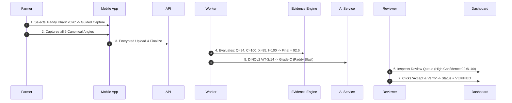
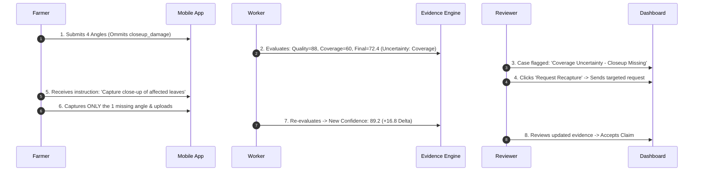
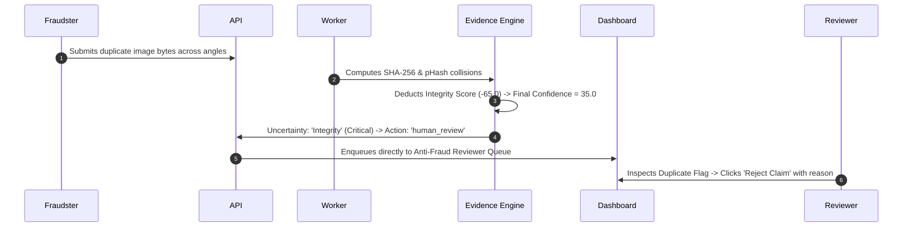

# MUN Exhibition Walkthrough & Showcase Guide

This guide provides a structured, presentation-ready script and walkthrough for demonstrating **Fasal-Pramaan** at Model United Nations (MUN) exhibitions, agricultural tech conferences, and policy stakeholder reviews.

---

## Pre-Demonstration Setup

1. **Start the Platform**: Run `scripts/start-portable.ps1` (Windows) or `scripts/start-portable.sh` (Mac/Linux).
2. **Open Portals**:
   - **Farmer Portal**: `http://localhost:8085` (Login: `farmer@fasalpramaan.local` / `Demo@12345`)
   - **Reviewer Portal**: `http://localhost:3000` (Login: `reviewer@fasalpramaan.local` / `Demo@12345`)
3. **Reset Operational Data** (Optional clean slate):
   ```bash
   docker compose stop worker beat
   docker compose exec api python scripts/clear_operational_data.py --confirm-local-reset
   docker compose start worker beat
   ```

---

## Showcase Scenarios

### Scenario 1: High-Trust Verified Claim (The Ideal Assessment)

**Narrative**: A smallholder farmer captures complete, high-quality, geotagged evidence of blast disease on a paddy plot. The system verifies optical quality, spatial boundaries, and authenticity, assisting the reviewer with instant triage.



1. **Farmer Action**: In the Mobile App (`:8085`), open **Farms** $\rightarrow$ **Add Farm** (*"Green Valley"*), **Add Plot** (*"Plot A1"*), and start **Paddy Cycle**. Tap **Capture Crop Evidence**. Capture all 5 angles and tap **Save & Submit**.
2. **Reviewer Action**: In the Command Centre (`:3000`), open **Review Queue**. Click the case to show:
   - **Final Evidence Confidence**: `92.6 / 100` (Evidence Sufficient).
   - **Component Breakdown**: Quality `94.0`, Coverage `100.0`, Context `85.0`, Integrity `100.0`.
   - **DINOv2 AI Screening**: Grade `C` (*Disease Pattern Detected*).
   - **PostGIS GIS Overlay**: Plot polygon boundary matching the GPS capture pin.
3. Click **Accept & Verify**. Show the updated status and immutable audit record.

---

### Scenario 2: Adaptive Evidence Recapture (Targeted Missing Angle)

**Narrative**: The farmer submits evidence but accidentally omits the critical `closeup_damage` angle. Rather than rejecting the claim or demanding all 5 photos again, Fasal-Pramaan triggers targeted adaptive recapture.



1. **Demonstrate the Gap**: Show the case in the Reviewer Dashboard with Evidence Confidence `72.4 / 100` and `Uncertainty: Coverage (High)`.
2. **Reviewer Action**: Click **Request Recapture**. Point out that the system auto-selects `["closeup_damage"]` and provides bilingual farmer instructions.
3. **Farmer Action**: Open the Farmer app. Notice the notification: *"Additional evidence required: Close-up damage photo"*. Tapping it opens guided capture in `specific_recapture` mode, requesting **only** the 1 missing photo.
4. **Re-Evaluation**: Upload the photo. Refresh the Reviewer Dashboard to show the **Confidence Delta**:
   $$\text{Previous: } 72.4 \longrightarrow \text{New: } 89.2 \quad (\Delta C = +16.8)$$
   The case updates to `pending_review` and is accepted.

---

### Scenario 3: Anti-Fraud & Integrity Gate (Duplicate Checksum Rejection)

**Narrative**: An attempted fraudulent submission reuses the same downloaded leaf photo across multiple angles. The engine catches the duplicate cryptographic checksum, imposes hard penalties, and routes the case directly to human anti-fraud investigation.



1. **Demonstrate Protection**: Show that even if an image is visually sharp ($S_{\text{Quality}} = 95.0$), a cryptographic or perceptual hash collision immediately drops $S_{\text{Integrity}}$ to $35.0$.
2. **Strict Escalation**: Highlight that the automated recapture engine **refuses to issue an automated retake** for integrity breaches, requiring explicit human reviewer adjudication to protect the insurance pool.
3. **Reviewer Action**: Reviewer clicks **Reject Claim** and logs the reason *"Fraudulent duplicate photo detected across angles"*.

---

### Scenario 4: Hands-Free Voice Capture (Fasal Saathi on Gemini Live)

**Narrative**: A farmer working hands-free in the field speaks natural Hindi or English to register plots, capture photos, and query claim status.

1. In the Mobile App (`:8085`), tap **Talk to Fasal Saathi**.
2. Speak: *"मेरे खेत दिखाओ"* $\rightarrow$ Assistant reads back registered farms.
3. Speak: *"फोटो खींचो"* $\rightarrow$ Assistant triggers the camera capture shutter.
4. Speak: *"क्यू सिंक करो"* $\rightarrow$ Assistant confirms the action before executing sync.
