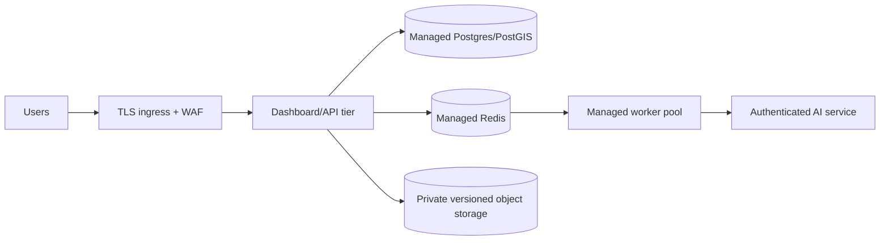

# Deployment boundary

## Local presentation and LAN deployment

The checked-in Compose stack is the supported MVP deployment:

```powershell
Copy-Item .env.example .env
powershell -ExecutionPolicy Bypass -File .\scripts\start-portable.ps1
```

| Port | Service | Binding |
|---|---|---|
| `3000` | Reviewer dashboard | LAN-accessible |
| `8085` | Farmer/field web app | LAN-accessible |
| `8000` | API and OpenAPI docs | LAN-accessible for diagnostics/native clients |
| `8001` | AI health/inference service | LAN-accessible for diagnostics |
| `9000` | MinIO S3 evidence endpoint | LAN-accessible for browser signed uploads |
| `5432`, `6379`, `9001` | DB, Redis, MinIO admin | loopback only |

For another device, pass the Docker host's trusted LAN IP:

```powershell
powershell -ExecutionPolicy Bypass -File .\scripts\start-portable.ps1 `
  -PublicHost 192.168.1.25
```

Use a private firewall profile and permit only the ports needed for the demo.
Do not port-forward this stack to the public internet.

## Portable, no-Git distribution

```powershell
powershell -ExecutionPolicy Bypass -File .\scripts\build-portable-bundle.ps1
```

The recipient extracts `dist/FasalPramaan-MVP-portable.zip`, installs Docker,
and runs the launcher. The bundle excludes Git history, `.env`, caches,
generated builds, downloaded datasets, and transient training runs while
retaining the selected model and model-evaluation evidence.

## Production shape (not provisioned)



Required gates before public deployment include managed secrets and key
rotation, TLS, private service networking, restrictive CORS, WAF/rate limits,
backup/restore drills, retention policy, monitoring, incident response,
privacy review, penetration testing, and independent field model validation.

This repository does not provision public cloud infrastructure, live
PMFBY/YESTECH integration, or production certification. See
[production-readiness.md](./production-readiness.md).
