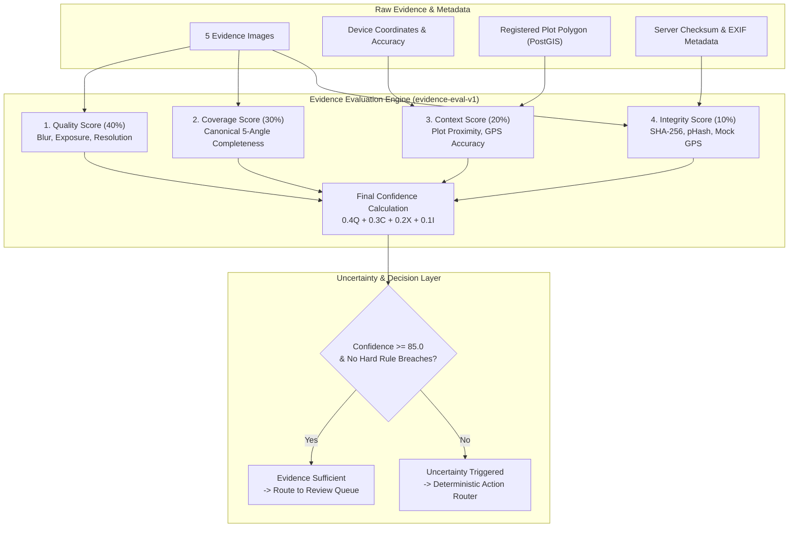

# Evidence Confidence & Trust Evaluation Engine

The **Evidence Confidence & Trust Evaluation Engine** is the core deterministic verification subsystem of Fasal-Pramaan. It establishes an objective, mathematical measure of evidence trustworthiness before any human adjudication or claim settlement takes place.

Traditional crop insurance and damage assessment systems either rely blindly on raw AI model probability or force human reviewers to manually inspect unstructured photos without standardized quality or coverage guarantees. Fasal-Pramaan decouples **Evidence Trust** from **Model Prediction Confidence**, evaluating evidence across four independent dimensions: **Quality**, **Coverage**, **Context**, and **Integrity**.

---

## 1. Mathematical Formulation

The canonical **Final Evidence Confidence Score ($C_{\text{final}}$)** is a normalized, weighted linear combination of four sub-scores, bounded in the range $[0, 100]$:

$$C_{\text{final}} = w_Q \cdot S_{\text{Quality}} + w_C \cdot S_{\text{Coverage}} + w_X \cdot S_{\text{Context}} + w_I \cdot S_{\text{Integrity}}$$

Where the canonical component weights are defined as:

| Component | Symbol | Weight ($w_k$) | Primary Objective |
|---|---|---|---|
| **Evidence Quality** | $S_{\text{Quality}}$ | **0.4 (40%)** | Visual clarity, sharpness, exposure, and leaf feature decodability |
| **Evidence Coverage** | $S_{\text{Coverage}}$ | **0.3 (30%)** | Spatial representation across all 5 canonical angles |
| **Contextual Validity** | $S_{\text{Context}}$ | **0.2 (20%)** | Geolocation accuracy, plot boundary proximity, and timestamping |
| **Data Integrity** | $S_{\text{Integrity}}$ | **0.1 (10%)** | Anti-tamper, duplicate hash prevention, mock GPS detection, and byte validation |

$$\sum_{k} w_k = 0.4 + 0.3 + 0.2 + 0.1 = 1.0$$

---

## 2. Component Score Breakdown



### 2.1 Evidence Quality Score ($S_{\text{Quality}}$ — 40%)

The Quality Score evaluates the optical and visual diagnostic utility of all uploaded active images. Each image starts with a baseline score of $100.0$ and incurs deterministic deductions based on detected anomalies:

- **Motion Blur / Low Sharpness**: A deduction of $-65.0$ is applied if the Laplacian variance blur score is below $0.30$ or if client/model blur flags are set.
- **Exposure Anomalies**: A deduction of $-30.0$ is applied if normalized brightness falls outside the acceptable envelope $[0.20, 0.90]$ (underexposed or overexposed).
- **Sub-Standard Resolution**: A deduction of $-40.0$ is applied if image dimensions fall below $128 \times 128$ pixels.
- **Decoding / Corruption Failures**: A deduction of $-50.0$ is applied if server-side image decoding detects corrupted headers or broken JPEG streams.

$$S_{\text{Quality}} = \text{clamp}\left( \frac{1}{N} \sum_{i=1}^{N} \max(0, 100 - \sum \text{Deductions}_i), 0, 100 \right)$$

### 2.2 Evidence Coverage Score ($S_{\text{Coverage}}$ — 30%)

Coverage measures spatial completeness across the **5 canonical evidence angles**:
1. `wide_field` (Landscape overview)
2. `left_context` (Left lateral perspective)
3. `mid_canopy` (Eye-level canopy structure)
4. `right_context` (Right lateral perspective)
5. `closeup_damage` (Macro symptomatic leaf/crop view)

$$S_{\text{Coverage}} = \left( \frac{\text{Count of Valid Uploaded Canonical Angles}}{5} \right) \times 100.0$$

*Note: A present image that fails decoding or visual usability does not count toward valid coverage.*

### 2.3 Context Score ($S_{\text{Context}}$ — 20%)

Context validates that the evidence was physically captured at the insured plot during the valid assessment window:
- **Base Score**: $100.0$ if valid GPS latitude and longitude are present.
- **Missing GPS**: If coordinates are entirely absent, $S_{\text{Context}} = 0.0$.
- **Plot Boundary Proximity**: A deduction of $-45.0$ is applied if the capture point falls outside the PostGIS-registered plot polygon buffer.
- **GPS Accuracy Degradation**: A deduction of $-20.0$ is applied if horizontal accuracy exceeds the configured threshold ($> 50.0\text{ meters}$).
- **Missing Timestamp**: A deduction of $-10.0$ is applied if timezone-aware capture timestamps are missing.

### 2.4 Integrity Score ($S_{\text{Integrity}}$ — 10%)

Integrity enforces anti-fraud and cryptographic authenticity:
- **Duplicate SHA-256 Checksums**: A deduction of $-65.0$ is applied if identical image byte hashes are detected across angles.
- **Perceptual Duplicate Hashes (pHash)**: A deduction of $-65.0$ is applied if perceptual hash Hamming distance indicates recycled or re-used photos.
- **Mock / Spoofed GPS Detection**: A deduction of $-65.0$ is applied if mock location provider flags or simulated trajectory markers are detected.
- **Screenshot / Screen Replay Detection**: A deduction of $-60.0$ is applied if high-frequency grid patterns or Moiré interference indicate a photo taken of a digital screen.
- **Server Verification Mismatches**: A deduction of $-35.0$ is applied if declared client byte size/MIME type diverges from server-observed object storage properties.

---

## 3. Thresholds & Deterministic Uncertainty Classification

The primary evidence sufficiency threshold is configured to **$85.0$**. If $C_{\text{final}} < 85.0$, or if any critical sub-component triggers a hard rule, the engine executes a deterministic uncertainty classification.

### 3.1 Hard Business Rules

| Condition | Primary Assessment | Recommended System Action |
|---|---|---|
| $S_{\text{Integrity}} < 70.0 \lor \text{Integrity Issues} > 0$ | **Integrity Failure** | `human_review` *(Automated retake disabled)* |
| $S_{\text{Coverage}} < 50.0 \lor \text{Missing Angles} > 0$ | **Coverage Uncertainty** | `request_specific_evidence` |
| $S_{\text{Quality}} < 40.0 \lor \text{Visual Issues} > 0$ | **Visual Uncertainty** | `retake_image` |
| $S_{\text{Context}} < 70.0 \lor \text{Location Issues} > 0$ | **Context Uncertainty** | `request_context` |

### 3.2 Strict Priority Ordering

When multiple issues coexist simultaneously (e.g., an image is both blurry and carries a duplicate hash), the engine enforces strict hierarchical resolution:

$$\text{Priority 1: Integrity} \succ \text{Priority 2: Coverage} \succ \text{Priority 3: Visual Quality} \succ \text{Priority 4: Context}$$

- **Integrity takes absolute precedence**: A fraudulent or duplicate image is never resolved by simply prompting the farmer for another photo; it is routed directly to a senior human reviewer for fraud adjudication.
- **Coverage takes precedence over visual quality**: If close-up damage evidence is missing entirely, the system requests that specific view before asking for re-takes of existing blurry lateral shots.

---

## 4. Persisted Evidence Evaluation Schema

Every evaluation run creates an immutable snapshot in the `evidence_evaluations` table. Historical snapshots are never overwritten, guaranteeing complete auditability.

```json
{
  "id": "e4b2d189-a5c3-4c91-9e23-7d2fa9108b41",
  "submission_id": "f8a1e230-b741-4cf0-9852-192a8310c952",
  "evaluation_version": "evidence-confidence-v1",
  "quality_score": 68.5,
  "coverage_score": 60.0,
  "context_score": 85.0,
  "integrity_score": 100.0,
  "final_confidence": 72.4,
  "confidence_threshold": 85.0,
  "uncertainty_type": "coverage",
  "uncertainty_severity": "high",
  "uncertainty_reasons": [
    "closeup_damage is missing",
    "right_context is missing"
  ],
  "recommended_action": "request_specific_evidence",
  "generated_request": {
    "reason_code": "missing_closeup",
    "required_angles": ["closeup_damage"],
    "title": "Capture close-up damage evidence",
    "instructions": "Move closer to the affected crop area and capture a clear, sharp image of the symptomatic leaves."
  },
  "component_details": {
    "weights": {
      "quality": 0.4,
      "coverage": 0.3,
      "context": 0.2,
      "integrity": 0.1
    },
    "quality": {
      "score": 68.5,
      "per_image": [
        {"image_id": "...", "angle_type": "wide_field", "score": 95.0, "issues": []},
        {"image_id": "...", "angle_type": "left_context", "score": 85.0, "issues": []},
        {"image_id": "...", "angle_type": "mid_canopy", "score": 25.0, "issues": ["blur"]}
      ],
      "blurry_angles": ["mid_canopy"],
      "exposure_angles": []
    },
    "coverage": {
      "score": 60.0,
      "total_required": 5,
      "total_present": 3,
      "present_angles": ["wide_field", "left_context", "mid_canopy"],
      "missing_angles": ["right_context", "closeup_damage"]
    },
    "context": {
      "score": 85.0,
      "has_gps": true,
      "capture_lat": 28.6139,
      "capture_lon": 77.2090,
      "accuracy_m": 12.4,
      "outside_plot_proximity": false
    },
    "integrity": {
      "score": 100.0,
      "integrity_passed": true,
      "issues": []
    }
  },
  "evidence_ids": [
    "c1e0a293-1284-482a-a921-99884120ab11",
    "d2f1b394-2395-593b-ba32-00995231bc22",
    "e3a2c405-3406-604c-cb43-11006342cd33"
  ],
  "model_version": "crop_health_dinov2_v14",
  "created_at": "2026-08-17T22:30:00Z",
  "actor_id": null
}
```

---

## 5. Independence of Evidence vs. Model Confidence

A fundamental design principle of Fasal-Pramaan is the separation of **Evidence Trust** from **AI Model Inference**:

$$\text{Evidence Confidence } (C_{\text{final}}) \neq \text{Model Prediction Confidence } (P_{\text{model}})$$

- **Model Confidence ($P_{\text{model}}$)**: The softmax probability or ensemble score of the DINOv2 classifier regarding whether a specific leaf shows disease (Grade C) or healthy tissue (Grade A).
- **Evidence Confidence ($C_{\text{final}}$)**: The aggregate trust score verifying whether the evidence set as a whole is complete, authentic, sharp, and physically situated within the insured plot.

A claim with $99\%$ Model Prediction Confidence on a single blurry, un-geotagged photo will have an Evidence Confidence of only $45.0$, properly preventing automatic acceptance and safeguarding the integrity of the insurance pool.
