# Evidence Confidence & Trust Evaluation Engine

The **Evidence Confidence & Trust Evaluation Engine** is the core deterministic verification subsystem of Fasal-Pramaan. It establishes an objective, mathematical measure of evidence trustworthiness before any human adjudication or claim settlement takes place.

Traditional crop insurance and damage assessment systems either rely blindly on raw AI model probability or force human reviewers to manually inspect unstructured photos without standardized quality or coverage guarantees. Fasal-Pramaan decouples **Evidence Trust** from **Model Prediction Confidence**, evaluating evidence across four independent dimensions: **Quality**, **Coverage**, **Context**, and **Integrity**.

---

## 1. Mathematical Formulation

The canonical **Final Evidence Confidence Score ($C_{\text{final}}$)** is a normalized, weighted linear combination of four sub-scores, bounded in the range $[0, 100]$:

$$C_{\text{final}} = w_Q \cdot S_{\text{Quality}} + w_C \cdot S_{\text{Coverage}} + w_X \cdot S_{\text{Context}} + w_I \cdot S_{\text{Integrity}}$$

Where the canonical component weights are defined as:

| Component | Symbol | Weight ($w_k$) | Primary Objective |
|---|---|---|---|
| **Evidence Quality** | $S_{\text{Quality}}$ | **0.4 (40%)** | Visual clarity, sharpness, exposure, and leaf feature decodability |
| **Evidence Coverage** | $S_{\text{Coverage}}$ | **0.3 (30%)** | Spatial representation across all 5 canonical angles |
| **Contextual Validity** | $S_{\text{Context}}$ | **0.2 (20%)** | Geolocation accuracy, plot boundary proximity, and timestamping |
| **Data Integrity** | $S_{\text{Integrity}}$ | **0.1 (10%)** | Anti-tamper, duplicate hash prevention, mock GPS detection, and byte validation |

$$\sum_{k} w_k = 0.4 + 0.3 + 0.2 + 0.1 = 1.0$$

---

## 2. Component Score Breakdown


### 2.1 Evidence Quality Score ($S_{\text{Quality}}$ — 40%)

The Quality Score evaluates the optical and visual diagnostic utility of all uploaded active images. Each image starts with a baseline score of $100.0$ and incurs deterministic deductions based on detected anomalies:

- **Motion Blur / Low Sharpness**: A deduction of $-65.0$ is applied if the Laplacian variance blur score is below $0.30$ or if client/model blur flags are set.
- **Exposure Anomalies**: A deduction of $-30.0$ is applied if normalized brightness falls outside the acceptable envelope $[0.20, 0.90]$ (underexposed or overexposed).
- **Sub-Standard Resolution**: A deduction of $-40.0$ is applied if image dimensions fall below $128 \times 128$ pixels.
- **Decoding / Corruption Failures**: A deduction of $-50.0$ is applied if server-side image decoding detects corrupted headers or broken JPEG streams.

$$S_{\text{Quality}} = \text{clamp}\left( \frac{1}{N} \sum_{i=1}^{N} \max(0, 100 - \sum \text{Deductions}_i), 0, 100 \right)$$

### 2.2 Evidence Coverage Score ($S_{\text{Coverage}}$ — 30%)

Coverage measures spatial completeness across the **5 canonical evidence angles**:
1. `wide_field` (Landscape overview)
2. `left_context` (Left lateral perspective)
3. `mid_canopy` (Eye-level canopy structure)
4. `right_context` (Right lateral perspective)
5. `closeup_damage` (Macro symptomatic leaf/crop view)

$$S_{\text{Coverage}} = \left( \frac{\text{Count of Valid Uploaded Canonical Angles}}{5} \right) \times 100.0$$

*Note: A present image that fails decoding or visual usability does not count toward valid coverage.*

### 2.3 Context Score ($S_{\text{Context}}$ — 20%)

Context validates that the evidence was physically captured at the insured plot during the valid assessment window:
- **Base Score**: $100.0$ if valid GPS latitude and longitude are present.
- **Missing GPS**: If coordinates are entirely absent, $S_{\text{Context}} = 0.0$.
- **Plot Boundary Proximity**: A deduction of $-45.0$ is applied if the capture point falls outside the registered plot polygon buffer.
- **GPS Accuracy Degradation**: A deduction of $-20.0$ is applied if horizontal accuracy exceeds the configured threshold ($> 50.0\text{ meters}$).
- **Missing Timestamp**: A deduction of $-10.0$ is applied if timezone-aware capture timestamps are missing.

### 2.4 Integrity Score ($S_{\text{Integrity}}$ — 10%)

Integrity enforces anti-fraud and cryptographic authenticity:
- **Duplicate SHA-256 Checksums**: A deduction of $-65.0$ is applied if identical image byte hashes are detected across angles.
- **Perceptual Duplicate Hashes (pHash)**: A deduction of $-65.0$ is applied if perceptual hash Hamming distance indicates recycled or re-used photos.
- **Mock / Spoofed GPS Detection**: A deduction of $-65.0$ is applied if mock location provider flags or simulated trajectory markers are detected.
- **Screenshot / Screen Replay Detection**: A deduction of $-60.0$ is applied if high-frequency grid patterns or Moiré interference indicate a photo taken of a digital screen.
- **Server Verification Mismatches**: A deduction of $-35.0$ is applied if declared client byte size/MIME type diverges from server-observed object storage properties.

---

## 3. Thresholds & Deterministic Uncertainty Classification

The primary evidence sufficiency threshold is configured to **$85.0$**. If $C_{\text{final}} < 85.0$, or if any critical sub-component triggers a hard rule, the engine executes a deterministic uncertainty classification.

### 3.1 Hard Business Rules

| Condition | Primary Assessment | Recommended System Action |
|---|---|---|
| $S_{\text{Integrity}} < 70.0 \lor \text{Integrity Issues} > 0$ | **Integrity Failure** | `human_review` *(Automated retake disabled)* |
| $S_{\text{Coverage}} < 50.0 \lor \text{Missing Angles} > 0$ | **Coverage Uncertainty** | `request_specific_evidence` |
| $S_{\text{Quality}} < 40.0 \lor \text{Visual Issues} > 0$ | **Visual Uncertainty** | `retake_image` |
| $S_{\text{Context}} < 70.0 \lor \text{Location Issues} > 0$ | **Context Uncertainty** | `request_context` |

### 3.2 Strict Priority Ordering

When multiple issues coexist simultaneously (e.g., an image is both blurry and carries a duplicate hash), the engine enforces strict hierarchical resolution:

$$\text{Priority 1: Integrity} \succ \text{Priority 2: Coverage} \succ \text{Priority 3: Visual Quality} \succ \text{Priority 4: Context}$$

- **Integrity takes absolute precedence**: A fraudulent or duplicate image is never resolved by simply prompting the farmer for another photo; it is routed directly to a senior human reviewer for fraud adjudication.
- **Coverage takes precedence over visual quality**: If close-up damage evidence is missing entirely, the system requests that specific view before asking for re-takes of existing blurry lateral shots.

---

## 4. Persisted Evidence Evaluation Schema

Every evaluation run creates an immutable snapshot in the `evidence_evaluations` table. Historical snapshots are never overwritten, guaranteeing complete auditability.

```json
{
  "id": "e4b2d189-a5c3-4c91-9e23-7d2fa9108b41",
  "submission_id": "f8a1e230-b741-4cf0-9852-192a8310c952",
  "evaluation_version": "evidence-confidence-v1",
  "quality_score": 68.5,
  "coverage_score": 60.0,
  "context_score": 85.0,
  "integrity_score": 100.0,
  "final_confidence": 72.4,
  "confidence_threshold": 85.0,
  "uncertainty_type": "coverage",
  "uncertainty_severity": "high",
  "uncertainty_reasons": [
    "closeup_damage is missing",
    "right_context is missing"
  ],
  "recommended_action": "request_specific_evidence",
  "generated_request": {
    "reason_code": "missing_closeup",
    "required_angles": ["closeup_damage"],
    "title": "Capture close-up damage evidence",
    "instructions": "Move closer to the affected crop area and capture a clear, sharp image of the symptomatic leaves."
  },
  "component_details": {
    "weights": {
      "quality": 0.4,
      "coverage": 0.3,
      "context": 0.2,
      "integrity": 0.1
    },
    "quality": {
      "score": 68.5,
      "per_image": [
        {"image_id": "...", "angle_type": "wide_field", "score": 95.0, "issues": []},
        {"image_id": "...", "angle_type": "left_context", "score": 85.0, "issues": []},
        {"image_id": "...", "angle_type": "mid_canopy", "score": 25.0, "issues": ["blur"]}
      ],
      "blurry_angles": ["mid_canopy"],
      "exposure_angles": []
    },
    "coverage": {
      "score": 60.0,
      "total_required": 5,
      "total_present": 3,
      "present_angles": ["wide_field", "left_context", "mid_canopy"],
      "missing_angles": ["right_context", "closeup_damage"]
    },
    "context": {
      "score": 85.0,
      "has_gps": true,
      "capture_lat": 28.6139,
      "capture_lon": 77.2090,
      "accuracy_m": 12.4,
      "outside_plot_proximity": false
    },
    "integrity": {
      "score": 100.0,
      "integrity_passed": true,
      "issues": []
    }
  },
  "evidence_ids": [
    "c1e0a293-1284-482a-a921-99884120ab11",
    "d2f1b394-2395-593b-ba32-00995231bc22",
    "e3a2c405-3406-604c-cb43-11006342cd33"
  ],
  "model_version": "crop_health_dinov2_v14",
  "created_at": "2026-08-17T22:30:00Z",
  "actor_id": null
}
```

---

## 5. Independence of Evidence vs. Model Confidence

A fundamental design principle of Fasal-Pramaan is the separation of **Evidence Trust** from **AI Model Inference**:

$$\text{Evidence Confidence } (C_{\text{final}}) \neq \text{Model Prediction Confidence } (P_{\text{model}})$$

- **Model Confidence ($P_{\text{model}}$)**: The softmax probability or ensemble score of the DINOv2 classifier regarding whether a specific leaf shows disease (Grade C) or healthy tissue (Grade A).
- **Evidence Confidence ($C_{\text{final}}$)**: The aggregate trust score verifying whether the evidence set as a whole is complete, authentic, sharp, and physically situated within the insured plot.

A claim with $99\%$ Model Prediction Confidence on a single blurry, un-geotagged photo will have an Evidence Confidence of only $45.0$, properly preventing automatic acceptance and safeguarding the integrity of the insurance pool.

---

## 6. Adaptive Thresholds: Peril-Aware Evidence Sufficiency

The static **85.0** threshold is now the **default for `normal` and `pest_disease`**. The webapp introduces **peril-adaptive thresholds** via `routeForPeril()` to reflect differential evidentiary burden:

**Source:** `apps/dashboard/src/lib/claim-routing.ts:47-160` (`ROUTE_CONFIG`), `apps/dashboard/src/lib/context/adaptive-engine.ts:24-27`, `apps/dashboard/src/components/EvidenceConfidenceSection.tsx:205-243`

| Peril (`Peril`) | `minConfidence` | Required Angles | Context Checks | Rationale |
|---|---|---|---|---|
| `normal` | **85** | 5/5 canonical | IMD, Bhuvan, nearby | Full spatial proof for generic damage |
| `pest_disease` | **85** | closeup+mid+wide | IMD, nearby, Bhuvan | Closeup lesions critical; AI screening auxiliary |
| `drought` | **80** | wide+mid+closeup | IMD, Bhuvan, nearby | Slow stress; canopy + soil context |
| `animal_damage` | **75** | wide+mid+closeup | wildlife, IMD, Bhuvan | Requires GPS trail; see §6.1 |
| `flood` | **75** | wide+mid+closeup | IMD, Sentinel, nearby | 7-day rain corroboration |
| `hailstorm` | **75** | wide+mid+closeup | IMD, nearby, Bhuvan | Physical shred evidence |
| `lodging` | **75** | wide+mid+closeup | IMD, nearby, Bhuvan | Lodged vs standing boundary |
| `fire_burn` | **70** | wide+closeup (+mid optional) | Sentinel, IMD, Bhuvan | Charred field, low green allowed; satellite mandatory |

> **Formula unchanged, threshold variable:**
> $$S_{\text{AdaptiveThreshold}}(peril) = \text{ROUTE\_CONFIG}[peril].minConfidence$$
> $$isSufficient = C_{\text{final}} \ge S_{\text{AdaptiveThreshold}} \land \text{no hard-rule breaches} \land adaptiveResult.level = \text{“high”}$$
> See `apps/dashboard/src/lib/context/adaptive-engine.ts:65-70` (High→proceed requires `overall >= threshold ∧ coverage ≥60 ∧ quality ≥40`).

### 6.1 Adaptive Level Routing (`adaptiveConfidence`)

**Source:** `apps/dashboard/src/lib/context/adaptive-engine.ts:15-91`

```ts
adaptiveConfidence({ quality, coverage, context, integrity, overall, peril, signals, gateFailed })
  → { level: "high"|"medium"|"low", nextStep, threshold, overall, reasons, reasonsHi }
```

| Level | Condition (abbrev.) | `nextStep` | UI Effect |
|---|---|---|---|
| **High** | `overall ≥ threshold && coverage ≥60 && quality ≥40 && integrity ≥50 && !gateFailed` and peril-specific guards pass | `proceed` | Evidence sufficient → enqueue for reviewer `accept/correct` |
| **Medium** | `overall ≥ threshold-20 && coverage ≥40` (or fire without Sentinel but `overall≥threshold`) | `request_missing` | Targeted delta request (see adaptive-recapture.md) |
| **Low** | `overall < threshold-20` or `coverage<40` or `quality<30` or `gateFailed` | `retake` or `escalate_to_human` | Full retake if spatial gap; escalation if integrity <50 or fire without Sentinel and `overall<threshold` |

Special peril guards (hard overrides):

* **Fire (`fire_burn`) needs Sentinel:** if `signals.find(s.source==="sentinel")?.status !== "available"` then `Medium` (if `overall≥threshold`) else `Low → escalate_to_human` — `apps/dashboard/src/lib/context/adaptive-engine.ts:52-57`
* **Animal damage needs GPS:** if `gps.status !== "available"` then force `Medium` at `overall≥70` with reason `Animal damage benefits from GPS trail — request location` — `apps/dashboard/src/lib/context/adaptive-engine.ts:59-63`
* **Gate failure:** any `gateFailed=true` (Gemini/heuristics flagged `usable:false`) → immediate `Low → retake` with bilingual reason — `apps/dashboard/src/lib/context/adaptive-engine.ts:40-44`
* **Integrity <50:** immediate `Low → escalate_to_human` — `apps/dashboard/src/lib/context/adaptive-engine.ts:45-49`

The `EvidenceConfidenceSection` component fetches live context via `POST /api/context/assemble` on mount and computes `adaptive` reactively (`apps/dashboard/src/components/EvidenceConfidenceSection.tsx:210-242`), displaying threshold, level badge, and per-signal status inline. The canonical 4-pillar math is still `0.4Q+0.3C+0.2X+0.1I` (see `apps/dashboard/src/lib/evidence.ts:149-151` and `apps/dashboard/src/components/EvidenceConfidenceSection.tsx:78-80`).

### 6.2 Worked Example (Adaptive)

*Pest disease, Q=88, C=100, X=85, I=100 → C_final=92.5. Threshold=85 → High → proceed. Same scores for fire_burn (threshold=70) also High, but if Sentinel pending → Medium → request_missing until satellite available.*

---

## 7. Realtime CV Pre-Gate (On-Device 64×64 Heuristic)

**Source:** `apps/dashboard/src/lib/vision/realtime-cv.ts:1-182` (also noted as `src/lib/vision/realtime-cv.ts:56` in docs shorthand)

Purpose: lightweight viewfinder guidance **before shutter**, pluggable with future TF.js/ONNX worker without API change. Runs at ~2-4 fps on a downsampled canvas, mirrors production CV contract and feeds Saathi in parallel via `webCaptureBridge`.

### 7.1 Signal Extraction

| Signal | How Computed | Range | Code Ref |
|---|---|---|---|
| **Luma (brightness)** | Mean of `(R+G+B)/3` over 64×64 (4096 pixels) → `luma = round((sumLuma/4096/255)*100)` | 0-100 | `realtime-cv.ts:68-88` |
| **Green % (vegetation proxy)** | Count pixels where `g>60 && g>r+10 && g>b+10` → `greenPct = round(greenPixels/total*100)` | 0-100 | `realtime-cv.ts:86` |
| **Blur Variance** | Luma variance `sumSq/total - (sum/total)²` mapped `variance/40*10` clamped 0-100; <35 → `hold_steady` | 0-100 | `realtime-cv.ts:90-92` |
| **Bbox (stub)** | Fixed centered `x:0.2 y:0.2 w:0.6 h:0.6` if `cropDetected`, else `null` (real detector would output box) | normalized 0-1 | `realtime-cv.ts:95-96` |

Still-image path `analyzeDataUrl(dataUrl, angleId)` (`realtime-cv.ts:122-177`) uses 256 px downsample, sampling every 4th pixel stride 16 for speed, same formulas.

### 7.2 Hint Decision (`hintFor`)

Source: `apps/dashboard/src/lib/vision/realtime-cv.ts:35-50`

```
if luma <12 → "too_dark" (block=true)  EN: "Too dark — move to brighter light…" HI: "बहुत अँधेरा…"
else if luma >92 → "too_bright" (block=false)
else if blur <35 → "hold_steady" (block=false)
else if greenPct < threshold → "crop_not_detected" (block=true)
  threshold = 8 for closeup_damage, 14 otherwise   // fire charred allowance
else if greenPct>78 && !isCloseup → "too_close" (block=false)
else → "ok" (block=false)  EN: "Good framing — ready to capture" HI: "सही फ्रेम…"
```

* **Crop detection:** `cropDetected = greenPct ≥(closeup?8:14) && luma≥12` — `realtime-cv.ts:94`
* **Shutter blocking:** `shouldBlockShutter = hint.block && !isFire` where `isFire = angleId==="wide_field" && greenPct<8` (placeholder; caller should pass `peril==="fire_burn"` to fully relax). This implements *“blocks shutter if crop_not_detected (except fire_burn where low green allowed)”* — `realtime-cv.ts:98-100`
* **Saathi parallel context:** `cvResultToSaathiHint(result, lang)` (`realtime-cv.ts:179-182`) is called from guided-capture loop and pushed to `webCaptureBridge` handlers (`apps/dashboard/src/lib/voice/capture-bridge.ts:22-62`) so `Fasal Saathi` voice agent narrates hints in Hindi/English in real time.

### 7.3 Quality Interaction

Realtime result **does not overwrite** the 4-pillar `S_Quality` directly; instead the per-image `blur_score`/`lighting_score` derived from the same sampling are persisted as `quality_flags.lighting_score`/`blur_score` and `quality_passed` (`apps/dashboard/src/lib/evidence.ts:108-118`), which `resolveEvidenceEvaluation` then averages into `S_Quality` and the `computeEvidencePreview` overall (`evidence.ts:149-151`). A `crop_not_detected` that blocks shutter therefore prevents a low-quality frame from entering the evaluation at all.

---

## 8. LLM Authenticity Gate (Gemini 2.0-flash)

**Source:** `apps/dashboard/src/app/api/vision/gate/route.ts:1-121` (shorthand `src/app/api/vision/gate/route.ts`)

### 8.1 Contract

```
POST /api/vision/gate
Body: { imageDataUrl: string (data:…), angleType?: string, expectedCrop?: string, peril?: string }
Returns: { usable: boolean, reason: string, crop_detected: string|null, warnings: string[], confidence: number, fallback?: boolean, raw?: unknown }
```

* **Validation:** rejects non-`data:` URLs (400), enforces 18 MB limit (`route.ts:111`), allows mime in `ALLOWED_TYPES = jpg/jpeg/png/webp` (`route.ts:3`).
* **Integration point:** Caller (guided capture `onCapture`) marks `image.qualityPassed = false` on `usable:false` gate failure, which sets `usable.length` down and drives `coverageScore = usable.length/5*100` and `overallConfidence` down, and `adaptiveConfidence(gateFailed=true)` → `Low→retake` (`adaptive-engine.ts:40-44`). See `apps/dashboard/src/lib/claim-pipeline.ts:271-299` and `apps/dashboard/src/lib/evidence.ts:127-128` (only `qualityPassed` frames count toward coverage).

### 8.2 Gemini Path (`geminiGate`)

Activated if `GEMINI_API_KEY` or `GOOGLE_API_KEY` present; otherwise heuristic fallback (`route.ts:26-27`). Model default `gemini-2.0-flash` (`route.ts:47`), override via `GEMINI_LIVE_MODEL`/`GEMINI_VISION_MODEL`.

* Parses base64 (`route.ts:28-32`), builds prompt (`route.ts:34-45`):

```
You are a crop evidence gate for PMFBY insurance. Decide if this field photo is usable.
Check: Expected crop is ${expectedCrop}. If no crop is visible or a different crop is shown, mark not_usable. | Detect if any crop is visible.
Also: Fire/burn claims may show charred field with little green — do not reject for low green. | Require clear crop presence.
Also reject if: AI-generated/synthetic, screenshot, meme, too dark/blurry to see crop, no field at all, or angle is completely wrong (e.g., indoor).
Return ONLY JSON with keys:
{"usable": true|false, "reason": "ok"|"not_crop"|"wrong_crop"|"ai_generated"|"too_dark"|"too_blurry"|"no_field"|"unusable", "crop_detected": string|null, "warnings": string[], "confidence": 0.0-1.0 }
Angle: ${angleType}, Peril: ${peril||"normal"}
```

* Calls `POST https://generativelanguage.googleapis.com/v1beta/models/${model}:generateContent?key=${apiKey}` with `inlineData` (mime+base64) and `generationConfig { temperature:0.1, maxOutputTokens:512, responseMimeType:"application/json" }` (`route.ts:48-63`), timeout 8 s (`AbortSignal.timeout(8000)`).
* Parses `candidates[0].content.parts[0].text` as JSON (`route.ts:69-72`), enforces **crop-only** rule: if `expectedCrop` given and `crop_detected` mismatches (case-insensitive, not substring) and `peril!=="fire_burn"` → override to `{ usable:false, reason:"wrong_crop" }` (`route.ts:76-82`).
* On any failure (no key, bad mime, fetch non-ok, parse error, timeout) → return `null` and fall through to heuristic (`route.ts:91-93,115-118`).

### 8.3 Heuristic Fallback (`heuristicGate`)

Source: `apps/dashboard/src/app/api/vision/gate/route.ts:13-23`

| Check | Result |
|---|---|
| `!dataUrl.startsWith("data:image/")` | `{ usable:false, reason:"not_image", confidence:0 }` |
| `approxBytes <8000` (≈ `dataUrl.length*0.75`) | `{ usable:false, reason:"too_small_or_blank", confidence:0.1 }` |
| `peril==="fire_burn"` | `{ usable:true, reason:"ok", crop_detected: expectedCrop\|\|"unknown", confidence:0.7 }` (allow low green) |
| `expectedCrop` present | `{ usable:true, reason:"ok", crop_detected: expectedCrop, confidence:0.62 }` |
| else | `{ usable:true, reason:"ok", crop_detected:"unknown", confidence:0.6 }` with `fallback:true` flag |

This ensures offline/demo builds still gate obviously broken images while never blocking fire claims for low vegetation.

### 8.4 Reason Taxonomy

`reason` enum (used by UI and `adaptive-engine`): `ok`, `wrong_crop`, `ai_generated`, `too_dark`, `too_blurry`, `no_field`, `not_crop`, `not_image`, `too_small_or_blank`, `unusable`. UI maps `reason!=="ok"` to `qualityPassed=false` and surfaces `reason` in Hindi/English; `adaptive-engine` treats any non-ok as `gateFailed`.

---

## 9. Multi-Signal Context Assembly

**Source:** `apps/dashboard/src/app/api/context/assemble/route.ts:1-208` (shorthand `src/app/api/context/assemble/route.ts`), types `apps/dashboard/src/lib/context/types.ts:1-34`

### 9.1 Endpoint Contract

```
POST /api/context/assemble
Body: { lat?: number, lon?: number, capture_lat?, capture_lon?, peril?: string, claim_type?, sowingDate? }
Returns: AssembledContext & { peril, sowingDate }
```

Used by `EvidenceConfidenceSection` effect (`apps/dashboard/src/components/EvidenceConfidenceSection.tsx:210-231`) and reviewer queue post-submit. `peril` is normalized via `normalizePeril` (`claim-routing.ts:162-173`).

### 9.2 Signal Schema (`ContextSignal`)

**Source:** `apps/dashboard/src/lib/context/types.ts:4-14`

```ts
type ContextSource = "imd" | "sentinel" | "bhuvan" | "wildlife" | "nearby" | "gps";
type ContextStatus = "pending" | "available" | "unavailable" | "error";
interface ContextSignal {
  source: ContextSource;
  status: ContextStatus;
  labelEn: string; labelHi: string;
  summaryEn: string; summaryHi: string;
  confidence?: number; // 0-100
  meta?: Record<string, unknown>;
  checkedAt: string; // ISO
}
interface AssembledContext {
  signals: ContextSignal[];
  overall: { status: "strong"|"mixed"|"weak"|"pending", summaryEn, summaryHi };
  sentinelThumbnailUrl?: string|null;
  imdRainfallMm?: number|null;
}
```

`contextOverall(signals)` (`types.ts:27-34`): `pending>0 && available===0 → "pending"`, `available≥2 → "strong"`, `available===1 → "mixed"`, else `"weak"`.

### 9.3 Per-Source Logic

| Source | When / What | Status & Confidence | Meta & Notes |
|---|---|---|---|
| **Sentinel-2 burn scar** | If `peril==="fire_burn"` and `SENTINEL_TOKEN`/`COPERNICUS_TOKEN` present → queued `status:"pending"` (real call would be `POST https://sh.dataspace.copernicus.eu/api/v1/process` with burn-scar Evalscript; currently probed with 2.5 s timeout fetch to `dataspace.copernicus.eu` as liveness check, else `pending` with `needsToken` flag). If `lat==null` → `pending` “No GPS”. If `peril!=="fire_burn"` → `unavailable` “Not required”. | `pending` (55) or `unavailable` | `meta: { lat, lon, stub:true, needsToken }` — `route.ts:23-78` |
| **IMD (open-meteo 7d rain proxy)** | If `lat/lon` present → `GET https://api.open-meteo.com/v1/forecast?latitude=${lat}&longitude=${lon}&past_days=7&daily=precipitation_sum&timezone=auto` (3 s timeout). Sums `daily.precipitation_sum` → `total`. | `available` (70) on `res.ok`, else `pending` | `meta: { rainfall_7d_mm: total, daily: sums, proxy:"open-meteo", hasImdKey }`, `imdRainfallMm` top-level echo — `route.ts:82-137` Peril-aware summary: `flood && total>60 → "Heavy rain supports flood"`, `drought && total<5 → "Very low supports drought"`, `hailstorm → "manual review if anomalous"` `route.ts:94-101` |
| **Bhuvan land use** | If `lat/lon` → `available` with deep link `https://bhuvan.nrsc.gov.in/bhuvan2d/...?lat=${lat}&lon=${lon}` for manual cross-check. | `available` / `unavailable` | `meta: { bhuvanUrl }` — `route.ts:140-162` |
| **Wildlife proximity** | Only for `peril==="animal_damage"` → `pending` “forest edge proximity would be verified via Bhuvan/forest layer”. Otherwise omitted. | `pending` | — `route.ts:165-175` |
| **Nearby fields** | Always emitted → `pending` “Nearby field anomaly comparison is queued.” (future: compare NDVI/claim density in Supabase Postgres). | `pending` | — `route.ts:176-184` |
| **GPS** | Directly from capture: `status = lat!=null && lon!=null ? "available" : "unavailable"`. | `available`/`unavailable` | Displayed as `GPS ${lat.toFixed(5)}, ${lon.toFixed(5)}` — `route.ts:187-195` |

**Overall example:** `GET flood, lat/lon=28.6139/77.2090` → Sentinel `unavailable`, IMD `available (rain=72.3 mm)`, Bhuvan `available`, Nearby `pending`, GPS `available` ⇒ `available=3 → overall="strong"` (`types.ts:31`).

All six signals are rendered inline under `Adaptive: …` / `Multi-signal Context` in `EvidenceConfidenceSection` (`EvidenceConfidenceSection.tsx:398-422`) and feed directly into `adaptiveConfidence` (fire needs Sentinel, animal needs GPS).

### 9.4 Plot Containment Signal (`plot_match`) & Sowing-Window Corroboration

**Source:** `apps/dashboard/src/lib/context/assemble.ts` (`plotContainment()`, `assembleContext()`); `"plot_match"` is now part of the `ContextSource` union (`types.ts`).

* **Plot containment scoring:** `plotContainment(captureLat, captureLon, plotLat, plotLon, maxMeters)` computes a haversine great-circle distance between the capture point and the registered plot center. Radius = `plotProximityMeters` clamped to 10–5000 m, default **200 m**.
  * Capture **within radius** → `status:"available"`, confidence **75** ("Matched (Within Plot)" in the context strip).
  * Capture **outside radius** → `status:"available"`, confidence **40**.
  * No registered plot point → `unavailable`; missing capture GPS → `pending`. Both score as unverified, never as a pass — consistent with the missing-signal policy (§2).
* **Sowing-window rainfall corroboration (drought):** when `peril==="drought"` and `daysSinceSowing ≥ 30`, the IMD signal adds cumulative rainfall since sowing from the Open-Meteo ARCHIVE endpoint (window starts at `max(sowingDate, now−180d)`), persisted as `meta.windowRainfallMm / windowDays / daysSinceSowing`. The summary marks drought corroboration **weak when average rainfall < 25 mm per 30 days** (i.e., `windowRainfallMm / windowDays × 30 < 25`); otherwise it reads as supporting the drought claim.
* **Hailstorm growth stage:** with a valid sowing date, hail summaries append an estimated crop stage — early vegetative (<30 d), vegetative (<60 d), reproductive (<100 d), maturity (≥100 d).
* **Confidence delta display locations:** re-evaluations persist `previousConfidence` + `confidence_delta` inside `adaptive_result`; the delta renders as bilingual ▲/▼ chips in the reviewer's **Evidence Confidence & Trust Layer** panel (`EvidenceConfidenceSection.tsx`, "Δ +x (Prev: y)") and on the farmer claim page (`/farmer/claims/[id]`, e.g. "▲ +12.5 after recapture").

---

## 10. End-to-End Authenticity Flow (Webapp Diagram)

```mermaid
flowchart LR
  subgraph Viewfinder["Viewfinder (Before Shutter)"]
    V[VideoElement] --> CV["analyzeVideoFrame 64x64\nrealtime-cv.ts:56"]
    CV -->|hintCode, green%, luma, blur| Hint["Hint: ok/too_dark/crop_not_detected…"]
    Hint -->|shouldBlockShutter?| Shutter{"Shutter enabled?"}
    Hint -->|cvResultToSaathiHint| Bridge["webCaptureBridge\ncapture-bridge.ts:22"]
    Bridge --> Saathi["Fasal Saathi Voice\n(Hindi/EN)"]
  end
  subgraph Gate["Post-Capture Gate (On Shutter)"]
    DataUrl["imageDataUrl"] --> GateAPI["POST /api/vision/gate\nroute.ts:96"]
    GateAPI -->|GEMINI_API_KEY?| Gemini["Gemini 2.0-flash\ngenerateContent inlineData\nroute.ts:50-63"]
    Gemini -->|JSON: usable, reason, crop_detected| Verdict{"usable?"}
    GateAPI -->|no key / error| Heur["heuristicGate\nroute.ts:13"]
    Heur --> Verdict
    Verdict -->|usable:false| Mark["qualityPassed=false\ncoverage--, gateFailed=true"]
    Verdict -->|usable:true| MarkOk["qualityPassed=true"]
  end
  subgraph Evidence["Evidence Evaluation (4 Pillars)"]
    Mark --> Eval["resolveEvidenceEvaluation\nEvidenceConfidenceSection.tsx:28\n0.4Q+0.3C+0.2X+0.1I"]
    MarkOk --> Eval
    Eval --> Cfinal["C_final"]
  end
  subgraph Adaptive["Adaptive & Context"]
    Cfinal --> AdaptiveEngine["adaptiveConfidence\nadaptive-engine.ts:15\nperil threshold"]
    Ctx["POST /api/context/assemble\nassemble/route.ts:5\nIMD/Sentinel/Bhuvan/GPS"] --> AdaptiveEngine
    AdaptiveEngine --> Level{"High / Medium / Low"}
    Level -->|High| Proceed["proceed → Reviewer Queue"]
    Level -->|Medium| Request["request_missing → Targeted delta"]
    Level -->|Low retake| Retake["retake"]
    Level -->|Low escalate| Human["escalate_to_human"]
  end
  Shutter -->|if not blocked| Gate
```



This flow ensures a **poor frame is blocked or flagged before it ever enters the 4-pillar calculation**, keeping $C_{\text{final}}$ honest and preventing farmers from wasting uploads on unusable evidence.
