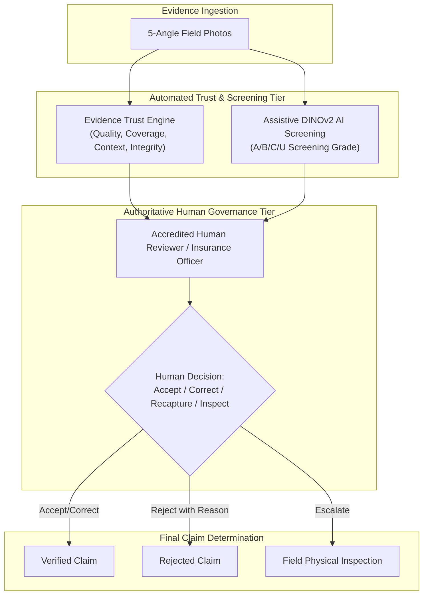

# AI Governance, Safety Boundaries & Operational Matrix

Fasal-Pramaan is built upon core principles of **Ethical AI, Algorithmic Transparency, and Human-in-the-Loop Governance**. In high-stakes agricultural insurance and disaster relief operations, automated machine learning models must never act as autonomous adjudicators of farmer livelihoods.

---

## 1. Core Governance & Safety Principles

### 1.1 Assistive Triage vs. Autonomous Adjudication
- **The AI Model is an Assistant**: The Vision Transformer provides rapid visual triage, preliminary screening grades ($A/B/C/U$), and quality anomaly detection.
- **Human Authority is Absolute**: Every insurance claim, damage percentage, and financial payout decision requires explicit review and confirmation by an accredited human officer.
- **Mandatory Override Logging**: Whenever a reviewer corrects an AI screening grade or modifies a damage severity estimate, the platform mandates an `override_reason` that is permanently recorded in the immutable audit log.

---

## 2. Operational Peril & Crop Coverage Matrix

| Crop Type | Scientific Name | Supported Disease Screening | Supported Foliar Perils | Macro Perils Requiring Reviewer Adjudication |
|---|---|---|---|---|
| **Paddy / Rice** | *Oryza sativa* | Blast, Brown Spot, Bacterial Blight | Leaf lesions, discoloration, blight | Flood inundation, submergence, lodging |
| **Maize (Corn)** | *Zea mays* | Common Rust, Northern Leaf Blight, Gray Leaf Spot | Foliar lesions, pustules, leaf scorch | Severe drought, wind lodging, stalk breakage |
| **Wheat** | *Triticum aestivum* | Yellow Rust, Brown Rust, Powdery Mildew | Rust pustules, fungal coatings | Hailstorm shredding, heat stress, lodging |
| **Potato** | *Solanum tuberosum* | Early Blight, Late Blight | Foliage blight, necrotic leaf spots | Frost damage, waterlogging, tuber rot |

---

## 3. Calibrated Abstention & Zero False-Accept Policy

1. **Explicit Abstention over Hallucination**: When presented with an image that is out-of-domain, excessively blurred, or representing an unsupported crop species, the AI service is calibrated to output Grade `U` (Unusable) or `B` (Uncertain) rather than hallucinating high-confidence predictions.
2. **Conservative Confidence Ceilings**: If critical contextual signals (such as GPS coordinates or server checksum verification) are absent, the Evidence Trust Engine imposes a strict ceiling on the final confidence score, preventing incomplete claims from bypassing reviewer triage.
3. **Integrity Hard Gates**: Evidence that exhibits duplicate hashes, perceptual hash collisions, or mock GPS flags is permanently barred from automatic acceptance and escalated to anti-fraud human queues.
