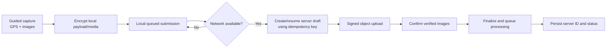

# Offline capture and sync

The mobile app is designed so evidence can be captured when connectivity is unreliable, then synchronized without creating duplicate cases.

## Local safeguards

- Payload and image media are encrypted using AES-GCM with key material held in secure storage (field-level envelopes on native SQLite paths; not full SQLCipher).
- Web Docker demo uses the same sync protocol; offline media encryption on pure web is limited compared with native.
- GPS/quality policies run before an item is queued (mock / weak GPS refused on device).
- A generated device identifier and client operation IDs support sync tracing and idempotency.
- The local record is retained until the server confirms its authoritative status.

## Synchronization rules

1. The client creates or resumes a draft with a stable idempotency key.
2. The server returns a stable submission ID and upload instructions.
3. The client uploads only required pending images, then confirms them.
4. The server re-verifies stored bytes before it accepts a finalized case.
5. If the app is interrupted after finalization, the client resumes from the saved server ID rather than re-uploading blindly.
6. Retry uses increasing delay with jitter; the server remains authoritative for status.

## Presentation wording

“The app can store evidence securely while offline and resume the same server case when connectivity returns. It does not claim that a client device alone proves GPS authenticity.”

Flutter/device verification remains an explicit pre-presentation check when the mobile app is shown. See [apps/mobile/README.md](../apps/mobile/README.md).
