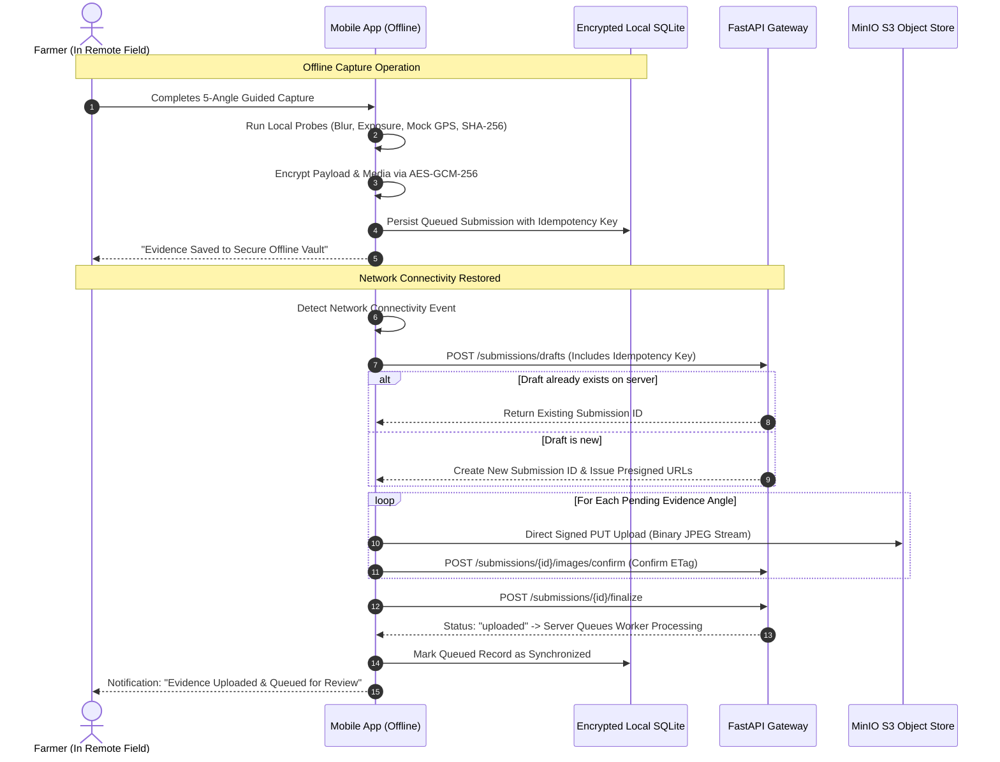

# Offline-First Architecture & Synchronization Protocol

In rural agricultural zones, cellular and broadband network connectivity is frequently intermittent or unavailable. The Fasal-Pramaan Mobile Application is architected with an **offline-first paradigm**, ensuring that farmers and field officers can complete the full 5-angle guided evidence capture protocol in remote fields without network connectivity.

---

## 1. Offline-to-Online Synchronization Flow


```mermaid
sequenceDiagram
  autonumber
  actor Farmer as Farmer (In Remote Field)
  participant App as Mobile App (Offline)
  participant LocalDB as Encrypted Local SQLite
  participant API as FastAPI Gateway
  participant S3 as MinIO S3 Object Store

  Note over Farmer,LocalDB: Offline Capture Operation
  Farmer->>App: Completes 5-Angle Guided Capture
  App->>App: Run Local Probes (Blur, Exposure, Mock GPS, SHA-256)
  App->>App: Encrypt Payload & Media via AES-GCM-256
  App->>LocalDB: Persist Queued Submission with Idempotency Key
  App-->>Farmer: "Evidence Saved to Secure Offline Vault"

  Note over Farmer,API: Network Connectivity Restored
  App->>App: Detect Network Connectivity Event
  App->>API: POST /submissions/drafts (Includes Idempotency Key)
  alt Draft already exists on server
    API-->>App: Return Existing Submission ID
  else Draft is new
    API-->>App: Create New Submission ID & Issue Presigned URLs
  end

  loop For Each Pending Evidence Angle
    App->>S3: Direct Signed PUT Upload (Binary JPEG Stream)
    App->>API: POST /submissions/{id}/images/confirm (Confirm ETag)
  end

  App->>API: POST /submissions/{id}/finalize
  API-->>App: Status: "uploaded" -> Server Queues Worker Processing
  App->>LocalDB: Mark Queued Record as Synchronized
  App-->>Farmer: Notification: "Evidence Uploaded & Queued for Review"
```

---

## 2. Cryptographic Local Vault Architecture

### 2.1 AES-GCM-256 Envelope Encryption
To prevent local tampering, extraction, or spoofing on shared or rooted Android/iOS devices:
- Every image binary and structured JSON payload is encrypted before writing to SQLite.
- Cryptographic keys are derived using PBKDF2 with 100,000 iterations and stored in hardware-backed keystores (Android Keystore / iOS Keychain).
- Each submission is packaged in an authentication envelope with an initialization vector (IV) and Galois authentication tag (GMAC), guaranteeing ciphertext integrity.

### 2.2 Local Integrity Probes
Before an item is committed to the offline vault, the mobile client executes pre-capture validation:
- **Mock Location Filtering**: Inspects Android `isFromMockProvider()` and iOS simulated location flags.
- **Minimum Horizontal Accuracy**: Rejects GPS readings with horizontal accuracy exceeding $50.0\text{ meters}$.
- **Duplicate Checksum Detection**: Ensures the 5 captured photos do not share identical SHA-256 or perceptual hash signatures.

---

## 3. Idempotency & Conflict Resolution

### 3.1 Idempotency Keys
Every offline capture session generates a cryptographically random, deterministic idempotency key format:
```text
idempotency_key = "sub_{device_id}_{crop_cycle_id}_{epoch_timestamp}"
```

When the client synchronizes:
1. The server checks for an existing submission matching the `idempotency_key`.
2. If found, the server resumes the existing draft without creating duplicate database records.
3. If network interruption occurs mid-upload, the client queries `/submissions/{id}` to determine which specific angles have already been confirmed, uploading *only* the remaining pending angles.

### 3.2 Exponential Backoff & Jitter
Background sync operations employ exponential backoff with randomized jitter to prevent thundering herd spikes on the API gateway:

$$t_{\text{retry}} = \min(t_{\text{max}}, t_{\text{base}} \times 2^{\text{attempt}}) \pm \text{uniform}(0, \text{jitter})$$

- $t_{\text{base}} = 2.0\text{ seconds}$
- $t_{\text{max}} = 120.0\text{ seconds}$
- Maximum automated retry attempts: 10
