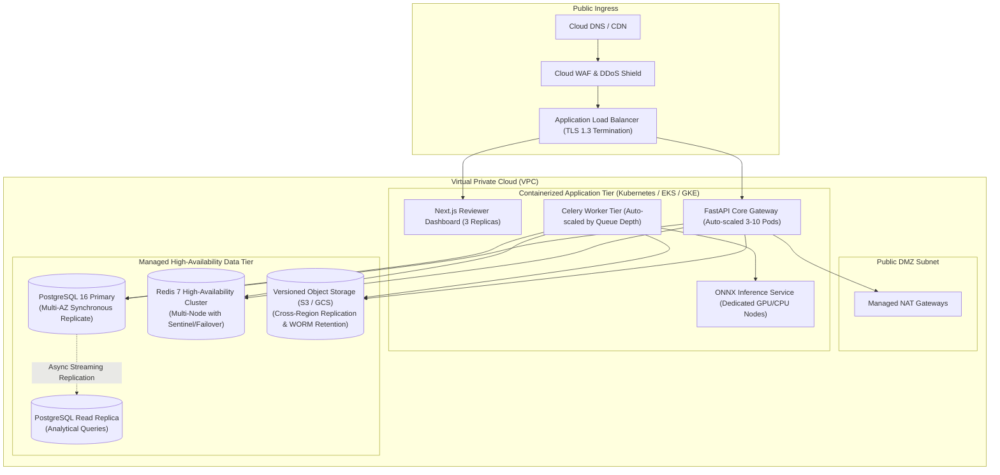

# Enterprise Production Architecture & Deployment Specifications

This document outlines the architectural specifications, infrastructure topologies, and operational standards for deploying Fasal-Pramaan in mission-critical enterprise environments.

---

## 1. Enterprise Multi-AZ Deployment Topology

---

## 2. Hardening & Compliance Matrix

| Security & Operational Gate | Standard Specification | Verification Mechanism |
|---|---|---|
| **Secret Management** | HashiCorp Vault / AWS Secrets Manager / GCP Secret Manager | Automated injection via CSI Driver; zero plaintext secrets in environment manifests. |
| **Network Isolation** | Zero Trust Private Subnets | API, AI, Worker, Database, and Storage reside in non-routable private subnets. |
| **Data Encryption at Rest** | AES-256-GCM / KMS Customer-Managed Keys | Full disk encryption for PostgreSQL EBS/PD volumes and S3 bucket-level KMS encryption. |
| **Data Encryption in Transit** | TLS 1.3 Strict Cipher Suites | Enforced HTTPS on ingress; mutual TLS (mTLS) across internal microservice meshes. |
| **Database Resilience** | Automated Multi-AZ Failover | PostGIS synchronous replication with automated failover in $< 30\text{ seconds}$. |
| **Audit Log Immutability** | Write-Once-Read-Many (WORM) Policy | Relational audit tables protected by database triggers preventing `UPDATE` or `DELETE` operations. |
| **Observability & APM** | OpenTelemetry + Prometheus + Grafana | Distributed tracing with correlation IDs, real-time error capture via Sentry, and metric dashboards. |

---

## 3. Disaster Recovery & SLA Targets

- **Recovery Point Objective (RPO)**: $\le 5\text{ minutes}$ (Continuous WAL archiving to geo-redundant storage).
- **Recovery Time Objective (RTO)**: $\le 15\text{ minutes}$ (Automated infrastructure recreation via Terraform/IaC).
- **Availability Target**: $99.95\%$ uptime across all API and evidence processing endpoints.
- **Inference Latency SLA**: P95 $< 100\text{ ms}$ per image frame under peak harvest concurrency.

---

## 4. Production Environment Validation

When `ENVIRONMENT=production` is initialized, the FastAPI Core Gateway performs strict boot-time assertion checks:
- Rejects default or weak JWT secrets (`JWT_SECRET_KEY` must be $\ge 32$ cryptographic bytes).
- Prohibits passwordless Redis or database connection strings.
- Disables mock AI fallbacks (`AI_ALLOW_MOCK_FALLBACK` is strictly enforced as `false`).
- Validates that CORS origins are restricted exclusively to authorized enterprise domains.
