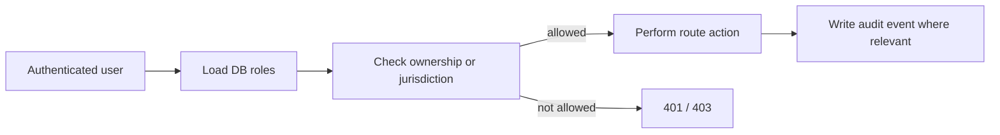

# Security boundary for the local demo

This document records the implemented application controls and the limits that remain. It is not a production security certification.

## Controls implemented

| Area | Implemented control |
|---|---|
| Passwords | Argon2 hashing; stronger registration policy; login lockout/rate limits |
| Access tokens | JWT token version checked against the database; logout invalidates the active version |
| Refresh tokens | Opaque values hashed at rest, rotated, family reuse detection/revocation |
| Authorization | Database roles plus ownership/jurisdiction checks on farms, cycles, submissions and SSE |
| Field officers | Restricted to assigned jurisdiction and descendants |
| API/AI boundary | `X-Service-Token` required for AI model/inference routes when configured; production requires a strong token (≥32 chars). Compose sets a default token for the local stack |
| Redis/Celery | Redis password required in compose; authenticated broker/result URLs |
| Rate limiting | Redis backend available and required by production validation; trusted proxy CIDRs are explicit |
| Evidence upload | Signed content type/length, server object metadata, SHA-256 and image-byte verification |
| Privacy | Log redaction, no production PII in seed data, private server-generated object keys |
| Browser | Dashboard CSP and security headers (including MinIO media origin); access/refresh tokens stay in memory during a browser session |
| Containers | API, worker and AI run as non-root users |
| Errors | Client-facing AI/API failures are sanitized; detailed exception paths are not returned |

## Port binding (matches `docker-compose.yml`)

| Binding | Ports / services |
|---|---|
| **LAN-facing (`0.0.0.0`)** | API `8000`, AI `8001`, dashboard `3000`, field web app `8085`, MinIO S3 `9000` |
| **Loopback only (`127.0.0.1`)** | PostgreSQL `5432`, Redis `6379`, MinIO console `9001` |

LAN binds are intentional for same-network demos (`PUBLIC_HOST`). Do **not** expose this stack to the public internet. Use a trusted private network and host firewall rules.

## Authorization rule

## Local-demo rules

- Prefer loopback-only access when a single-machine demo is enough; open LAN ports only on trusted Wi-Fi.
- Use only the seeded accounts and synthetic evidence.
- Keep `.env` private and never display its values during a presentation.
- Do not present the MinIO console or demo credentials as a production design.
- Rotate `JWT_SECRET_KEY`, `DEMO_PASSWORD`, `AI_SERVICE_TOKEN`, and MinIO credentials before any shared-network demo beyond a personal machine.

## Remaining security and programme work

- Managed secrets and rotation, TLS ingress, WAF/DDoS controls, backups/restore drills, and object retention/AV scanning.
- Real SMS/email account verification and recovery (`is_verified` is stored but not enforced on write paths).
- Independent penetration testing, privacy/DPIA review, operational monitoring and incident response.
- Device attestation if GPS spoofing resistance is a requirement.
- Always-on AI service token even in development when AI is bound to non-loopback interfaces.
- A server-side BFF/httpOnly browser session is a future hardening option; the current dashboard reduces exposure by retaining tokens only in memory.

See [production-readiness.md](./production-readiness.md) for deployment gates and [SVH26007 audit readiness](./SVH26007_AUDIT_READINESS_2026-07-18.md) for historical verification evidence (with the current-status addendum at the top of that file).
