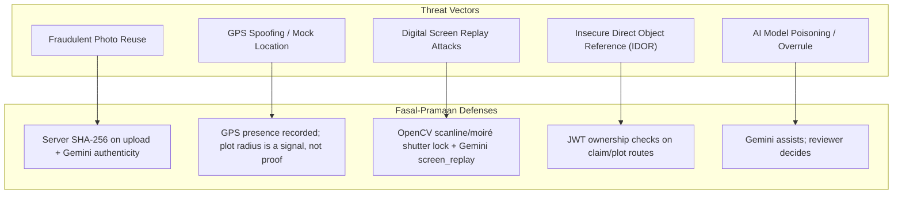
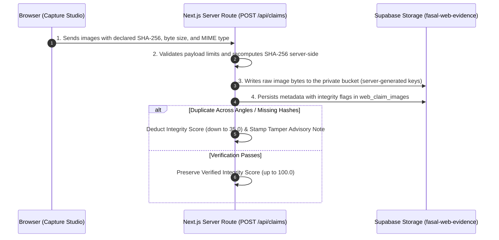

# Security Architecture & Trust Controls

Fasal-Pramaan implements a **defense-in-depth security model** engineered to protect sensitive agricultural and farmer data, prevent fraudulent claim submissions, and guarantee the non-repudiation of photographic evidence.

---

## 1. Security Architecture Matrix

| Security Domain | Implemented Control | Technical Implementation |
|---|---|---|
| **Identity & Passwords** | Supabase Auth | Managed credential hashing and lockout-resistant defaults; the public site additionally sits behind a shared gate password (`SITE_LOCK_PASSWORD`). |
| **Session & Tokens** | Supabase Auth JWT | Short-lived signed session tokens; global logout revokes the session; server routes verify the JWT before acting. |
| **Refresh Tokens** | Supabase Token Rotation | Refresh tokens are rotated automatically with reuse detection by Supabase Auth. |
| **Role-Based Access (RBAC)** | Principle of Least Privilege | Reviewer vs farmer roles resolved from `REVIEWER_EMAILS` / `app_metadata.roles`; farmers only access their own claims and plots. |
| **Spatial Fencing** | Plot Ownership Scoping | Farmer data is ownership-scoped in `web_*` tables; plot boundary geometry is stored in Supabase Postgres (PostGIS extension). |
| **Service-Role Isolation** | Server-Only Keys | Privileged writes use `SUPABASE_SERVICE_ROLE_KEY`. Gemini uses server-only `GEMINI_API_KEY`. Neither is exposed to the browser. |
| **Evidence Immutability** | Content-Addressed Storage | Object keys are server-generated; direct client file naming is prohibited; uploaded bytes are immutable in the private `fasal-web-evidence` bucket. |
| **Anti-Tamper & Anti-Fraud** | Checksum + vision | Server recomputes SHA-256 on upload. Gemini rejects screen replays, AI images, and indoor fakes. GPS presence is recorded; it is not proven hardware-only. |
| **Browser Protection** | CSP | CSP with `frame-ancestors 'none'`. Supabase persists the session with its default storage. |
| **Managed Platform Hardening** | Serverless + RLS | Vercel serverless runtime with no long-lived processes; Supabase anon RLS policies on `web_*` tables and storage stay closed. |

---

## 2. Threat Modeling & Mitigation

```mermaid
flowchart TD
  subgraph Threats["Threat Vectors"]
    T1["Fraudulent Photo Reuse"]
    T2["GPS Spoofing / Mock Location"]
    T3["Digital Screen Replay Attacks"]
    T4["Insecure Direct Object Reference (IDOR)"]
    T5["AI Model Poisoning / Overrule"]
  end

  subgraph Mitigations["Fasal-Pramaan Defenses"]
    M1["Server SHA-256 on upload + Gemini authenticity"]
    M2["GPS presence recorded; plot radius is a signal, not proof"]
    M3["OpenCV scanline/moiré shutter lock + Gemini screen_replay"]
    M4["JWT ownership checks on claim/plot routes"]
    M5["Gemini assists; reviewer decides"]
  end

  T1 --> M1
  T2 --> M2
  T3 --> M3
  T4 --> M4
  T5 --> M5
```

---

## 3. Cryptographic Evidence Verification Pipeline

```mermaid
sequenceDiagram
  autonumber
  participant Client as Browser (Capture Studio)
  participant API as Next.js Server Route (POST /api/claims)
  participant Store as Supabase Storage (fasal-web-evidence)

  Client->>API: 1. Sends images with declared SHA-256, byte size, and MIME type
  API->>API: 2. Validates payload limits and recomputes SHA-256 server-side
  API->>Store: 3. Writes raw image bytes to the private bucket (server-generated keys)
  API->>Store: 4. Persists metadata with integrity flags in web_claim_images
  alt Duplicate Across Angles / Missing Hashes
    API->>API: Deduct Integrity Score (down to 35.0) & Stamp Tamper Advisory Note
  else Verification Passes
    API->>API: Preserve Verified Integrity Score (up to 100.0)
  end
```

---

## 4. Operational Secrets & Deployment Policy

1. **Zero Hardcoded Secrets**: All cryptographic keys, database passwords, and API tokens are injected strictly via environment variables. Never commit `SUPABASE_DB_PASSWORD`, `HF_TOKEN`, or publishable/service keys. `scripts/test_supabase_conn.py` reads env only.
2. **Vercel server-only keys**: `SUPABASE_SERVICE_ROLE_KEY` and `HF_TOKEN` must never be named `NEXT_PUBLIC_*`. The evidence bucket `fasal-web-evidence` is private.
3. **Local vs. Production Isolation**: Never enable demo credentials or mock inference fallbacks on a hosted deployment; keep demo data out of the production Supabase project.
4. **Audit Trails**: All reviewer overrides, claim status mutations, gate adjudications, and recapture requests write immutable records to the `web_review_actions` table with actor UUID, action type, notes, and timestamp.
