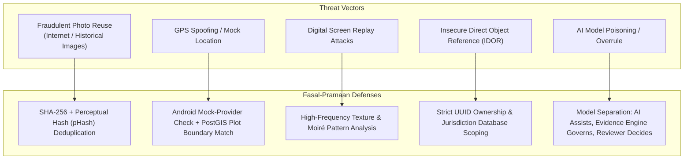
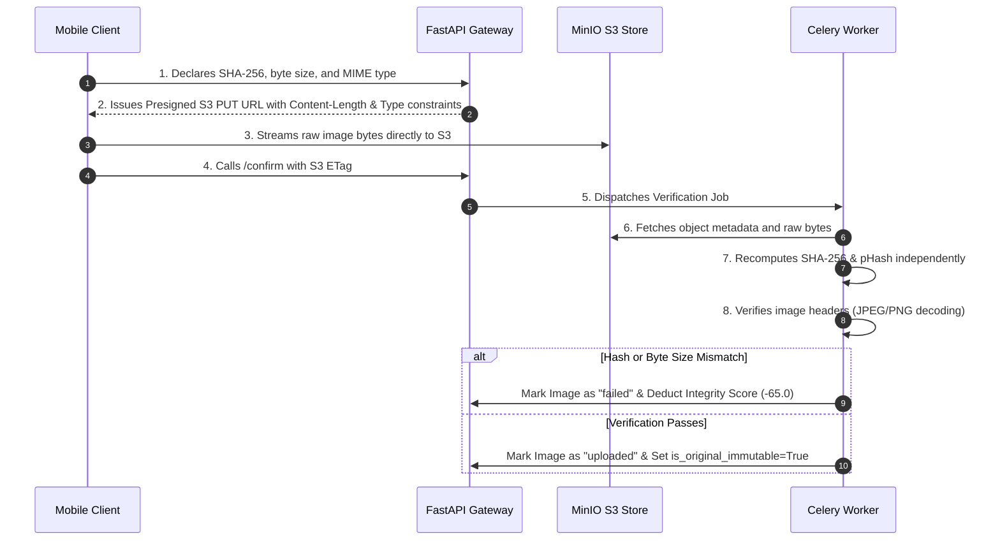

# Security Architecture & Trust Controls

Fasal-Pramaan implements a **defense-in-depth security model** engineered to protect sensitive agricultural and farmer data, prevent fraudulent claim submissions, and guarantee the non-repudiation of photographic evidence.

---

## 1. Security Architecture Matrix

| Security Domain | Implemented Control | Technical Implementation |
|---|---|---|
| **Identity & Passwords** | Argon2id Hashing | High-memory cost parameters; automated account lockout after 5 consecutive failed attempts. |
| **Session & Tokens** | JWT Token Versioning | Short-lived access tokens (30 min); user `token_version` checked in DB; global logout revokes all active tokens. |
| **Refresh Tokens** | Cryptographic Token Families | Opaque SHA-256 hashed tokens with automatic family revocation if token reuse/theft is detected. |
| **Role-Based Access (RBAC)** | Principle of Least Privilege | Distinct permission matrices for Farmers, Field Officers, Reviewers, and System Administrators. |
| **Spatial Fencing** | PostGIS Jurisdiction Scoping | Field officers are restricted to plots within their assigned administrative geometry ($State \rightarrow District \rightarrow Block \rightarrow Village$). |
| **Inter-Service Auth** | `X-Service-Token` Header | Microservices (API $\rightarrow$ AI $\rightarrow$ Worker) communicate over private networks with strong HMAC tokens (≥32 chars). |
| **Evidence Immutability** | Content-Addressed Storage | Object keys are server-generated UUIDs; direct client file naming is prohibited; uploaded bytes are immutable. |
| **Anti-Tamper & Anti-Fraud** | Multi-Factor Verification | SHA-256 checksums, Perceptual Hashes ($pHash$), EXIF capture time consistency, and mock-location detection. |
| **Browser Protection** | CSP & Memory Retention | Strict Content Security Policy; tokens retained in memory rather than `localStorage` to prevent XSS exfiltration. |
| **Container Hardening** | Non-Root User Execution | All Docker containers run under unprivileged service users with minimal Linux capabilities. |

---

## 2. Threat Modeling & Mitigation

```mermaid
flowchart TD
  subgraph Threats["Threat Vectors"]
    T1["Fraudulent Photo Reuse\n(Internet / Historical Images)"]
    T2["GPS Spoofing / Mock Location"]
    T3["Digital Screen Replay Attacks"]
    T4["Insecure Direct Object Reference (IDOR)"]
    T5["AI Model Poisoning / Overrule"]
  end

  subgraph Mitigations["Fasal-Pramaan Defenses"]
    M1["SHA-256 + Perceptual Hash (pHash) Deduplication"]
    M2["Android Mock-Provider Check + PostGIS Plot Boundary Match"]
    M3["High-Frequency Texture & Moiré Pattern Analysis"]
    M4["Strict UUID Ownership & Jurisdiction Database Scoping"]
    M5["Model Separation: AI Assists, Evidence Engine Governs, Reviewer Decides"]
  end

  T1 --> M1
  T2 --> M2
  T3 --> M3
  T4 --> M4
  T5 --> M5
```

---

## 3. Cryptographic Evidence Verification Pipeline

```mermaid
sequenceDiagram
  autonumber
  participant Client as Mobile Client
  participant API as FastAPI Gateway
  participant S3 as MinIO S3 Store
  participant Worker as Celery Worker

  Client->>API: 1. Declares SHA-256, byte size, and MIME type
  API-->>Client: 2. Issues Presigned S3 PUT URL with Content-Length & Type constraints
  Client->>S3: 3. Streams raw image bytes directly to S3
  Client->>API: 4. Calls /confirm with S3 ETag
  API->>Worker: 5. Dispatches Verification Job
  Worker->>S3: 6. Fetches object metadata and raw bytes
  Worker->>Worker: 7. Recomputes SHA-256 & pHash independently
  Worker->>Worker: 8. Verifies image headers (JPEG/PNG decoding)
  alt Hash or Byte Size Mismatch
    Worker->>API: Mark Image as "failed" & Deduct Integrity Score (-65.0)
  else Verification Passes
    Worker->>API: Mark Image as "uploaded" & Set is_original_immutable=True
  end
```

---

## 4. Operational Secrets & Deployment Policy

1. **Zero Hardcoded Secrets**: All cryptographic keys, database passwords, and API tokens are injected strictly via environment variables. Never commit `SUPABASE_DB_PASSWORD`, `HF_TOKEN`, or publishable/service keys. `scripts/test_supabase_conn.py` reads env only.
2. **Vercel server-only keys**: `SUPABASE_SERVICE_ROLE_KEY` and `HF_TOKEN` must never be named `NEXT_PUBLIC_*`. The evidence bucket `fasal-web-evidence` is private.
3. **Local vs. Production Isolation**: When `ENVIRONMENT=production`, the application startup lifecycle strictly verifies that no demo credentials, default passwords, or mock fallbacks are active.
4. **Audit Trails**: All reviewer overrides, claim status mutations, and voice assistant operations write immutable records to the `audit_logs` table with actor UUID and timestamp. Hosted web actions also go to `web_review_actions`.
